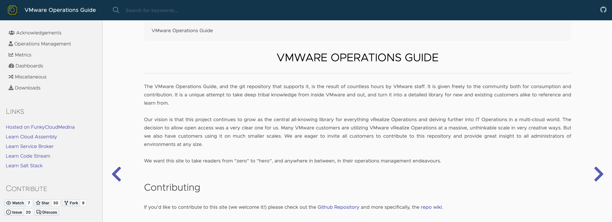

# VMware Operations Guide

The [VMware Operations Guide](https://www.vmwareopsguide.com), and the git repository that supports it, is the result of countless hours by VMware staff. It is given freely to the community both for consumption and contribution. It is a unique attempt to take deep tribal knowledge from inside VMware and out, and turning it into a detailed library for new and existing customers alike to reference and learn from.

Our vision is that this project continues to grow as the central all-knowing library for everything vRealize Operations and delving further into IT Operations in a multi-cloud world. The decision to allow open access was a very clear one for us. Many VMware customers are utilizing VMware vRealize Operations at a massive, unthinkable scale in very creative ways. But we also have customers using it on much smaller scales. We are eager to invite all customers to contribute to this repository and provide great insight to all administrators of environments at any size.

We want this site to take readers from “zero” to “hero”, and anywhere in between, in their operations management endeavours.

## License

Shield: [![CC BY-NC-SA 4.0][cc-by-nc-sa-shield]][cc-by-nc-sa]

This work is licensed under a
[Creative Commons Attribution-NonCommercial-ShareAlike 4.0 International License][cc-by-nc-sa].

[![CC BY-NC-SA 4.0][cc-by-nc-sa-image]][cc-by-nc-sa]

[cc-by-nc-sa]: http://creativecommons.org/licenses/by-nc-sa/4.0/
[cc-by-nc-sa-image]: https://licensebuttons.net/l/by-nc-sa/4.0/88x31.png
[cc-by-nc-sa-shield]: https://img.shields.io/badge/License-CC%20BY--NC--SA%204.0-lightgrey.svg

## Legal

VMware and the VMware taglines, logos and product names are trademarks or registered trademarks of VMware in the U.S. and other countries.