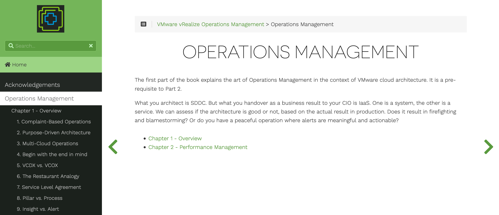

# VMware Operations Guide

This repo contains the contents of Iwan Rahabok's [VMware Operations Guide](https://via.vmw.com/OpsMgmt), ported to Markdown and built into a static site using Hugo: https://vrops.funkycloudmedina.com.

The entire site is static and built using the static site generator [Hugo](https://gohugo.io/). Hugo uses HTML/CSS, Markdown files, and a templating engine to generate a static site that can be hosted almost anywhere. This is a great model for an online book, as the Markdown files can be parsed by Pandoc and made into EPUB, MOBI and PDF files quite easily.

## Why Markdown?

There's no point trying to improve on a great write up. Read this [Why Markdown?](https://learn.netlify.app/en/cont/markdown/) post to see why I selected this format.

For your convenience, here's an excerpt:

>Let’s face it: Writing content for the Web is tiresome. WYSIWYG editors help alleviate this task, but they generally result in horrible code, or worse yet, ugly web pages.
>
>Markdown is a better way to write HTML, without all the complexities and ugliness that usually accompanies it.
>
>Some of the key benefits are:
>
> - Markdown is simple to learn, with minimal extra characters so it’s also quicker to write content.
> - Less chance of errors when writing in markdown.
> - Produces valid XHTML output.
> - Keeps the content and the visual display separate, so you cannot mess up the look of your site.
> - Write in any text editor or Markdown application you like.
> - Markdown is a joy to use!

## License

Shield: [![CC BY-NC-SA 4.0][cc-by-nc-sa-shield]][cc-by-nc-sa]

This work is licensed under a
[Creative Commons Attribution-NonCommercial-ShareAlike 4.0 International License][cc-by-nc-sa].

[![CC BY-NC-SA 4.0][cc-by-nc-sa-image]][cc-by-nc-sa]

[cc-by-nc-sa]: http://creativecommons.org/licenses/by-nc-sa/4.0/
[cc-by-nc-sa-image]: https://licensebuttons.net/l/by-nc-sa/4.0/88x31.png
[cc-by-nc-sa-shield]: https://img.shields.io/badge/License-CC%20BY--NC--SA%204.0-lightgrey.svg