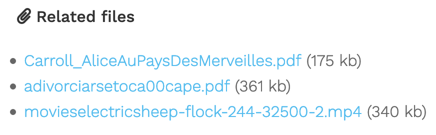

# VMware Operations Guide

This repo contains the contents of Iwan Rahabok's [VMware Operations Guide](https://via.vmw.com/OpsMgmt), ported to Markdown and built into a static site using Hugo.


The entire site is static and built using the static site generator [Hugo](https://gohugo.io/). Hugo uses HTML/CSS, Markdown files, and a templating engine to generate a static site that can be hosted almost anywhere. This is a great model for an online book, as the Markdown files can be parsed by Pandoc and made into EPUB, MOBI and PDF files quite easily.

# Table of Contents

1. [Why Markdown?](#why-markdown)
2. [Content Organisation](#content-organisation)
3. [Contributing](#contributing)

# Why Markdown?

There's no point trying to improve on a great write up. Read this [Why Markdown?](https://learn.netlify.app/en/cont/markdown/) post to see why I selected this format.

For your convenience, here's an excerpt:

>Let’s face it: Writing content for the Web is tiresome. WYSIWYG editors help alleviate this task, but they generally result in horrible code, or worse yet, ugly web pages.
>
>Markdown is a better way to write HTML, without all the complexities and ugliness that usually accompanies it.
>
>Some of the key benefits are:
>
> - Markdown is simple to learn, with minimal extra characters so it’s also quicker to write content.
> - Less chance of errors when writing in markdown.
> - Produces valid XHTML output.
>- Keeps the content and the visual display separate, so you cannot mess up the look of your site.
> - Write in any text editor or Markdown application you like.
> - Markdown is a joy to use!

# Content Organisation

In Hugo, "pages" are the core of your site. This book uses Hugo [Page Bundles](https://gohugo.io/content-management/organization/#page-bundles) to represent each page that is generated.

The structure on disk ends up looking like this:

```
.
└── content
    └── Acknowledgements
    |   └── _index.md  // <- https://example.com/content/acknowledgements/
    ├── Dashboards
    |   ├── _index_.md   // <- https://example.com/content/dashboards/
    |   ├── Chapter 1 - Design Considerations
    |   |   ├── _index.md  // <- https://example.com/dashboards/chapter-1-design-considerations/
    |   |   └── 3.1.1-dashboard-alert-report
    |   |       └── _index.md // <- https://example.com/dashboards/chapter-1-design-considerations/3.1.1-dashboard-alert-report/
    ├── Metrics
    |   ├── _index_.md   // <- https://example.com/content/metrics/
    |   ├── Chapter 1 - Overview
    |   |   ├── _index.md  // <- https://example.com/metrics/chapter-1-overview/
    |   |   └── 2.1.1-nuances-in-metrics
    |   |       └── _index.md // <- https://example.com/metrics/chapter-1-overview/2.1.1-nuances-in-metrics/
```

The result leaves us with appropriate folders for each and every page to contain not only the `_index.md` file but any supporting materials (documents, images, attachments, etc). 

## Page Bundles

Every page underneath a chapter is represented by a folder with an `_index.md`. This folder/_index.md combination is called a [Page Bundles](https://gohugo.io/content-management/organization/#page-bundles). The Page Bundle naming convention follows the same section, chapter and heading values in use in the source material (Iwan's book). Every leaf Page Bundle is prefixed with the **Part#**-**Chapter#**-**Heading#** followed by the title of the page. Look at the directory structure above. Dashboards is Part **3** in Iwan's book, and underneath it is Chapter **1**, with a page titled "**Dashboard, Alert, Report**". The resulting page bundle name is **3.1.1-dashboard-alert-report** (replacing breaks between words with hyphens).

In many Page Bundles, images exist to support the page. These follow the same naming convention as the page bundles, but instead of the title, I append **fig-X** to the file instead. To continue the example above, that leaves me with **3.1.1-fig-1.png**, **3.1.1-fig-2.png** and so on.

# Contributing

You can contribute to this book by submitting a pull request with your changes. Any changes will be reviewed for accuracy and document structure before being accepted.

If you do not want to submit a PR, you can always file an Issue for it to be addressed by a repo maintainer.

## Getting Started

If you'd like to work on this book on your local machine, you'll need [Hugo](https://gohugo.io/) and a text editor. That's pretty much it! I use VS Code but you could use whatever you want.

1. Install Hugo for [macOS](https://gohugo.io/getting-started/quick-start/#step-1-install-hugo) or [Windows](https://gohugo.io/getting-started/installing)
1. Clone this repo: `git clone <to be included>`
1. Change to the repo directory `cd vmware-operations-guide`
1. Start a Hugo server with live render: `hugo server`
1. Open your browser and go to `http://localhost:1313`

With Hugo running in the background, you can see your changes live in the browser as you make them.

## Creating a new page

Identify where your new page will exist in the folder structure (check the `content` folder). Is it a new page for Dashboards Chapter 1 `content/Dashboards/Chapter 1 - Design Considerations/`? Maybe it's a new page for Metrics Chapter 6 `content/Metrics/Chapter 6 - Other Metrics/`?

In either case, you'll need to know the path. You'll also need to know the page title and the numerical identifier. You'll need these values to run `hugo new` to create the page bundle.

### Example Page

For now, I'll provide an example. Let's say you want to create a new page titled "Super Metrics - Friend or Foe" in **Chapter 4 - Super Metrics** under **Miscellaneous**. You can see that 4 Page Bundles already exist, which would make yours number **5**. The new name for your Page Bundle would be "4.4.**5**-super-metrics-friend-or-foe". You could go ahead and make the folder and _index.md file yourself, or, you can use Hugo to create the entire Page Bundle for you using the `hugo new` command like this: `hugo new "Miscellaneous/Chapter 4 - Super Metrics/4.4.5-super-metrics-friend-or-foe/_index.md`

## Front Matter

Every page has **front matter**. Front matter is metadata about the page that exists at the beginning of the Markdown file. If you used the page creation method above, your new page will have the default front matter included, with the date automatically populated. It will look like this:

```markdown
---
title: "x.x.x-my-page-title"
date: 2021-06-11T11:31:22+10:00
draft: true
---
```

This front matter specifies many attributes, but for this book, only the basics are used: 

- Title: The title of the page. Display on sidebars and menu's and the top of the rendered page.
- Date: Refers to the date the file was created. Is typically auto-populated by the `hugo new` command but can be updated by the author.
- Draft: true/false. If set to true, the page will not be rendered when you run `hugo`. If set to false, it will render. You can live render any drafts you're working on using `hugo server -D`
- Chapter: true/false. Used only on Chapter pages.
- Weight: integer. Used to dictate relative weight when ordering pages in the sidebar. The lower the number, the higher priority it will have in the list.

## Page Content

All content is written in Markdown. See the [Why Markdown?](#why-markdown) section above.

However, there are a lot of things that Markdown doesn’t support well. You could use pure HTML to expand possibilities. But this happens to be a bad idea. Everyone uses Markdown because it’s pure and simple to read even non-rendered. You should avoid HTML to keep it as simple as possible.

To avoid this limitations, Hugo created shortcodes. A shortcode is a simple snippet inside a page. Some small details throughout the online book are achieved through shortcodes.

### Images and Attachments

If you wish to include images or attachments, include the file in the Page Bundle you want to use it in (same directory as your page's `_index.md`) with a name that matches [the naming convention](#page-bundles). This will keep related content together. 

#### Images

To reference an image in a page using Markdown: ``.

#### Attachments

Attachments should exist in a **page.files** folder within a Page Bundle like so:

> - content
>   - _index.md
>   - page
>      - _index.md
>      - **page.files**
>        - attachment.pdf

To list the page bundle attachments on the page, use the Attachments shortcode:

```
{}
```

Which renders to something like this:



For more information on attachments, read the theme's [documentation on shortcodes](https://learn.netlify.app/en/shortcodes/attachments/). 

## Writing Guide

TODO: Write a writing guide