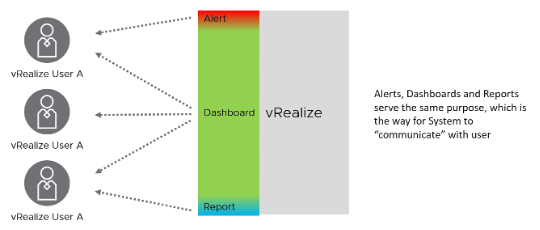

很容易认为仪表板、警报和报告是分开的，应该独立设计。 顾全大局, 这些功能的重叠最小，因为它们形成了一个 ***连续体*** . 它们服务于相同的目的，这是系统与用户“沟通”的方式。

如果您应用这个想法，您将意识到您可以减少警报风暴，因为许多警报更适合作为仪表板的一部分。报告也将被最小化并保留给没有在线访问权限的角色和不需要交互的用例。

警报的性质意味着它的用例非常狭窄。您不想根据警报运行您的操作。太多了，你不知所措。太少，你缺乏大局的可见性。 Alert 仅适用于以下情况：

- 紧迫. 如果时间不是关键，那么带有仪表板的常规标准操作程序 (SOP) 会更有效，因为您可以看到全局。避免向不处理日常操作的角色发送警报。最好使用仪表板来执行诸如容量管理之类的长期操作。
- 问题. 如果没有任何问题，则无需触发警报。这就是为什么通常您不设置库存变化警报的原因，因为库存只是某种事物的帐户。
- 补救. 如果您无法立即采取任何措施来解决问题，为什么要触发警报？在这种情况下使用仪表板。
- 很少. Alert 关注异常，而不是大局。因此，您希望它最小化。如果整个房子都着火了，那么警报就太迟了。

在光谱的另一端是报告。 报告的性质意味着它的用例也非常狭窄。现代运营需要报告所缺乏的更丰富的交互。 该报告仅适用于以下情况：

- 不互动 (例如用户需要将其发送到他们的电子邮件收件箱)
- 离线 (例如，用户在飞机上)
- 无法访问 vRealize
- 印刷文件
- 持续时间（例如日历月）
- 进一步处理 (例如与数据不在 vRealize 中的其他系统集成)
- 进一步分析和报告 (例如财务团队希望将数据作为电子表格报告的一部分)

仪表板涵盖了最广泛的用例，因为它是最通用的。

下表详细说明了 3 种参与方式如何互补。

如果用户可以通过他们的桌面访问在线，请考虑使用自助服务仪表板，因为他们不需要登录并且更易于使用。您可以开发一个带有这些仪表板和自定义指南链接的门户。

vRealize Operations 的最后几个版本引入了许多改变仪表板外观的新功能。 vRealize Operations 8.2 具有增强的仪表板到仪表板导航，因此您可以在仪表板之间创建流程。您的仪表板不再局限于独立的仪表板。

8.2 版附带了一组经过改进的仪表板。它们保持简单，旨在针对您的特定环境进行定制。在 vRealize Operations 8.4 中改进了仪表板。