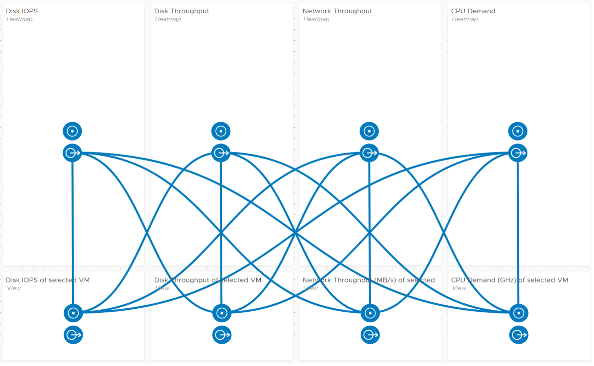

Take advantage of the interaction while ensuring they remain logical and consistent. Logically design the dashboard first using any drawing tools so you can see the flow of information.

A rich interaction will increase the functionality of the dashboard. If possible, aim for a symmetrical interaction as it’s easier for the dashboard consumer to understand. The following shows 4 heat maps driving 4 line charts. It looks complicated but feels natural when used.

