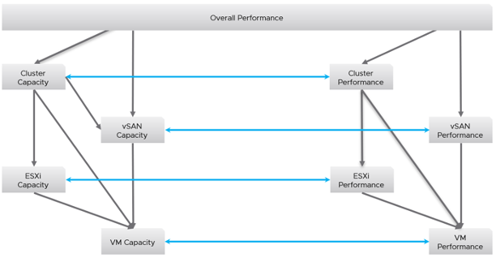

Avoid designing a deep dashboard with many widgets that requires multiple pages of scrolling. They are harder to understand and may suffer from loading time. Instead, take advantage of the dashboard to dashboard navigation feature, which was enhanced in vRealize Operations 8.2. You can drill down from one dashboard to another, or move laterally. Note that you cannot go up the parent hierarchy.

The following is an example. There is an overall performance dashboard, which drills down into capacity dashboards and performance dashboards. The grey arrows indicate a drill down. The blue lines indicate a lateral movement, hence it is bidirectional. 

Once you design the overall flow, you implement it on each dashboard. Here is an example, where this dashboard drills down into two other dashboards (ESXi Contention and VM Contention).

