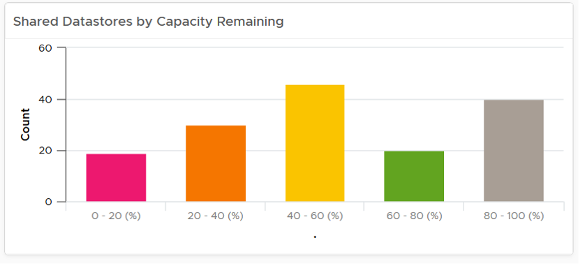

Distribution Charts comes in many shapes, with bar chart being one of most familiar. It can be used to give insight to a large dataset. Take the following as an example. It shows vSphere shared datastores by their capacity remaining. They are categorised into 5 buckets, from the lowest capacity remaining to the highest. Each bucket is given a color to convey a meaning. Can you guess why >80% is given a grey color, as opposed to even more green? 

The reason has to do with the reason you bought the capacity in the first place. It's to be consumed. If the capacity is not well used after months or even years, it's a wastage. You overbought capacity.