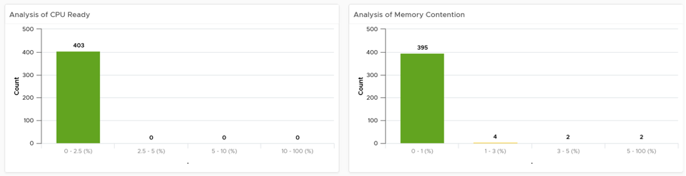
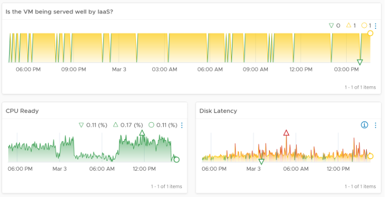

The VM Contention Dashboard is the primary dashboard for VM performance. It's designed for VMware Administrators or Architects, and can be used in both monitoring and troubleshooting. Once you determine there is performance issue, use the VM Utilization dashboard to see if the contention is caused by very high utilization. 

The dashboards answer these questions:
- Are the VMs performing well? If not, which VMs are affected by what problems (CPU, Disk, RAM, Network)?
- Is the VM performance caused by IaaS not serving it, or by contention within the Guest OS?
- Are the VMs running high utilization? If yes, which VMs, how high, and what resource (CPU, RAM, Disk, Network)?
- Are they really high relative to the underlying IaaS capacity? That can cause strain in the shared infrastructure.
- Any VMs need to be right-sized? By how much and for which resource? For disk, we need to look inside each partition, not at VM level.

You can also go back to any point in time, and ask the same questions above. This is important as by the time you have the chance to look at the problem, 5 minutes have passed, or the problem is no longer happening.

## Design Consideration

This dashboard is designed to be used as part of your [Standard Operating Procedure](https://en.wikipedia.org/wiki/Standard_operating_procedure) (SOP). It is designed to be used daily, hence the views are set to show data in the last 24 hours. This is to encourage daily usage, as what happens beyond 24 hours ago may be practically irrelevant from performance troubleshooting viewpoint.

Data center is used as the boundary for scalability and usability, as showing tens of thousands of objects will impact the dashboard performance and complicate the troubleshooting process. 

See the Performance Dashboard page for common design consideration among all the dashboards for performance management. 

For understanding the performance concept of the selected counters and their thresholds, see the Performance Dashboards.

## How to Use

Select a data center from the **Data Center** table
- For small environment, select vSphere World to see VMs from all the data centers. 
- Note that the count of VM includes powered off VMs. If you need to exclude them, modify the widget and choose running VM metric.
- Analysing by data center makes sense as performance problems tend to be isolated in a single physical environment. A performance problem in country A typically does not cause performance problem in country B. 

The bar charts above will be automatically shown.

Use them together to get an insight if you have CPU or Memory performance problems. Each chart analyzes how the VMs are served by the cluster. For each VM, it picks the worst metric in the last 24 hours. By default, vRealize Operations collects every 5 minutes, so this is the highest value among 288 datapoints. Once it has the value from each VM, the bar charts put each VM in the respective performance buckets. The threshold in the buckets consider best practice, hence they are color coded. 

For your mission-critical environment, you should expect that all the VMs are being served well by the IaaS. So expect to see green on both distribution chart. For development, you may tolerate a small amount of contention in both CPU and Memory.

The table listing all the VMs in the selected data center is automatically shown. A portion of the table is shown below.

The table shows the hostname as known by Windows or Linux. This is the name that application team or VM owner know, as they may not be familiar with the VM name.

The rest of the columns show performance counters. Because the goal is proactive monitoring, as opposed to reactive troubleshooting, the counters show the ***worst*** value instead of the average of the monitoring period. For example, the CPU Ready counter shows the highest CPU Ready within the period you specify. The default period is 24 hours, as the dashboard is designed to be part of the daily SOP. 

The table is sorted by **KPI Breached** column, directing your attention to the VMs that are not served well by the IaaS.

The column KPI Breached counts the number of SLA breaches in any given 5 minute period. As a VM consumes 4 resources of IaaS (CPU, Memory, Disk, Network), the counter varies from 0 - 4, with 0 being the ideal. The value 4 indicates that all 4 IaaS services are not delivered. Note that the same threshold is used regardless of class of service, as this is an internal KPI, not an external SLA. Your internal threshold should be more stringent, so you have reaction time. 

Choose a VM from the table. All the health charts are automatically shown, showing KPIs of that VM.

Each of the health charts is color coded according to the best practice of that counter. You can change it by simply editing the widget. The chart also displays the last value, lowest value and the peak value of the monitoring period. Expect that the peak is within your threshold. 

Going back to the table, I've circled the first VM disk latency. It's showing 79.48 ms latency, hence shown in red. That number corresponds to the peak shown in the Disk Latency health chart below.

## Points to Note

If you need more granular visibility, you can use the following metrics
- **Peak vCPU Ready (%)** tracks if any of the virtual CPU is experiencing high CPU Ready. It takes the highest among the vCPU. This can be useful in large VMs with many vCPU.
- **Peak Virtual Disk Read Latency (ms)** and **Peak Virtual Disk Write Latency (ms)** track whether any of the virtual disks (either VMDK or RDM) is experiencing latency. This can be useful in large VMs with many virtual disks.
- **Disk Outstanding IO** is an average of both read and write. If you prefer better visibility, show read and write separately.

If you need more space, remove the CPU Swap Wait. Its value is covered by Memory Contention.

The VM counter **Performance \ Number of KPIs Breached** tracks the number of KPIs breached. The value ranges from 0 (no breached, which is the ideal state) to 4 (all 4 IaaS services are not delivered well). 

If the Guest OS counters are not showing up, check that you meet the requirements. 

The health chart is color coded. Change the settings if it does not suit your environment. If you are unsure of what suitable numbers to set for your environment, profile the metrics. The Guest OS Performance Profiling dashboard provides an example of how to profile metrics. 

For a smaller environment with just 1-2 Data centers, changing the filter from data center to cluster makes more sense. Once you are listing cluster, you can then add the cluster performance (%) metric and sort them in an ascending order. This way the cluster that needs immediate attention is on top.

If you have screen real estate, group the VMs by cluster or by ESXi. In this way, you can quickly see if the problem is in particular cluster or ESXi.

Change the default timeline from one week to one day as and when required to suit your operations.

The **Dropped Packet (%)** formula is `(dropped / (dropped + transferredPackets)) * 100%`. In a rare case where there is no packet at all, the result shows undefined (blank). This is because the maths of 0 / 0 = undefined.