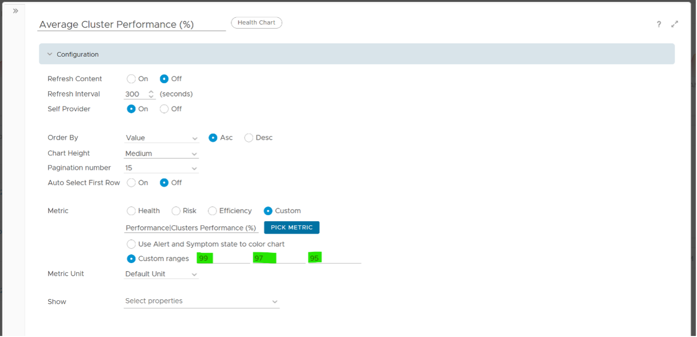
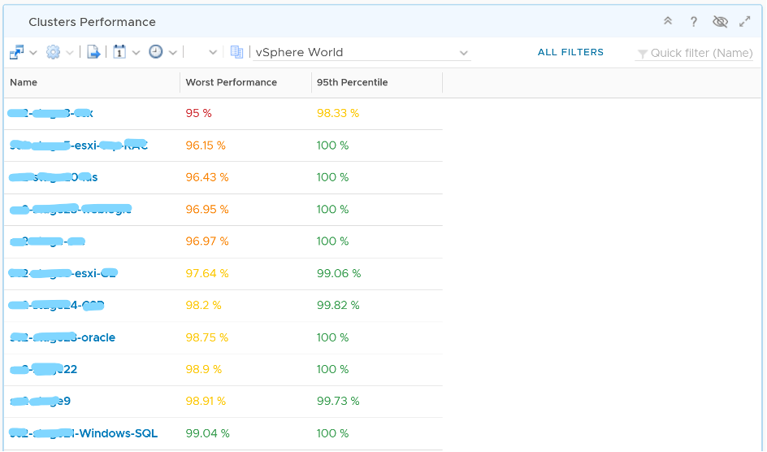
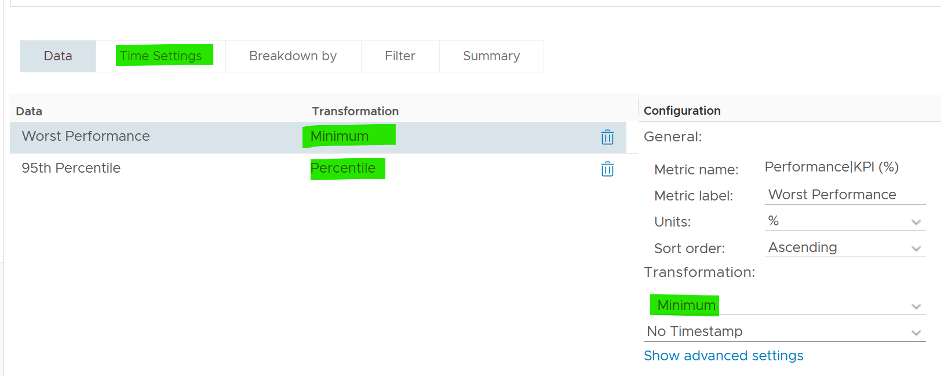
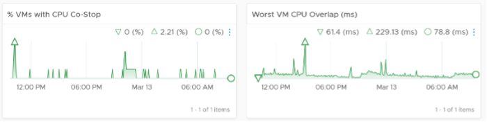
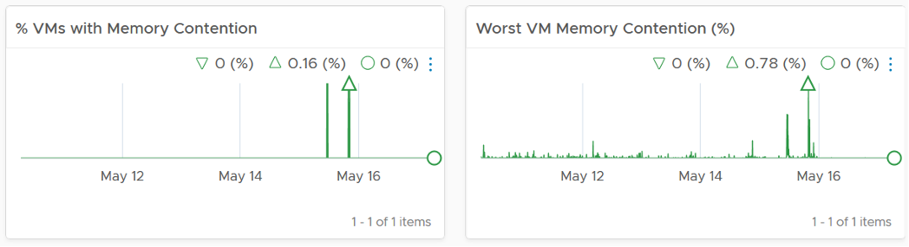
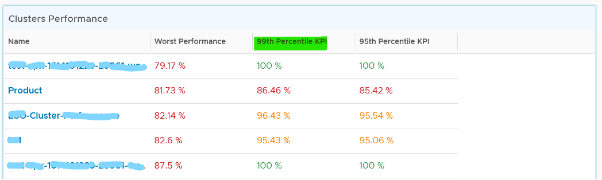

The Cluster Contention Dashboard is the ***primary*** dashboard for vSphere Cluster performance. It's designed for VMware Architects, and can be used in both monitoring and troubleshooting. Once you determine there is a performance issue, use the Cluster Utilization dashboard to see if the contention is caused by utilization near 100%. 

## Design Consideration

This dashboard is designed to be used as part of your [Standard Operating Procedure](https://en.wikipedia.org/wiki/Standard_operating_procedure) (SOP). It is meant to be used daily, hence the views are set to show data in the last 24 hours. The dashboard provides performance metrics for VMs in the selected data center. 

Utilization metrics are not shown in this dashboard at all. There are two reasons behind it:
- Separate the 2 concepts (utilization and contention) as they tend to get mixed.
- Keep the level of complexity manageable. A large and complex dashboard will also take longer to load. 

Both CPU and Memory are shown separately, because you can have one problem and not the other. CPU problems tend to be more common than Memory problems, due to lower overcommit ratio in memory in practice among customers. It is common to see customers do 4:1 CPU overcommit and only 2:1 memory overcommit. This conservative practice was due to the inherent higher value of memory counter. vSphere cluster shows high memory value as memory, giving the impression the actual utilization is high. And the reason for high value is modern Operating Systems like ESXi VMkernel uses memory as disk cache.

See the Performance Dashboard page for common design consideration among all the dashboards for performance management. 

## How to Use

Look at the "Average Cluster Performance (%)" health chart at the top of the dashboard. In a high performing environment, where all the clusters are doing well, you will see something like this. 

There was only one occurrence where the color is not green. At that time, the actual value is also relatively good.

On the other hand, if the clusters are unable to serve the VMs well, you will see something like this.

The average among all the clusters is no longer green, with a few occurrences of reds. The good part is the value does not trend downwards. 

As this KPI takes into account every single running VM in your environment, the number should be steady, especially in a large environment. The analogy in real life is the stock market index. While individual stocks can be volatile on a 5 minute by 5 minute basis, the overall index should be relatively steady. A big drop is called a market crash and that's not something you want in your environment.

The **relative** movement of the metric is as important as the **absolute** value of the metric. Your absolute number may not be as high you wish it to be, but if there have been no complaints for a long time, then perhaps there is no urgent business justification to improve it.

As the chart shows all the clusters, it uses the **vSphere World** object. This object is the parent of vCenter object, so it will show all clusters from all vCenter, making it suitable when you want to show everything. 

The actual metric used is **Performance \ Clusters Performance (%)**, as shown in the following dialog box. This is the primary KPI for your entire IaaS. It plots how your IaaS is performing every 5 minutes, giving you the trend view of overall performance.

The metric itself is simply the average of **Cluster KPI \ Performance (%)** metric. This performance metric in turn averages the **VM Performance \ Number of KPIs Breached** metric from all running VMs in the cluster. Hence a value of 100% indicates that every single running VM in the cluster is served well. Based on this formula, when do you want the cluster performance to turn red?

Let's take an example of a cluster with 500 VM. Each VM consumes 4 IaaS resource (CPU, Memory, Disk, Network), hence there are 500 x 4 = 2000 KPI instances that the cluster must deliver. As a result, the counter will turn yellow if one of these two happens:
- It can't serve 1% of the VM population, which is 5 VMs. None of these VMs get the 4 IaaS resource within the KPI threshold. In mission critical environment, You are expected to serve all the VMs well. In development environment, you may be able to get away with lower service level. 
- It fails to deliver one of the IaaS resources (CPU, Memory, Disk, Network) to 20 VM. 

More details on the formula were covered earlier here as it's an important foundation of IaaS performance KPI.

The counter will turn orange if one of these two happens:
- 3% of the VM population, which is 15 VMs, do not get any of the 4 IaaS resource within the threshold. 
- The cluster fails to deliver one of the IaaS resources to 60 VM.
Review the Clusters Performance table
- It lists all the clusters, sorted by the least performing in the last 1 week. You can change this time period.
- The Worst Performance shows the lowest number in the time period. As vRealize Operations collects every 5 minutes, there are 12 x 24 x 7 = 2016 data points in a week. This column shows the worst point among 2016 datapoints.

If the chart is showing green, then all is good. If not, you want to know which clusters are not performing. This is where the table comes in.

The table lists all the clusters, starting with the lowest performance. By default, it's showing data from the last 24 hours as this dashboard is designed to be part of your daily SOP.

The **Worst Performance** column shows the lowest performance in the last period, specified under Time Settings.

The problem with functions like Minimum() and Maximum() is their value can be extreme. All it takes is a single 5-minute collection to show bad data and the entire 24 hours (which is 288 data points) becomes bad. This is where the Percentile() function comes in. It tells you if the Worst Performance is something you should look further into or not. 

Can you figure out why we don't show average instead?

Average() is too late. It's covered previously here. 

Select a row (not the cluster name) to see the trend over time. All the health charts will automatically show the KPIs of the selected cluster. 

For performance, it's important to show both the depth and breadth of the performance problem, as explained here. A problem that impacts 1-2 VMs requires a different troubleshooting process than a problem that impacts all VMs in the cluster. 

The depth is shown by reporting the worst among any VM counter. So the highest value of VM CPU Ready, VM Memory contention, VM Disk Latency among all the running VMs are shown. If the worst number is good, then you do not need to look at the rest of the VM.

A large cluster with thousands of VM can have a single VM experiencing poor performance while >99.9% of the VM population is fine. The depth counter will not be able to report that most VMs are fine. It only reports the worst. This is there the breadth counters comes in. 

The breadth counters report the percentage of the VM population that is experiencing performance problems. The threshold is set to be stringent, as the goal is to provide early warning and enable proactive operations. 

VM CPU CoStop is included, but placed at lower priority than Ready because high CoStop does not mean the ESXi is struggling to serve the VMs. CoStop can be reduced by right-sizing an oversized VM, so the remediation action is not always on the ESXi Host. CPU Overlap is included as it can happen when there are many active VMs in the cluster.

Here is an example where the performance problem is clearly shown. You can see the cluster performance has regular drop in the last 7 days.

What's the problem?

The next 2 widgets show that CPU is a problem.

Memory is not an issue

## Points to Note

For network dropped packets, there are 2 types: physical (ESXi) and virtual (VM). The physical counter is used as that better represents infrastructure problems. The VM counter may suffer from a [false positive](https://en.wikipedia.org/wiki/False_positives_and_false_negatives). I recommend you customize this dashboard and add it anyway, for completeness.

Certain settings such as DRS automation level and the presence of many resource pools can impact performance. Consider adding a property widget to show relevant property of a selected cluster, and a relationship widget to show resource pools.

For a very large environment with many clusters, add a grouping to make the list more manageable. Group it by class of service, so you can focus on the more critical clusters. You can then adjust the threshold accordingly. For example, add the column 99th percentile to complement Worst and 95th Percentile. This is useful if you have clusters with large number of VMs.

