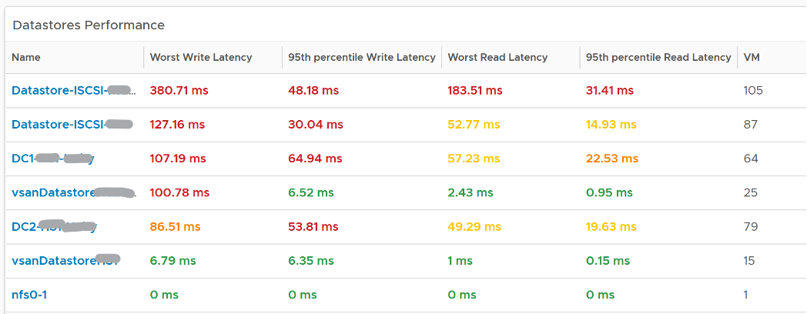
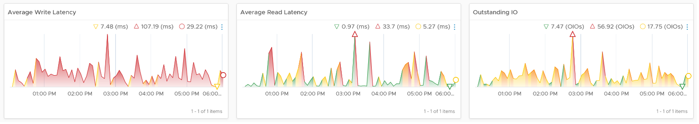

Use the Datastore Performance dashboard to view performance problems related to storage such as high latency, high outstanding IO, and low utilization. This dashboard is designed for both VMware administrator and Storage administrator, with the goal of fostering closer collaboration between the 2 team.

See the Performance Dashboard page for common design consideration among all the dashboards for performance management. 

This dashboard combines contention and utilization metrics in 1 dashboard, but still visually separate them for ease of use.

Local datastores are treated separately, as they have their own use case.

## How to Use

Select a data center from the Data centers table
- The list of shared datastores in the data center will be automatically shown, along with their KPI. note that datastore that is unavailable is not shown.

Review the Datastore Performance table
- Read and Write latency are shown separately for a better insight. The nature of read and write problem may not be the same so it’s useful to see the difference. 
- Both the worst (peak) performance and 95thpercentile are shown. If the later is close to the peak and it’s also high, then it’s a sustained problem. If the later is low, then it’s a short duration.
- The table is color coded. If your operations require a different threshold, edit the widget to adjust accordingly. 

Select a datastore you want to troubleshoot
- Its read latency, write latency and outstanding IO is automatically shown.
- Outstanding IO should be seen in conjunction with latency. It can be acceptable to have high number of IO in the queue, so long the actual latency is low
- Note the latency is the normalized average of all VMs in the datastore. 
- Its IOPS and throughput are also shown. These line charts are not color coded as it varies per customer. Edit the widget and add your expected threshold. It will make it easier for the operations team.
- Its list of VM is automatically shown

Select a VM you want to troubleshoot
- Its read latency and write latency are automatically shown.
- Note that this number is at the VM level. If you suspect one of the virtual disk has high latency, use the counter Peak Virtual Disk Read Latency (ms) and Peak Virtual Disk Write Latency (ms).
- Consider adding the VM Outstanding IO if you have the screen real estate.

## Points to Note
- The dashboard does not have datastore clusters. If your environment use it, add a View List to list them, and have this view list drives the Datastore Performance view list.
- If you have many VMs with virtual disks on multiple datastores, add a View List widget to list the individual virtual disks. Use this list to plot the latency of individual virtual disk. 