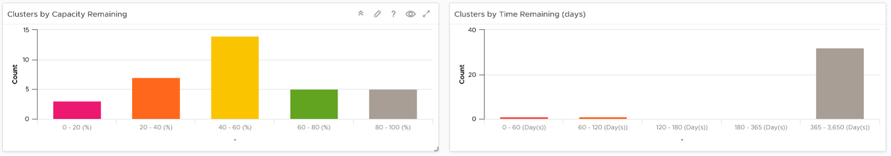
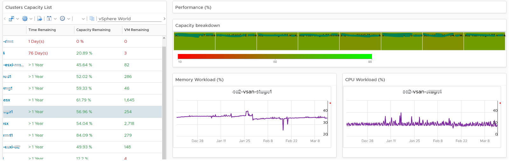

The **Cluster Capacity** dashboard is designed for Capacity Team, not day to day Operations team. It provides long term and top down view, enabling the capacity team to better plan future expansion and ageing hardware technological refresh.

## Design Consideration

See the Capacity Dashboards page for common design consideration among all the dashboards for capacity management. 

The dashboard considers all factors that impact capacity: 
- Utilization
- Allocation
- Reclamation
- Contention

Utilization is the primary counter for capacity, as it reflects the actual, live usage of the resources. If utilization is high, it does not matter if the overcommit ratio is far below your target, the cluster is full. On the other hand, if utilization is very low, that is not a good thing either. Unless it’s a newly provisioned cluster, that could indicates wastage.

Allocation complements utilization as not all workload is real. This is covered in the Capacity chapter, under Allocation Model.

Reclamation is included as that can impact your decision, and wastage is pretty common. Capacity can be low, but if you can reclaim a sizeable chunk of wastage, you can defer hardware purchase.

Wastage is shown by a new color. Dark grey indicates wastage as capacity is not used. In fact, there can be performance problem is the low utilization was caused by bottleneck somewhere else. 

Contention is included as it directly measures performance. If your cluster is unable to serve its existing workload, then it is unwise to add new workload. By definition, if the cluster does not have room for new workload, then its capacity is full. The ideal scenario is the cluster is running at 100% utilization but 0% contention, because it’s working as productively as possible. You get your investment well used.

## How to Use

The dashboard is layered, gradually providing details as you work top down in the dashboard.

The first layer shows 2 distribution charts
- Bar charts summarize the clusters based on capacity remaining and time remaining. Just because you are running low on capacity does not mean you are running out of time. Cluster with a cyclical loads that hits high utilization but never trends toward 100% will have low capacity remaining, but plenty of time remaining.
- The two bar charts work *together*. The ideal situation is low Capacity Remaining and high Time Remaining. This means your resources are cost effective and working as expected.

The second layer shows a heat map
- The three heat maps are Time Remaining, Capacity Remaining, and VM Remaining.
- The cluster size has been made constant for ease of use and better focus on the action to be taken. If your cluster sizes are not standardized, consider using the number of ESXi hosts to show the size difference. 

The third layer shows a table, accompanied by other widgets to show details of selected cluster
- Clusters Capacity List. If any cluster needs attention, then select the cluster to view the related details.
- Utilization displayed for three months and not one week. The daily average is displayed and not the hourly average and the focus is on consumed memory and not active memory.
- Reservation can impact the efficiency of your cluster. If your cluster size varies, complement the reservation number by showing relative value. You will need a super metric for that.

No of VM are shown because newly provisioned may not yet be active. They are often mistaken as idle, as they can remain unused for months. If you see VM growing but demand remains low, that's a sign of potential demand coming up in the future. 
- Workload can be low, but is overcommit ratio high? Newly provisioned VMs tend to be idle for weeks, and suddenly grow. Use the VM Count to see if there was recent growth.
- Why is it low on capacity? Is it because of real workload, or just reservation?

## Points to Note

- If you find it useful, add a drill-down to the **ESXi Capacity** dashboard and **VM Capacity** dashboard. A logical place to initiate this drill down is in the **Cluster Capacity List** widget. Link this widget into the table of ESXi Host in the destination dashboard. 
- If you have the screen real estate, add cluster size information. Small clusters are less efficient from a capacity perspective due to higher overhead and the inability to support larger VMs.
- The peak is defined as the highest among any ESXi hosts. If the peak is higher than the cluster-wide average, then it is unbalanced and is a common reason for suboptimal capacity. You can add a peak to complement the average utilization. Find out the cause of unbalance and optimize it.
- Add peak to complement average utilization. This lets you focus on unbalance, a common reason for suboptimal capacity. Find out the source of unbalance, which can be opportunity for optimization.
- This dashboard is not designed for stretched cluster, as this needs its own capacity model. You will need to have an object or custom group for each site, and then displays them side by side.