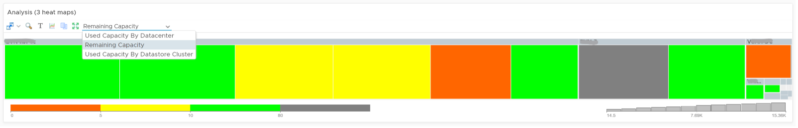
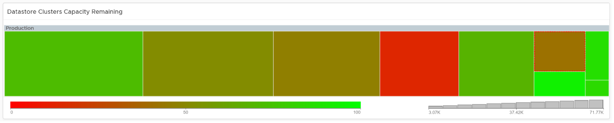

The **Datastore Capacity** dashboard is designed for Capacity Team, not day to day Operations team. It provides long term and top down view, enabling the capacity team to better plan future expansion and ageing hardware technological refresh. This dashboard is designed for both VMware administrator and Storage administrator, with the goal of fostering closer collaboration between the 2 team.

## Design Consideration

See the Capacity Dashboards page for common design consideration among all the dashboards for capacity management. 

This dashboard complements out of the box pages by highlighting the datastores that need attention. It shows 2 distribution charts, grouping datastores with capacity remaining and time remaining. 

Local Datastores are shown separately as a table on its own, at the end of this dashboard. Avoid running VMs on local datastores, unless its storage requirements can be met with a local disk.

## How to Use

The dashboard is layered, gradually providing details as you work top down in the dashboard.

 
The first layer shows 2 distribution charts
- Bar charts summarize the datastores based on capacity remaining and time remaining. Just because you are running low on capacity does not mean you are running out of time. 
- The two bar charts work together. The ideal situation is low Capacity Remaining and high Time Remaining. This means your resources are cost effective and working as expected.

 
The second layer shows a heat map
- There are three heat maps, the primary being Remaining Capacity heat map. The 2 other heat maps cover Used Capacity. One of them is designed for environment that use Datastore Clusters
- Each box represents a datastore. If you have many datastores, the heat map will group them. You can drill down to see its members. The larger the datastore, the larger its box is. If you have many small datastores, consolidation can make operations easier.
- The color indicates usage. Low utilization is marked as grey, not green, as it represents waste.

)
 
Review the **Shared Datastores** table
- The table provides a summary, showing all datastores a glance. They are grouped by Data center. If you use Datastore Cluster as your standard, replace the grouping with it.
- Here are some of the things you can do: 
  - Sort by any column. You can quickly see which datastores are running out of capacity,
  - Filter to a specific vCenter, or even Data center. This is handy in large environment.
- The table is sorted by the least capacity remaining. 

Select a datastore from the table
- The remaining widgets will automatically show the capacity details of the selected datastore
- For disk space, the total capacity, allocated and actual used are shown. Compare the total capacity vs provisioned vs used. If allocated space grow but actual do not, that could mean the VMs are yet to use it. Watch out, you can run out of space sooner than expected.
- There are three reclamation opportunities: powered off VM, snapshot, and orphaned VMDK. 
  - The snapshot must be 0 GB. If it is not 0, then it should be temporary. A snapshot lasting beyond a day must be investigated. 
  - Orphaned VMDK are the ones that are not associated to any VM. The orphaned VMDK must be 0.

## Points to Note

If you are using “thin on thin”, meaning the underlying LUN is also thin provisioned, add visibility into the physical array.

The dashboard does not have **datastore clusters**. If your environment use it, modify this dashboard or create a new one. In a large environment with many datastores and datastore clusters, add a View List to list the datastore clusters so you get summary information. From this list, drives the datastore view list. Alternatively, create a heat map, listing the datastore clusters. 

