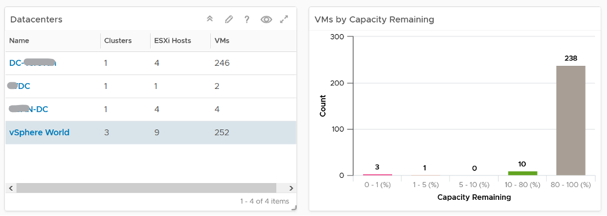
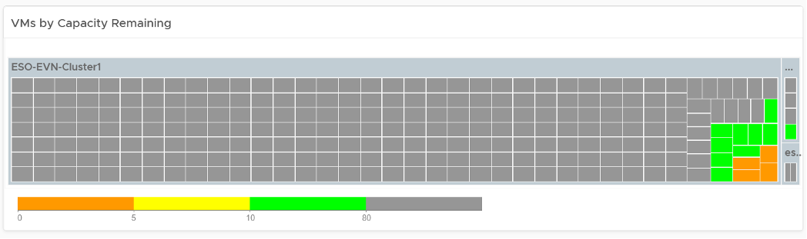
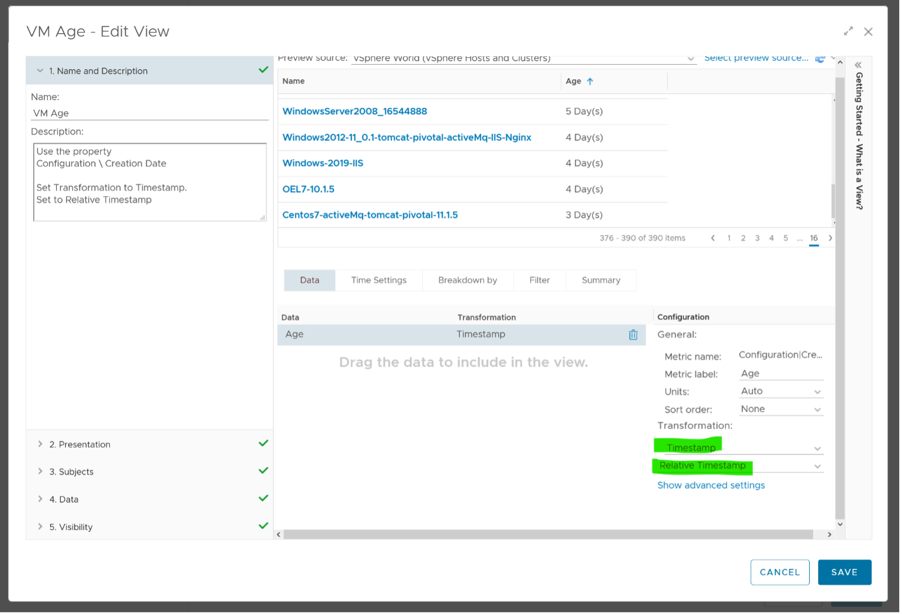

The VM Capacity dashboard is designed for Capacity Team, not day to day Operations team. It provides long term and top down view, enabling the capacity team to better plan future expansion and ageing hardware technological refresh.

See the Capacity Dashboards page for common design consideration among all the dashboards for capacity management. 

## How to Use

Select a data center from the Data centers table. To show from all clusters, select vSphere World. This object covers all clusters. Take note that the charts will take longer due to refresh due to higher amount of data.

 
The bar chart will show the distribution of VM by capacity remaining in the selected data center. It gives you a quick overview if many VMs are undersized or oversized. The bucket size has been designed to map the default settings in VM capacity policy.

Review the heat map[^1]. It provides the next level of details by grouping the VMs by clusters, so you can see which clusters need to be attended to.

 
Note the VM size has been standardized for better visualization. If it suits your capacity team better, add the size. Note that you have to pick CPU or Memory, so you may have to create 2 heat maps.

Review the table listing all VMs in the selected data center.

The list is sorted by the VM with the least capacity remaining. If it suits your capacity team better, sort it by Time Remaining.

The table is also color coded. Take note that the threshold is unable to show the grey (wastage) color.

Select a VM from the list. All the remaining widgets will automatically show the capacity information of the selected VM 

The CPU and Memory utilization are automatically shown. 3 months data is shown, and they are averaged to hourly so you can see the overall trend. 

Right-sizing recommendation is also shown for both CPU and Memory. Unlike physical server, it's important to right-size VM for the benefits listed here. 

For CPU, the CPU Usage counter is used instead of Demand. Use the knowledge you learned here to figure out why.

For disk, it’s showing at the Guest OS partition level. There is no overall capacity at VM level because different partitions have different capacity.

## Points to Note

Add more information in the table to give context to the VM. Information such as VM Owner, clusters where the VM is running, and datastores where the VM files are stored can be useful in the analysis. 

There is a known bug in the age of the VM scoreboard. As a workaround, create a View List, and choose the VM property **Configuration \ Creation Date**. Choose the **Transformation: Timestamp** and then **Relative Timestamp**.

[^1]: vRealize Operations 8.4 sorts the heat map when the size is identical. You are welcome.