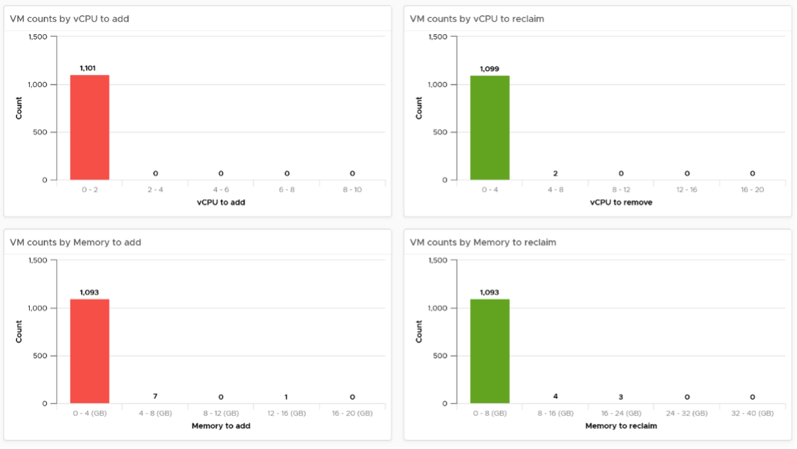
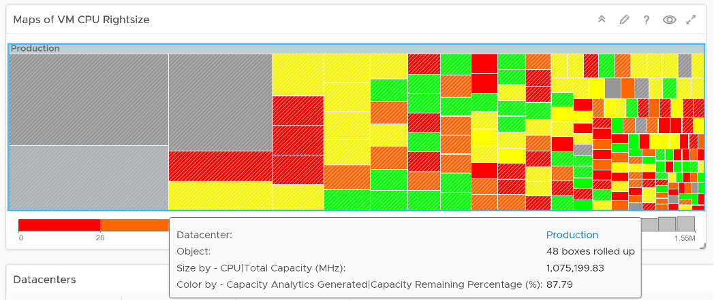

The VM Rightsizing dashboard helps you in adjusting the VM size for optimal performance and capacity. It covers both undersized and oversized scenarios. It is designed for both the Capacity team and the Operations team, as rightsizing VM has benefit for day to day performance.

## How to Use

Select a data center from the Data centers table
- The cluster capacity remaining is provided to give better context. Focus on reclaiming on cluster that is low on capacity remaining, and focus on upsizing on cluster with high capacity remaining.

 
The 4 tables showing the rightsizing is automatically shown.
- 2 tables for upsizing recommendation. One for CPU and one for Memory.
- 2 tables for downsizing recommendation. One for CPU and one for Memory.
- The business processes for oversized and undersized VMs are different, as one requires the affected VM to be shut down and the Owner to give back resources. For upsize, you want to add incrementally or even automate this process. For downsize, you want to remove in one change window as the effort to reduce is the same and there will be only one downtime.
- The metrics used are Summary \ Oversized \ Virtual CPUs and Summary \ Undersized \ Virtual CPUs. It stores the capacity engine calculation on recommended number of vCPUs that must be removed or added.

## Points to Note

You can enhance the dashboard if you need to convey the overall situation to senior management. You plot every single powered-on VM in the environment, sized by their vCPU. In this way, the monster VMs will be highlighted. A 64 vCPU VM will appear 64x larger than a single vCPU VM. This is good as the focus should be on the large VM, as discussed here. 

The heat map colors the VM by its capacity remaining. A VM with high capacity remaining means it has plenty of wastage resources.

What would it look like on an environment with many monster VMs that are oversized? You get something like this. The grey boxes dominate the space of the heat map. One of the boxes consist of 48 VMs with total > 1000 GHz. All of them have 87.79% capacity remaining. Another word, they are oversized.

You may want to do the same for memory.