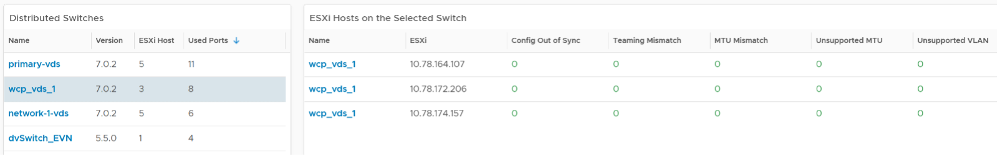

Use the Network Configuration dashboard to view the overall configuration of vSphere distributed switch in your environment, especially for the areas that need attention.

The dashboard is designed with the same considerations that are common among all the configuration management dashboards. 

## How to Use

The dashboard is organized into 2 sections for ease of use. 

 
The first section displays network configurations that needs your attention
- There are 5 bar charts that focuses on critical security settings. 
- The last bar chat shows the version of the vSphere Distribution Switch. Aim to keep the version current, or matching your vSphere version.

The second section provides overall configuration, with ability to drill down into a particular switch
- Start by selecting a switch from the list.
- The ESXi Hosts, port groups and VMs on the switch will automatically be shown. 
- Review each of the tables. For the ESXi Host table, ensure their settings are consistent. 
- Some of the columns are color coded to facilitate quick reviews. Adjust their threshold to either reflect your current situation or your desired ideal state. 
- You can sort the columns and export the result into spreadsheet for further analysis.

## Points to Note
For a more complete visibility, consider adding physical network device monitoring by using the appropriate management pack. More info [here](https://www.vmware.com/products/vrealize-operations.html).