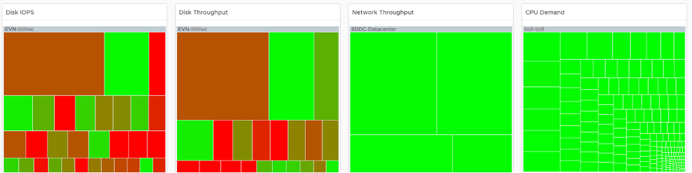

This dashboard helps you analyze the misuse of the shared infrastructure. This dashboard displays details of VMs misusing the shared infrastructure and if that has caused performance problems to the other VMs. The cause for excessive load might be due to security attacks, for example, denial of service, process runaway, or mass activation of agents. 

## Design Consideration

See the Performance Dashboard page for common design consideration among all the dashboards for performance management. 

In shared environment, it is possible to have victim-villain problem. In the heat map, the villain VM is the one with the largest box size, while the victim is the one with red box. If a handful of VMs are dominating the shared infrastructure, their collective size will be highly visible on the dashboard.

There are 4 areas where a monster VM can impact its neighbours. 
- CPU. 
- Disk IOPS. Any VM with PVSCSI can generate very high IOPS. Since this hits the underlying physical storage, the view is grouped by Data center, not Datastore or Cluster.
- Disk Throughput. Apps with large block size (e.g. 4 MB) can consume bandwidth without generating high IOPS
- Network. 

Memory is not needed as it’s rare for Guest OS to actively read/write from DIMM. It’s mostly cache. Think of it like disk space (passive).

Remediation Action you should take: Check why the VMs are generating excessive load.

## How to Use

There are 4 heat maps, showing the 4 different loads that can be excessive. The heat map displays the relative value and not the absolute value. A VM does not generate a high load in the absolute term just because it has large configuration.

 
Each heat map has their own color threshold, reflecting the nature of the contention metrics used in each of them.

For NOC Operator, drill down by selecting one of the VM on the heat map

 
All the 4 line charts are automatically showing, enabling you to get a more complete picture of the selected VM.

## Points to Note

- Memory is not shown as it’s a form of storage. The memory counters are space utilization, not speed. Think of disk space instead of IOPS. It can cause capacity problem on the shared ESXi host, but not performance problem to other VMs. 
- In a large environment, it might be difficult to view a small victim VM. Consider having multiple dashboards and rotate among them.