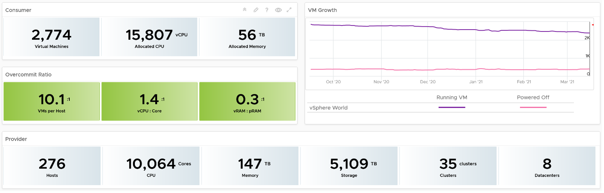
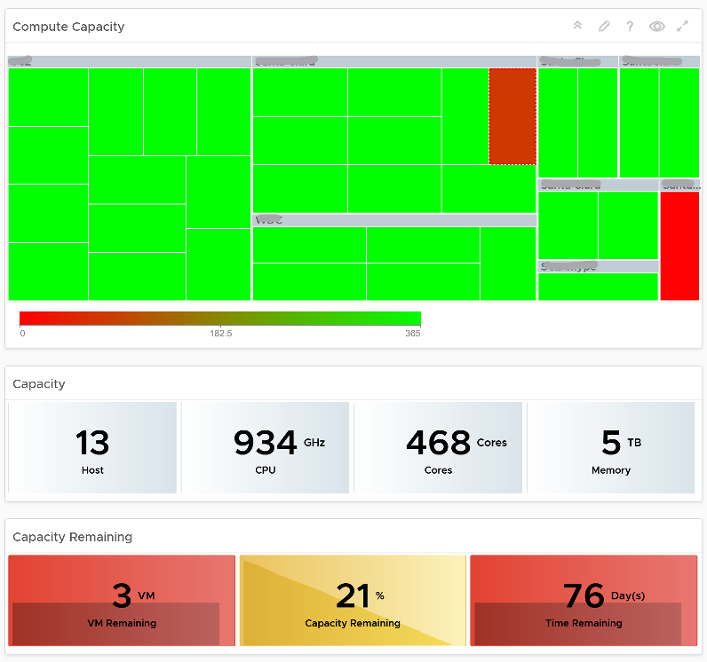

This dashboard is used by the Ops team to explain capacity to the IT Management team. It works together with the Inventory Summary dashboard. The inventory provides details on available resources and what is running on these resources. The capacity provides details on the remaining capacity and time.

## Design Consideration

See the Executive Summary Dashboards page for common design consideration among all the dashboards for IT senior management. 

## How to Use

The dashboard has 2 sections.
- The top section provides summary at the vSphere World level.
- The bottom section enables drill down into individual compute or storage capacity

The weekly average of VM growth is displayed to provide holistic visibility of overall growth across all Data centers for both running and powered off workloads. If the increase in VM count is not accompanied by corresponding increase in utilization, these newly provisioned VMs are likely not yet used.

Overcommit Ratio highlights the efficiency gained by vSphere virtualization running multiple workloads on shared infrastructure. It is important to note that overcommitment needs to be further reviewed in conjunction with elevated resource contention (refer to contention dashboards) to understand the performance impact when running VMs competing for resources. In general, Overcommit is required to be financially more economical than the public cloud. As a reference, AWS typically overcommits CPU 2:1 by counting the hyper-threading and does not overcommit memory. Note: vRealize Operations uses Physical CPU Cores not Logical Cores (Hyper-threading) for all CPU-based capacity calculations 

The bottom part of the dashboard is split into 2 columns: 
- compute 
- storage

Network is not added due to its nature. It's an interconnect, not nodes, so capacity is much harder to compute.

The dashboard uses the term compute (and not vSphere Cluster) and storage (and not vSphere datastore) to keep the visual simple. 

The two columns have identical design. The heat map displays capacity by size and colored by time remaining. However, for compute the size of each box in the heat map is fixed as there is no single metric to represent the size. A cluster size can be measured in 4 different ways (No of ESXi Hosts, Total CPU GHz, Total CPU cores, and Total Memory).

Here is what the compute portion looks like. The heat map is interactive. By selecting one of the cluster, you can further drill-down to clearly understand remaining capacity and time (in days).

 
Here is what the storage portion looks like. They are designed to be similar

 
## Points to Note
- Capacity Remaining is not shown at the world level as it could be misleading, especially in global or large infrastructure. Clusters also tend to serve different purpose, and they are not interchangeable. 
- If you are using both on-prem and external cloud, for example, VMware on AWS, consider splitting the dashboard into 2 columns. You would need extra screen real estate though.