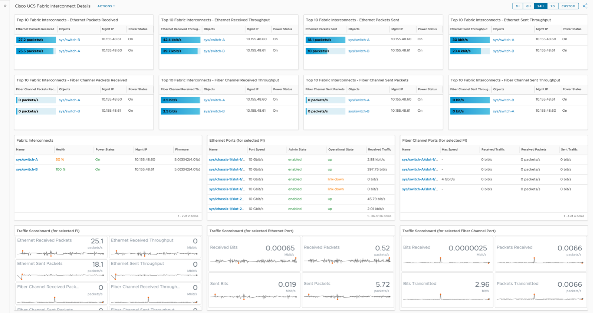
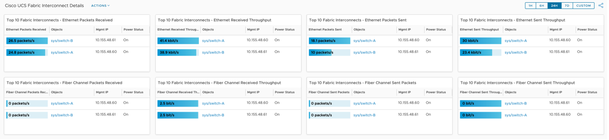
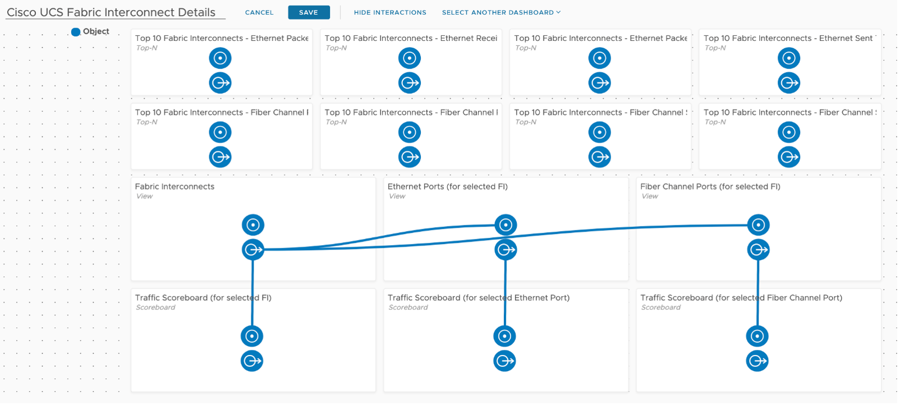
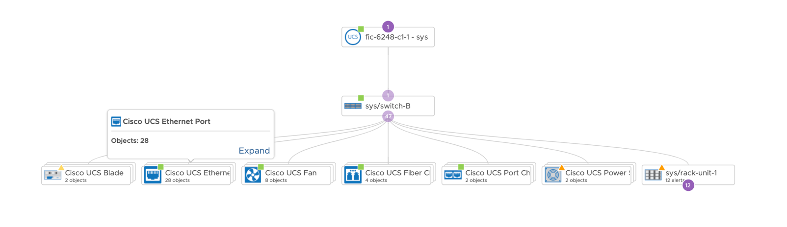

The Cisco UCS Fabric Interconnect Details dashboard is used by System Administrators (SAs) to find Fabric Interconnects (FIs) with the most traffic. It is used in cooperation with the other dashboards in the vRTVS management pack for Cisco UCS to troubleshooting problems and find busy FIs and FI Ports, both ethernet and fiber channel.

This is a custom dashboard. You can download it [here](https://code.vmware.com/samples?id=7581) on VMware {code}:

The Cisco UCS Fabric Interconnect Details dashboard was designed to show traffic flowing through FIs. By many SAs, FIs are considered the most important piece of the Cisco UCS architecture. Acting as a gateway from the UCS hardware itself (chassis, blades, etc), the FIs serve as a network switch distributing both ethernet and fibre channel traffic out to networks.

## How to Use

The top two rows provide the user with Top-N widgets showing which FIs are more heavily used. Both ethernet and fibre channel traffic are shown here.

I've included the Management IP and Power Status for each FI for ease of use, giving the consumer visibility into each property. I've taken the default blue/grey colors to avoid red/yellow/green, but the user can adjust as they wish. Simply edit the widget and go here.

The second half of the dashboard includes three views, showing the FIs and their ethernet and fiber channel ports.

I've configured these such that the user will select an FI which will drive the other five widgets. The widget interaction looks like this.

It's important to note that Ethernet Ports and Fiber Channel Ports are children of the Fabric Interconnect. This is documented [here](https://docs.vmware.com/en/VMware-vRealize-True-Visibility-Suite/1.0/cisco-ucs/GUID-1C1FE7CD-44C1-4827-B3EA-FCFBDAF373F3.html) in the TVS guide.

It can be seen visually by going to the FI Summary Page and exploring the Metrics tab.

You'll notice the FI above has several child objects, Ethernet Ports and Fiber Channel Ports are the two we are interested in there from a traffic perspective.

Looking in detail at the FI and Port Views, the user is presented with Health, Power Status, Admin State, Operational State, and other metrics to provide some detail around each object.

You'll notice that I've used custom colors in the underlying Views to highlight degraded Health, Power Status, Admin State, and Operational State. The user can adjust these colors and thresholds in the Views themselves, here's the Cisco UCS FI Details View.

I've configured the Ethernet Port and Fiber Channel Port Views to auto select the first row, such that their respective Scoreboard widgets are populated upon selection of the FI.

Looking at the Scoreboards in detail gives the user visibility into both current and historic traffic details. This will allow the user to determine if/when traffic started to increase or decrease. Hovering over any metric gives the user the same ability to see more detail described previously in the MS SQL section.

