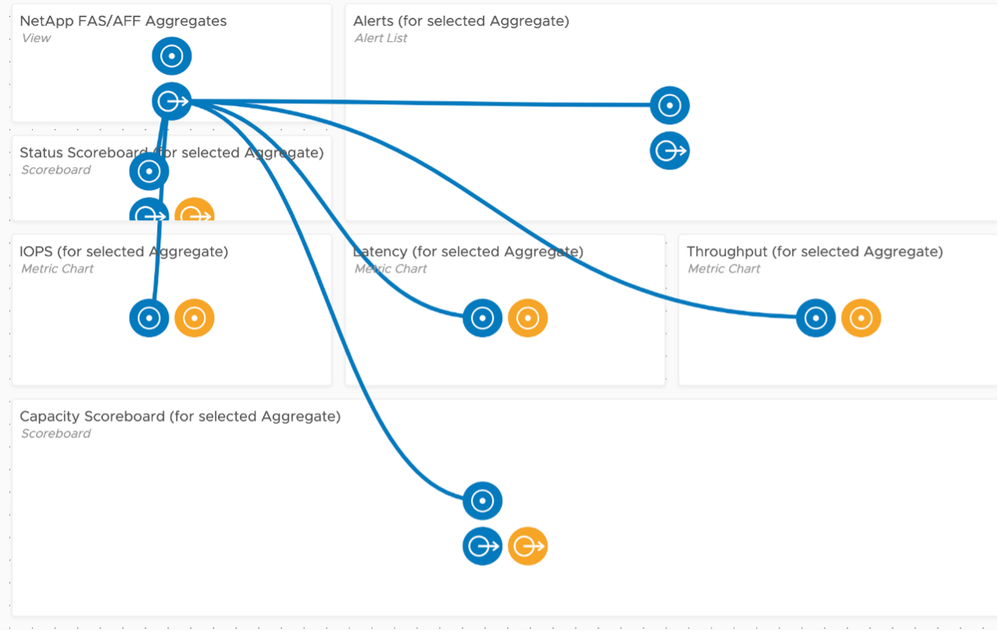
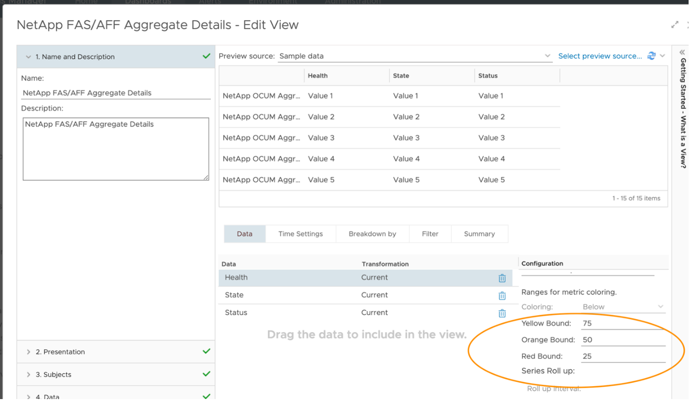
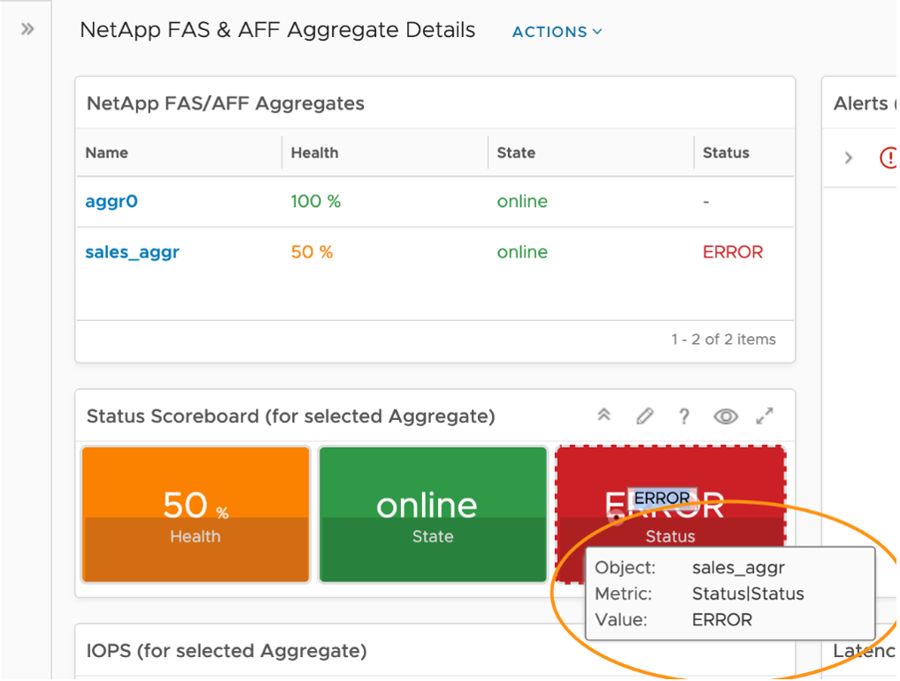
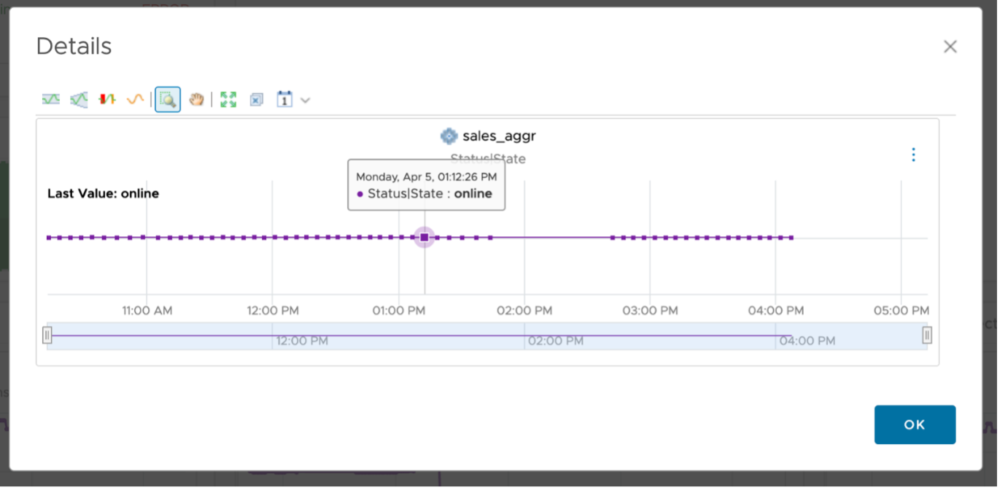
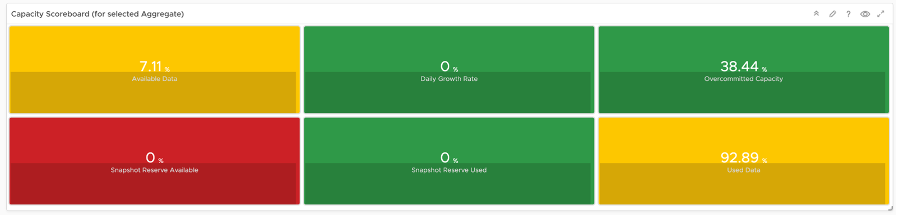

The NetApp FAS & AFF Aggregate Details is generally used by storage administrators to explore the health, capacity position, and performance of their NetApp FAS & AFF Aggregates. It can be used as an environmental overview type dashboard, showing capacity managers their current capacity position. It can also be used to find potential performance issues.

This is a custom dashboard. You can download it [here](https://code.vmware.com/samples/7582/netapp-fas-and-aff-aggregate-details-dashboard) on VMware {code}:

 
The NetApp FAS & AFF Aggregate Details dashboard was designed to show the performance and capacity position of all NetApp FAS & AFF Aggregates. It is designed to flow from top left to the bottom, allowing the user to select an Aggregate and all other widgets will be populated. The widget interaction looks like this.

 
## How to Use

Select an Aggregate in the top left View widget, which will drive all other widgets. The top left View was configured to show a list of Aggregates, their Health, State, and Status. The View uses red/yellow/green colors to reflect the spectrum from bad to good. Here is the View showing the Health metric colors.

Once an Aggregate has been chosen, all other widgets will be populated. Just below the list of Aggregates you will see Aggregate state and status. To the right you will see all Alerts. The vRTVS management pack for NetApp FAS & AFF consumes all NetApp OCUM/AIQUM generated alerts. The Alert List widget here shows all Alerts (both active and inactive) for the Aggregate and any child objects, but this is configurable. If you only want to see active alerts, edit the widget, go to Output Filter – Alert Related, and select the Active box.

 
The Status Scoreboard has been configured to show the immediate value of the metric and its history. Hovering over a metric gives you the details behind it and the ability to double click for more details.

 
Double clicking gives you a timeline for that particular metric and the ability to see things like dynamic thresholds, adjust timelines, and more. 

 
Next is a row of Metric Chart widgets showing IOPS, Latency, and Throughput for the selected Aggregate, giving the user visibility into the current performance of the Aggregate and how it compares historically.

 
In the top right of each Metric Chart widget there are two buttons, one graph icon and the ellipses (three vertical dots) for more detail. Hovering over the graph indicates that it's for Correlation.

 
Correlation gives us the opportunity to correlate the existing metric with other metrics on this particular object or against other metrics on peer objects. Choosing the Self-Metrics tile will show you other metrics on the same object that are behaving similarly.

The final row in this dashboard is a Scoreboard widget showing capacity metrics over time. All features previously discussed are applicable here as well.
 
