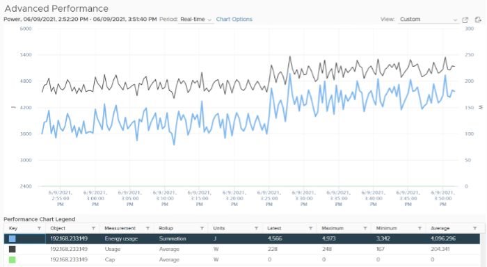
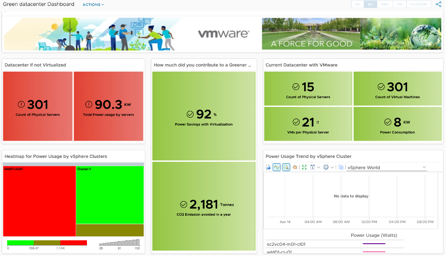

Customer's requirements to VMware can largely be classified into 2 timeline:

##### Past 	
- What has been achieved.
- Demonstrates their savings and achievement to date. They want both the relative comparison and absolute value. The relative is show case they leading their peers in the industry, and performs better than public cloud. The absolute shows the hard numbers on their green impact to the environment.

##### Future
- What can be achieved
- Find and realize future potential environmental benefits by optimizing their virtual environment and virtualizing their remaining physical environment. Optimization covers a wide range of wastage and efficiency, such as zombie VM and EC2, oversized datastores, and islands of clusters. Virtualizing is not limited to server, but include storage, back up, security, network, and non x86 workload.

To implement the above requirements, we need to see 3 aspects of **Sustainable Operations**:

##### Clean Demand	
- This means genuine demand, required by either business or IT.
- Opportunity to clean up the demand:
  - Orphaned files, VMDK, VM, LUN. They may not even appear in the inventory.
  - Powered off VM. Not orphaned as it appears in Inventory.
  - Snapshot, both at VM level and storage level.
  - Idle VM. Cover AWS EC2, Azure VM, GCP VM.
  - Unused VM (cover AWS EC2, Azure VM, GCP VM). They may not be idle, but no business usage anymore. The VM owner may have left the company
  - Unused AWS storage files or K8 shared volume. The VM no longer uses them.
  - Oversized VM. Cover AWS EC2, Azure VM, GCP VM (could be worse due to their fixed size).
  - Runaway VM or EC2. They consume excessive resource due, typically due to software bug such as memory leak or CPU lock
  - Unmap files at storage level.
  - Reduction of agents. While each agent maybe light in resource, collectively they can result in high overhead.

##### Green Supply
- Hardware & Software infrastructure that is optimized
- Opportunity to optimize the supply
  - Fibre Channel -> Ethernet consolidation. No need 2 separate network for storage and server.
  - Physical Array -> vSAN migration. HCI consumes less power and DC footprint.
  - Physical Network -> NSX migration. Physical FW, LB, etc
  - Islands of hardware due to physical air gaps -> NSX
  - Ageing hardware. Newer CPU has more cores and more power efficient
  - Physical Desktop -> VDI with thin client. This also improves security.
  - Incorrect power mgmt settings. Many customers like to set power management to Max, legacy of old best practice.
  - Oversized cluster, datastore, storage arrays, physical switches, SAN fabric, network devices.
  - Unused resource (physical servers, network devices, network ports). Old equipment are easily forgotten in large environment.
  - Smaller DC footprint. Less land usage.

##### Lean Operations	
- Run with minimal overhead and buffer
- Opportunity to optimize the operations itself (process, people, tools)
  - SLA-based Operations. Customers can go beyond the simple Availability SLA and introduce Performance SLA and Compliance SLA. Using the Class of Service feature, they provide differentiated services.
  - Business-aware Operations. Using a proper inventory of VM, grouped by Business Units and Applications, customers can show how the business runs on the IaaS platform.
  - On-Demand scaling. Some customers like GIC in Singapore implemented on-demand scaling for VDI. On the weekend it's reset back to original size.
  - Correct utilization counters. Current counters are legacy of Virtual Center 1.0, have not changed in 17 years. Virtualization has matured but we still use the highly conservative counters, resulting in excess hardware. By using the correct counters for the correct use case, customers can run higher utilization.

Total Carbon Emissions footprint or CO2 Avoidance have become two important data center KPIs for all organisations of all sizes. vRealize Operations helps by providing the observability required to calculate and understand what an organisation's CO2 footprint looks like when the power metrics of vSphere and SDDC objects monitored are calculated and visualised. 

vRealize Operations collects power consumption metrics (Energy in Joules and Power in Watts) for ESXi Host and VM objects. These metrics can be used to calculate power savings and CO2 emissions using super metrics. 

 
ESXi has an extra metric called Cap. I've not seen it used, and how its impacts on performance is measured. If you know, let me know.

Energy Usage is the total consumption over a period of time. It's expressed in Joule or Watt-hour, where 1 Wh = 3600 J. Using car analogy, think of it as distance covered in 1 hour.

Usage is the rate. It's the consumption at any given second. So if you consume 1 W non stop for 10 hour, you consume 10 Wh. If you consume 1 W non stop for 0.5 hour, you consume 0.5 Wh. 

Take note that Energy Usage is not carried forward to the next collection cycle. It gets reset to 0. So if you want to know the total power consumed in the last 1 hour (as the chart below covers 1 hour), you need to sum all the data points. You can't take the average. 

For Energy, you can take average, min and max of the data points. You don't sum them up.

 
Calculations for these dashboards are aimed to be conservative, hence your actual savings are likely to be more. 

We are not including the following in the above savings calculation:
- Physical buildings and land. With virtualization, you consume less footprint. This means less physical rack.
- Network equipment - Less physical servers mean less network ports. Because firewall, load balancers, IDS, IPS can be VM, you have less equipment.
- Other components like UPS, facilities, lighting, cooling and labour.

Assumptions and references:
- Power consumption of a small server (1 socket, 10 cores, 32 GB RAM) = 0.1 KW 
- CO2 emission per KWh = 0.6 Kg (from [IEA Global Energy & CO2 Status Report 2019](https://www.iea.org/reports/global-energy-co2-status-report-2019/electricity#abstract)) 
- Electricity cost = $0.106 per KWh (based on contiguous US average value, see [VMware TCO Reference Calculator](https://www.vmware.com/content/dam/digitalmarketing/vmware/en/pdf/whitepaper/vmware-tco-comparison-calculator-methodology-whitepaper.pdf)) 
- Tree offset for CO2 Emission = 36.4 pound of carbon per tree (see United States [Environmental Protection Agency report on Greenhouse Gases Equivalencies calculator](https://www.epa.gov/energy/greenhouse-gas-equivalencies-calculator)) which is equivalent to 36.4 * 2.24 Kg of carbon per tree.

## Environment Savings

This dashboard compares physical vs virtual workloads. Physical means every single VM would exist as a physical server, though much smaller than an ESXi Host, if they were not virtualized. While a small physical server draws a lot less power than ESXi, it adds up, especially over time. The dashboard compares power consumption of all the theoretical non-virtualized workloads with the actual power consumption of the ESXi hosts. 

 
The calculations applied to the Sustainability supermetrics are detailed below and can all be modified as required through vRealize Operations under the respective calculations to reflect regional factors that are at different values for each customer environment (e.g. Power cost per KWh - set to 0.106 in this dashboard):
- Power Consumed before Virtualization = Number of VMs x 0.1 in KW 
- Power Consumed after Virtualization = Power Consumed by all ESXi hosts in KW 
- Monthly savings ($) = Power Savings in a month in KWh x 0.106 
- Carbon Emissions before Virtualization = Power consumed in KWh before Virtualization x 0.744 Kg 
- Carbon Emissions after Virtualization = Power consumed in KWh after Virtualization x 0.744 Kg 

## Environmental Impact

The Dashboard identifies the Idle VMs and Power savings that could be achieved by reclaiming them. It also provides their associated CO2 emissions. While each VM may only consume a small amount of power, collectively the impact starts to add up. Additionally, this dashboard displays the idle VMs per cluster, so you can see where your inefficiencies lie within each cluster. 

 
Idle workloads (VMs) are quantified here with the potential power savings that could be achieved by decommissioning the workloads. The dashboard also provides CO2 emissions amount calculated from this group of VMs. While each VM only consumes a tiny amount of power (approximately 0.x - 2 Watts), collectively and over time they can add up depending on how efficiently you have been right-sizing your environment on a regular basis. Additionally, the cluster view helps to aggregate the number of idle VMs per cluster, so identifying which clusters have a lot of Idle VMs is easier. Finally, by leveraging published [EPA](https://www.epa.gov/energy/greenhouse-gas-equivalencies-calculator) multipliers, your are able to calculate using super metric, the number of trees to plant that can help compensate CO2 emissions from these idle VMs.

CO2 emission from Idle VMs = Power Consumed by Idle VMs x 0.744 Kg.

Trees required to compensate CO2 emission due to Idle VMs = CO2 emission from Idle VMs (Kg) / (36.4 x 2.22)

## Green Data Center Dashboard

The Green Data Center view represents a comparison of what the CO2 emissions footprint would be calculated if every VM in the environment was a physical server (based on average industry values for server power usage in KWh). A total tally of the physical server count and total power usage is reflected on the left representing the negative impact on Sustainability goals. 

Then the center column of views represents the total amount of CO2 avoidance and power savings achieved with VMware virtualisation having consolidated this total number of physical workloads into VMs. This reflects a KPI for businesses to highlight on this executive view.

Lastly, the views on the right represent a current state view of the inventory virtualised with trends and a heatmap to help identify clusters that potential targets for further consolidation and efficiency.

 
## Identify Green Options to Run Workload Dashboard

This dashboard is designed to be an interactive way to allow users to identify which VM's, ESXi hosts and Compute Clusters are consuming the most power (Watts). The Geographical dashboard view allows representation of the various Green Data Center objects based on their "green score" KPI. ESXi hosts that are tagged by host hardware model details identified from object native metrics are also categorised on the bottom to help identify and compare power efficiencies for all hardware models in use.

{}
Additional configuration will be required after importing the dashboard package to assign geographical tag against the ESXi hosts and editing their respective vendor model details. Refer to the import instructions for additional detail.
{} 
 
