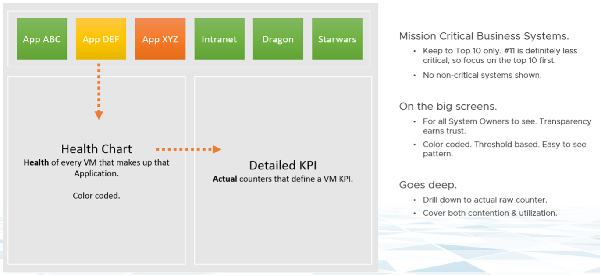
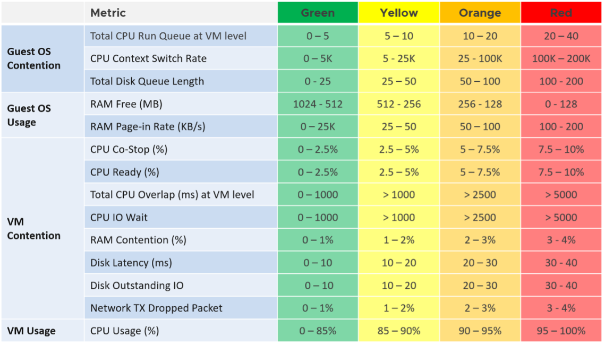
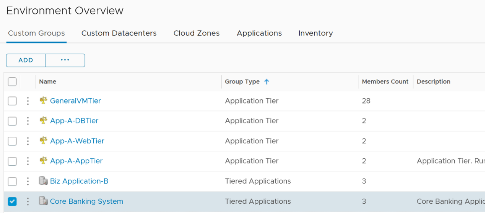
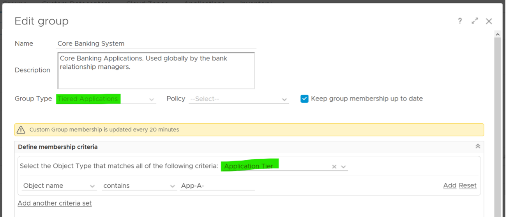
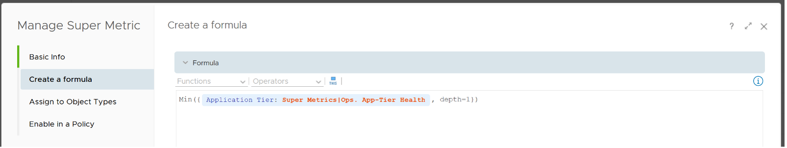
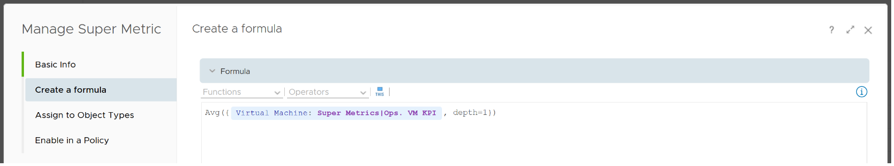
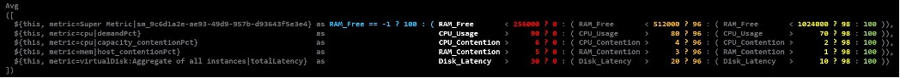

A business application typically spans multiple tiers, with each tier consisting of multiple VMs. I’ve worked with a large telco application spanning 5 tiers and 120 VMs. Since you typically have multiple business applications, you need a quick way to check the overall health before diving into each tier and VM.

While all production applications are important, some are definitely more important than others. You monitor these critical applications 24 x 7, display them on the big screen, and want to be ahead of your customers in detecting their health. The health of the apps should be color coded for ease of visualization on the NOC screen.

There are 3 parts that make up the health of an application:

- Is it up?
- Is it fast?
- Is it secured?

The following dashboard focuses on Performance. To some extent, if the Guest OS is down, the dashboard below will detect it. If you enhance it to include availability and compliance, let me know!

A multi-tier application can suffer from either horizontal or vertical problem:

- By horizontal, I mean a tier has problem. When the web tier is slow, it can slow down the entire application. The speed of a convoy is determined by the slowest car.
- By vertical, I mean something that cut across tier. Storage, for example. If the slowness is caused by something common, there is no need to troubleshoot individual VM, as they are simply victim.

That means we need to check both angles when an application had performance problem:

- Which tier had the problem? Since when? How bad? What was the problem?
- What infra problem did the app had? Storage, Network, CPU, RAM?

The above check makes a good starting point in your analysis. Don’t zoom into a particular VM until you know the overall picture. No point firefighting the kitchen if the whole house is on fire.

## Logical Design

The following is the logical design of the dashboard. I’ve not include the vertical problem to keep it simple.

At the top of the dashboard, the list of critical applications is shown across. The logical design shows 6. The actual dashboard can handle more. I’ve seen a large customer showing forty, as the list is just limited by your screen real estate.

If an app is not green, you can click on it. The dashboard will list all its VMs automatically. It’s plotting a line chart, so you can see the history. You can see how long, how bad and how often the problems happen. This is why I prefer line chart over a single number. A single number hides too many things, and can result in false impression.

## KPI Modelling

First step in performance dashboard is modelling the KPI. This is required so we show a single number for each business applications, and then drill down from it.

The health of a tier is the average health of its member. This is because a tier scales out. We are not taking the minimum value. This is not a convoy.

“Hold on!” you might say. Since it is scale out, App Team has catered for this. If they only need 3 web servers, they will deploy 4 or even 5. So both performance and availability are not affected if one web server goes down. The tier performance has to take into account this extra capacity, and not simply doing an average.

This logic sounds reasonable. But is it correct?

It is not actually. This is not about Availability. This is about Performance. All web servers are still up, but if node no 4 is slower than usual, user experience will be affected.

The VM KPI is turn an aggregation of its key performance metrics. As each metric has their own units, we need to convert them into a unit-less range. I picked 0 – 100 range as that’s easier to understand.

The threshold is designed to support proactive, not alert based operations. Hence, the red range does not mean emergency and you must drop everything. It means you need to take a look within the next 24 hours.

## Result

Using vRealize Operations 8.2, the dashboard looks like the following:

The top part of the dashboard shows 4 mission critical applications. Each of them is color coded for ease of visualization. Selecting one of them will automatically shows the trend chart of each tiers in the app. In the example above, I’ve selected one of the business applications. I did not have enough space for the VMs, so I’ve placed the VMs in the selected tier below the tier. I selected the DB Tier, which had 5 VM (4 of them being shown below). Selecting any of the VM will show all the KPI that make up the VM. There are 28 counters that make up the VM KPI, and we can quickly see that Free Memory has turned from green to yellow.

## Implementation

You can create your own object and assign metrics to it in vRealize Operations. In the following screenshot, I’ve created Tiered Applications object, which has the Application Tier object as its children.

You set the relationship making the Application Tier object as the group member. In the following screenshot, notice the group membership is dynamic. If you follow a naming convention, you will not need to hardcode each member one by one. The number of members can be dynamic.

For the KPI metrics, yuo will need three super metrics. The first one is at the business application object. This is simply the minimum of its tier KPI.

The second super metric is assigned to the application tier object. The formula is simply the average of its member VM KPI.

The third and last super metric is the KPI of each VM. I use a nested IF Statement to assign each value to the respective color.

I added the blue line. It sets the value to 100 when it’s detecting **-1**.