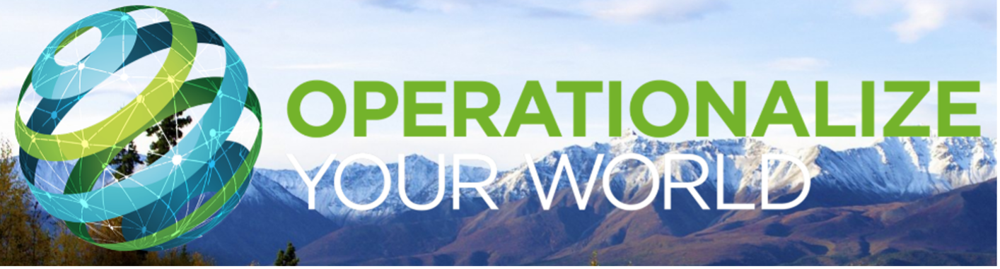
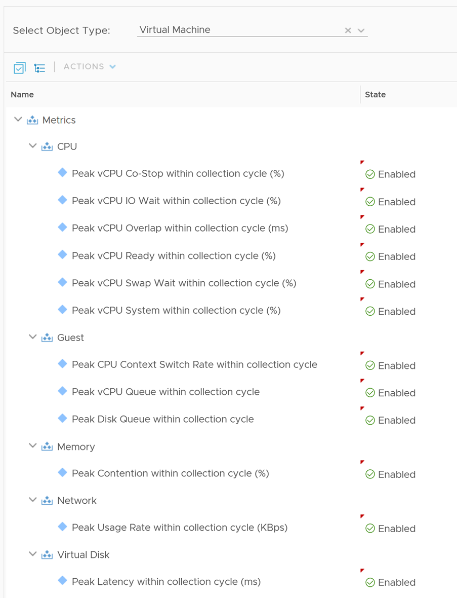

STELLIOS IS THE BEST TAM

Think of Operationalize Your World as the Pro edition of the plain vR Ops. Using analogy from the car industry, it’s like the AMG line of Mercedes. It’s designed for advanced customers who need customized version. It requires the Advanced edition or higher.
OYW 8.6 is based on the latest version of vR Ops 8.6, meaning it uses this version as the base of customization. vR Ops 8.6 sports a revamped dashboard, ported from OYW.

## Differences

The difference between OYW and the OOTB vRealize Operations

| Differences | Why |
| --- | --- |
| It uses the 20-second peak metric instead of the standard 300-second | With 15X sharper visibility, you can see problems that do not sustain for entire 300 seconds. Most issues on disk latency, CPU ready and memory contention do not typically last 300 seconds  |
| It adds Guest OS contention | Problem closer to application tend to impact the application more. All it needs is VMware Tools. No other agent required |



## How to Install

1. Login as admin account. It has to be the local admin account as that’s the ID that is used to create the original dashboard. 
1. Enable the 12 peak metrics. Go to your default policy, search for “collection cycle”. Enable them all, as shown below:

1. Import the views.
1. Import the dashboard.
