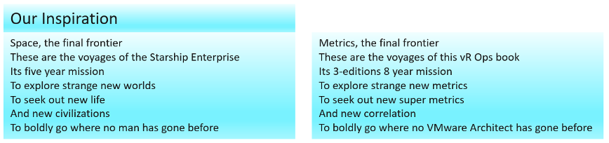

#### Same name, same object, different formula

The counters have the same name, belong to the same object, yet they have a different formula depending on where in the object you measure it.

VM CPU Used in vCPU level does not include System time but at the VM level it does. The reason is that System time does not exist at vCPU level since the accounting is charged at the VM level.

#### Same name, different formula

Counters with the same name do not always have the same formula in different vSphere objects.

Memory Usage: in VM this is mapped to Active, while in ESXi Host this is mapped to Consumed. In Cluster, this is Consumed + Overhead[^1]. vRealize Operations uses Guest OS data for Usage, and falls back to Active if it's not available.

Memory Consumed: in ESXi this includes memory consumed by ESXi, while in Cluster it only includes memory consumed by VM.

Memory Consumed: in VM this does not include overhead, while in Cluster it does.
VM Used includes Hyper Threading but penalty is 37.5%. ESXi Used is also aware of HT but the penalty is 50%.

Steal Time in Linux only includes CPU Ready, while Stolen time in VM include many other factors including CPU frequency.

#### Same name, different meaning

Counters with the same name, yet different meaning. Be careful as you may misinterpret them.

VM CPU Usage (%) shows 62.5% when ESXi CPU Usage (%) shows 100%. This happens since VM CPU Usage considers Hyper Threading, while ESXi CPU Usage does not. It happens when the ESXi core that the VM vCPU runs is also running another thread.

Another example is Latency. Disk Latency and Memory Latency indicate a performance problem. They are in fact the primary counter for how well the VM is being served by the underlying IaaS. But CPU Latency does not ***always*** indicate a performance problem. Its value is affected by Hyper-Threading and CPU Frequency, which can go up or down. Sure, the VM is running at a higher or lower CPU speed, or run less efficiently, but it is not waiting to be served. It's the equivalent on running on older CPU.

#### Same name, different behaviour

Memory and CPU Reservations have different behaviours from monitoring viewpoint.

VM RAM Reservation is permanent, hence impacts memory utilization. The Memory Consumed counter includes it even though the page is not actually consumed yet. If you power on a 16 GB RAM VM into a BIOS state, and it has 10 GB Memory Reservation, the VM Consumed memory counter will jump to 10 GB. It has not actually consumed the 10 GB, but since ESXi has reserved the space, it is not available to other VMs.

VM CPU Reservation is on demand, hence it does not impact CPU utilization. Run, Used, Demand, Usage do not include it. Their value will be 0 or near 0 if the Guest OS is not running.

#### Same purpose, different name

You would expect if the purpose is identical then the label or name would be identical.

Swapped Memory in VM is called Swapped, while in ESXi is called Swap Used.

Static frequency CPU utilization in VM is called Run, while ESXi calls it Utilization.

What vCenter calls Logical Processor (in the client UI) is what ESXi calls Physical CPU (in esxtop panel)

#### Confusing name

The name of the counter may not be clear.

VM CPU Wait counter includes Idle time. Since many VMs do not run at 100%, you will see CPU Wait counter to be high. You may think it's waiting for something (e.g. Disk or Memory) but it's just idle.

In Microsoft Windows, the CPU queue only counts the queue size, while the disk queue excludes the IO commands being processed.

#### Confusing roll up

Why is VM CPU Ready above 100%? If you look at esxtop, many VM level counters are >100%.

#### Confusing unit

Why are CPU counters expressed in milliseconds instead of percentage or GHz? How can a time counter (milliseconds in this case) account for CPU Frequency? There is a good reason for that!

#### "Missing" Counters

You will find VM CPU Demand, but not VM Memory Demand. Demand does not apply to memory as it's a form of storage, just as there is no such thing as a Demand metric for your laptop disk space.

#### Too many choices

When you have two watches showing different time, You are not sure which watch is the correct one.

There are five counters for VM CPU "utilization": Run, Used, Usage, Usage in MHz, and Demand. Why so many counters just to track utilization, different to what Windows or Linux tracks?

There are 6 counters for ESXi CPU "utilization": Core Utilization, Utilization, Used, Usage, Usage in MHz, and Demand.

You must remember that the counters are not just created for vSphere administrators. They are also used by the VMkernel scheduler itself as input. CPU Latency is one such counter.

#### ESXi vs vCenter

While ESXi is the source of counters, vCenter may add its own counters and the formula don't always match 100% in all scenarios, such as Used vs Usage.

ESXi provides Run (ms), Used (ms), Demand (MHz) for VM CPU. vCenter adds Usage (MHz) and Usage (%), which create confusion as there are now 5 choices.

ESXi shows Used (%), while vCenter shows Used (ms). The first one affected by CPU frequency and can go beyond 100%.

#### ESXi != VMs + VMkernel

The counters at ESXi is more complex than the sum of its VM + VMkernel. The reason is there are additional parameters that must be taken into account. For example, the impact of CPU SMP (or Hyper Threading as Intel calls it) is not measured at the VM level. Be careful when summing VM counters and assume it's ESXi counter.

#### M:N relationship

A VM with multiple virtual disks can span across multiple datastores, and even RDMs. On the other hand, a datastore typically hosts many VMs. An ESXi may mount multiple LUNs and a LUN is typically presented into multiple ESXi or even multiple clusters. These many to many relationships make the counters across VM, datastore, ESXi and Cluster inconsistent when viewed overall. Each of them is correct as each has to look from their own vantage point.

#### Windows vs Linux

Windows CPU queue excludes the running thread, Linux includes the threads being executed.

----

Complicated stuff, isn't it? And we have not added NSX, vSAN, Kubernetes, AWS, Google, Azure, applications, network, etc. 

Not all vSphere-specific characteristics are well understood by management tools that are not purpose-built for it. Partial understanding can lead to misunderstanding as wrong interpretation of counters can result in wrong action taken.

There is also a scalability concern. In vCenter, there are 17 CPU counters available at the VM level, and 12 of them are available at a vCPU level too. In addition, each VM comes with 28 memory counters. That means a VM with 4 vCPUs will have 93 counters (17 + 4 x 12 + 28). A vSphere environment with 1,000 VMs with 4 vCPUs as the average VM size will have process 93K counters each time it collects. If you do that every minute, you will collect almost 134 million metrics per day. Since many customers like to keep for at least 6 months, that's 24+ billion metrics!

With so many metrics, the amount of business value received becomes a valid concern.

vRealize Operations does not regurgitate the counters that vCenter has. It starts by understanding the unique behaviour of vSphere, then simplifying it by consolidating and standardizing the counters. For example, vRealize Operations creates derived counters such as KPI and capacity metrics, then applies them to CPU, RAM, disk, and network as appropriate.

[^1]: Technically speaking, mapping usage to active for VM and consumed for ESXi makes sense, due to the two-level memory hierarchy in virtualization. At the VM level, we use active as it shows what the VM is actually consuming (related to performance). At the host and cluster levels, we use consumed because it is related to what the VM claimed (related to capacity management). This confusion has resulted in customers buying more RAM than what they need.