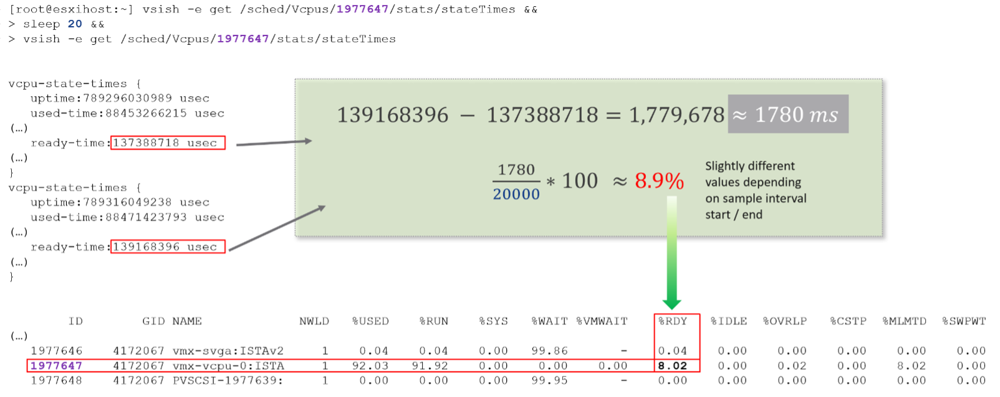
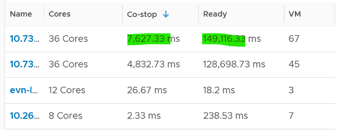

在我們介紹計數器之前，您需要了解各種單位以及它們是如何獲得的：

- 隨著時間的推移聚合 (例如。從 20 秒到 5 分鐘)
- 更高級別對象的聚合.

一些常用單位是毫秒、MHz、百分比、KBps 和 KB。某些計數器以 MHz 顯示，這意味著您需要與 ESXi 物理 CPU _static_頻率[^1] 進行比較。在大型環境中，這在操作上可能很困難，因為您擁有來自不同代的不同 ESXi 主機（因此可能具有不同的 GHz）。這也是集群是最小的邏輯構建塊的原因。如果您的集群具有頻率不同的 ESXi 主機，這些基於 MHz 的計數器可能難以使用，因為虛擬機通過 DRS 獲得 vMotion。

CPU的毫秒數怎麼樣？它來自哪裡，為什麼？

要回答這個問題，我們需要深入了解 ESXi VMkernel 調度程序。考慮時間的流逝和在那段時間內完成的 CPU 週期數量。與以 1 GHz 運行的內核相比，以 2 GHz 運行的 CPU 內核將完成 2 倍的 CPU 週期。超線程也是如此。當有對等線程同時競爭時，完成的周期更少。

你認為的利用率或使用量或需求或使用量，如果你將它們視為循環，一旦你進行了這種小的範式轉變，就會更容易。

讓我們讓 VM CPU Ready。以下內容來自 ESXi vsish 命令。它表明原始的原始計數器實際上是一個運行數字。要計算給定時間段的 CPU 就緒，我們需要從第一個數字中減去最後一個數字。為了轉換為百分比，我們對集合進行劃分，在屏幕截圖中為 20000 毫秒。

補充單位是統計類型。有3種類型：

#### 三角洲

該值來自運行計數器。你看到的是兩個時間點之間的差異。所有以毫秒為單位的單位都是增量類型。

#### 速度

該值衡量變化率，例如每秒的吞吐量。該速率始終是 20 秒週期內的平均值。
注：有以百分比為單位、以比率為統計類型的指標。我很困惑為什麼。

#### 絕對

該值是一個獨立的數字，與其他數字無關。絕對值可以是第 20 秒的最新值或 20 秒期間的平均值。

## 隨著時間的推移聚合

時間列的聚合非常重要。對於 vRealize Operations，平均值是指 5 分鐘的平均值。 **和** 呢？為什麼在匯總數字時數字會不斷上升？

對於那些累積更有意義的計數器，它實際上是平均值。讓我們舉個例子。 CPU 就緒時間在採樣週期內累積。 vCenter 每 20 秒報告一次計數器，即 20000 毫秒。下表顯示 VM 每秒具有不同的 CPU 就緒時間。它在第 5 秒和第 6 秒有 900 毫秒的 CPU 就緒時間，但在剩餘的 18 秒內有較低的數字。

在 20 秒的時間段內，VM 可能會累積每秒不同的 CPU 就緒時間。 vCenter 將所有這些數字相加，然後除以 20,000。這實際上是一個平均值，因為您在此期間失去了峰值。

**最新**，另一方面，是不同的。它採用採樣週期的最後一個值。例如，在 20 秒採樣中，它取第 19 秒和第 20 秒之間的值。該值可以低於或高於整個 20 秒週期的平均值。與平均值相比，最新版本不太受歡迎，因為您會錯過 95% 的數據。

從 20 秒累積到 5 分鐘或更長時間會導致進一步平均，無論累積技術是求和還是平均。這就是為什麼對於早於 1 天的數據使用 vRealize Operations 比使用 vCenter 更好的原因，因為 vCenter 將數據進一步平均為 0.5 小時的平均值。

由於源數據基於 20 秒，並且默認情況下 vRealize Operations 對這些數據進行平均，因此任何毫秒數據的​​“100%”都是 20,000 毫秒，而不是 300,000 毫秒。當您看到 3000 毫秒的 CPU 就緒時，實際上是 15% 而不是 1%。

默認情況下，vRealize Operations 每 5 分鐘獲取一次數據。這意味著 **不** 適合對不持續 5 分鐘的性能進行故障排除。事實上，如果性能問題只持續 5 分鐘，您可能不會收到任何警報，因為收集可能恰好發生在這 5 分鐘的中間。例如，假設 CPU 從 08:00:00 到 08:02:30 空閒，從 08:02:30 到 08:07:30 出現峰值，然後從 08:07:30 到 08 再次空閒： 10:00。如果 vRealize Operations 恰好在 08:00、08:05 和 08:10 進行收集，您將不會看到峰值，因為它分佈在兩個數據點上。這意味著，要讓 vRealize Operations 在沒有任何閒置數據的情況下 *** 整個*** 地接收峰值，則峰值 **可能** 必須持續 10 分鐘。

vRealize Operations 能夠存儲單獨的 20 秒數據。但這會導致數據量增加 15 倍。在大多數情況下，您想要的是 15 個數據點中的峰值。這是一組新的故障排除指標的用武之地。 [故障排除指標](/zh-tw/metrics/chapter-6-other-metrics/2.6.1-troubleshooting-metrics/)

vCenter 中的集合級別不適用於 vRealize Operations。更改收集級別不會影響 vRealize Operations 收集的計數器。它使用自己的過濾器從 vCenter 收集所有計數器，您可以通過策略對其進行自定義。

## 更高級別對象的聚合

聚合到更高級別的對像很複雜，因為沒有無損解決方案。您試圖通過在其中選取 1 個值來表示一系列值，因此您往往會丟失細節。技術的選擇是平均值、中值、最大值、最小值、百分位數和計數。使用的默認技術是 average() 函數。平均的問題在於它會掩蓋問題，除非它們很普遍。到 1000 台虛擬機的平均性能不佳時，您可能有一百台虛擬機處於不良狀態。

讓我們舉個例子。下表顯示了 ESXi 主機。第一台主機的 CPU 就緒時間為 149,116.33 毫秒。這是一個壞數字嗎？

很難得出結論。該主機有 67 個正在運行的 VM，每個 VM 都可以有多個 vCPU。總共有 195 個 vCPU。每個 vCPU 可能會經歷 20,000 毫秒的 CPU 就緒（這是最糟糕的情況）。

如果將 67 個 VM 的 CPU Ready 相加，您會得到多少？

你是對的，你得到了 ESXi 主機報告的相同數字。這意味著 ESXi CPU 就緒 = Sum（VM CPU 就緒），VM CPU 就緒 = Sum（VM vCPU 就緒）。

因為它是虛擬機的總和，轉換成 % 需要除以正在運行的虛擬機 vCPU 的數量。

`ESXi CPU 就緒 (%) = ESXi CPU 就緒 (ms) / 總和（正在運行的虛擬機的 vCPU)`

CPU Ready 是否在 VM 之間平均分配？你怎麼看？

這取決於許多設置，因此您很有可能會得到以下內容。此熱圖顯示了上述主機上的 67 個虛擬機，按 CPU 就緒著色，按虛擬機 CPU 配置調整大小。您可以看到較大的 VM 往往具有更高的 CPU 就緒狀態，因為它們具有更多的 vCPU。

在分析數百萬個數據點時，您還需要考慮性能要求。每 5 分鐘從 100K 對像中求平均值將需要大量資源。對於 VMware Horizo​​​​n，我們應用兩步匯總技術來最小化計算成本。從數學上講，它不太準確，因為小型 VDI 池或 RDS 場與大型 VDI 池同等對待。在操作上，僅僅因為它們較小並不意味著它們不那麼重要。

[^1]：實際上，CPU 頻率因每個內核而異。它也隨著時間而變化。為了便於記賬，我們假設整個盒子都是靜態的。