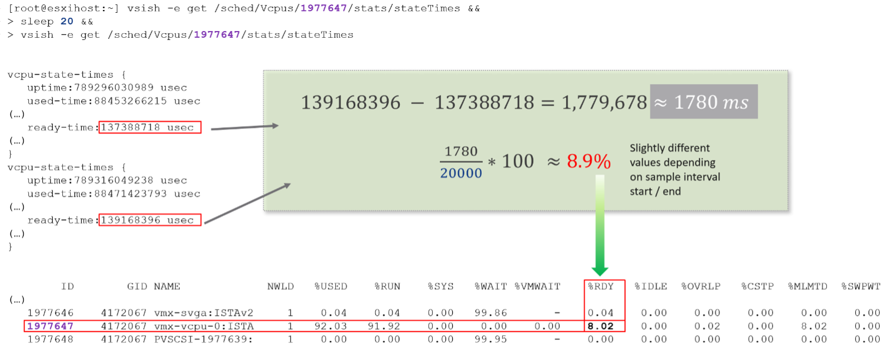
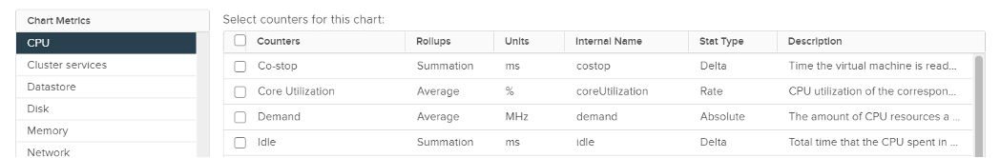
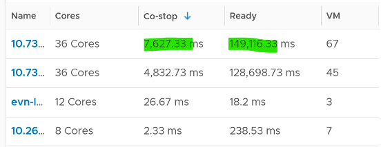
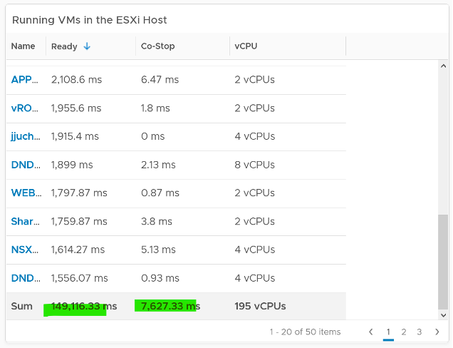
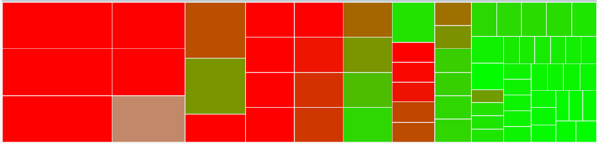
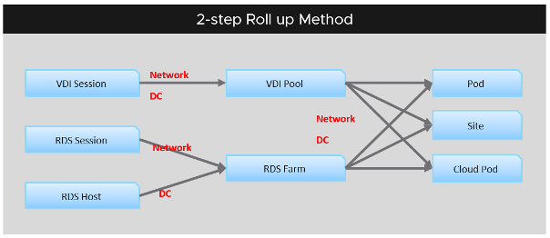

在我们介绍计数器之前，您需要了解各种单位以及它们是如何获得的：

- 随着时间的推移聚合 (例如。从 20 秒到 5 分钟)
- 更高级别对象的聚合.

一些常用单位是毫秒、MHz、百分比、KBps 和 KB。某些计数器以 MHz 显示，这意味着您需要与 ESXi 物理 CPU _static_频率[^1] 进行比较。在大型环境中，这在操作上可能很困难，因为您拥有来自不同代的不同 ESXi 主机（因此可能具有不同的 GHz）。这也是集群是最小的逻辑构建块的原因。如果您的集群具有频率不同的 ESXi 主机，这些基于 MHz 的计数器可能难以使用，因为虚拟机通过 DRS 获得 vMotion。

CPU的毫秒数怎么样？它来自哪里，为什么？

要回答这个问题，我们需要深入了解 ESXi VMkernel 调度程序。考虑时间的流逝和在那段时间内完成的 CPU 周期数量。与以 1 GHz 运行的内核相比，以 2 GHz 运行的 CPU 内核将完成 2 倍的 CPU 周期。超线程也是如此。当有对等线程同时竞争时，完成的周期更少。

你认为的利用率或使用量或需求或使用量，如果你将它们视为循环，一旦你进行了这种小的范式转变，就会更容易。

让我们让 VM CPU Ready。以下内容来自 ESXi vsish 命令。它表明原始的原始计数器实际上是一个运行数字。要计算给定时间段的 CPU 就绪，我们需要从第一个数字中减去最后一个数字。为了转换为百分比，我们对集合进行划分，在屏幕截图中为 20000 毫秒。

补充单位是统计类型。有3种类型：

#### 三角洲

该值来自运行计数器。你看到的是两个时间点之间的差异。所有以毫秒为单位的单位都是增量类型。

#### 速度

该值衡量变化率，例如每秒的吞吐量。该速率始终是 20 秒周期内的平均值。
注：有以百分比为单位、以比率为统计类型的指标。我很困惑为什么。

#### 绝对

该值是一个独立的数字，与其他数字无关。绝对值可以是第 20 秒的最新值或 20 秒期间的平均值。

## 随着时间的推移聚合

时间列的聚合非常重要。对于 vRealize Operations，平均值是指 5 分钟的平均值。 **和** 呢？为什么在汇总数字时数字会不断上升？

对于那些累积更有意义的计数器，它实际上是平均值。让我们举个例子。 CPU 就绪时间在采样周期内累积。 vCenter 每 20 秒报告一次计数器，即 20000 毫秒。下表显示 VM 每秒具有不同的 CPU 就绪时间。它在第 5 秒和第 6 秒有 900 毫秒的 CPU 就绪时间，但在剩余的 18 秒内有较低的数字。

在 20 秒的时间段内，VM 可能会累积每秒不同的 CPU 就绪时间。 vCenter 将所有这些数字相加，然后除以 20,000。这实际上是一个平均值，因为您在此期间失去了峰值。

**最新**，另一方面，是不同的。它采用采样周期的最后一个值。例如，在 20 秒采样中，它取第 19 秒和第 20 秒之间的值。该值可以低于或高于整个 20 秒周期的平均值。与平均值相比，最新版本不太受欢迎，因为您会错过 95% 的数据。

从 20 秒累积到 5 分钟或更长时间会导致进一步平均，无论累积技术是求和还是平均。这就是为什么对于早于 1 天的数据使用 vRealize Operations 比使用 vCenter 更好的原因，因为 vCenter 将数据进一步平均为 0.5 小时的平均值。

由于源数据基于 20 秒，并且默认情况下 vRealize Operations 对这些数据进行平均，因此任何毫秒数据的“100%”都是 20,000 毫秒，而不是 300,000 毫秒。当您看到 3000 毫秒的 CPU 就绪时，实际上是 15% 而不是 1%。

默认情况下，vRealize Operations 每 5 分钟获取一次数据。这意味着 **不** 适合对不持续 5 分钟的性能进行故障排除。事实上，如果性能问题只持续 5 分钟，您可能不会收到任何警报，因为收集可能恰好发生在这 5 分钟的中间。例如，假设 CPU 从 08:00:00 到 08:02:30 空闲，从 08:02:30 到 08:07:30 出现峰值，然后从 08:07:30 到 08 再次空闲： 10:00。如果 vRealize Operations 恰好在 08:00、08:05 和 08:10 进行收集，您将不会看到峰值，因为它分布在两个数据点上。这意味着，要让 vRealize Operations 在没有任何闲置数据的情况下 *** 整个*** 地接收峰值，则峰值 **可能** 必须持续 10 分钟。

vRealize Operations 能够存储单独的 20 秒数据。但这会导致数据量增加 15 倍。在大多数情况下，您想要的是 15 个数据点中的峰值。 这是一组新的故障排除指标的用武之地。[故障排除指标](/zh/metrics/chapter-6-other-metrics/2.6.1-troubleshooting-metrics/)

vCenter 中的集合级别不适用于 vRealize Operations。更改收集级别不会影响 vRealize Operations 收集的计数器。它使用自己的过滤器从 vCenter 收集所有计数器，您可以通过策略对其进行自定义。

## 更高级别对象的聚合

聚合到更高级别的对象很复杂，因为没有无损解决方案。您试图通过在其中选取 1 个值来表示一系列值，因此您往往会丢失细节。技术的选择是平均值、中值、最大值、最小值、百分位数和计数。使用的默认技术是 average() 函数。平均的问题在于它会掩盖问题，除非它们很普遍。到 1000 台虚拟机的平均性能不佳时，您可能有一百台虚拟机处于不良状态。

让我们举个例子。下表显示了 ESXi 主机。第一台主机的 CPU 就绪时间为 149,116.33 毫秒。这是一个坏数字吗？

很难得出结论。该主机有 67 个正在运行的 VM，每个 VM 都可以有多个 vCPU。总共有 195 个 vCPU。每个 vCPU 可能会经历 20,000 毫秒的 CPU 就绪（这是最糟糕的情况）。

如果将 67 个 VM 的 CPU Ready 相加，您会得到多少？

你是对的，你得到了 ESXi 主机报告的相同数字。这意味着 ESXi CPU 就绪 = Sum（VM CPU 就绪），VM CPU 就绪 = Sum（VM vCPU 就绪）。

因为它是虚拟机的总和，转换成 % 需要除以正在运行的虚拟机 vCPU 的数量。

`ESXi CPU 就绪 (%) = ESXi CPU 就绪 (ms) / 总和（正在运行的虚拟机的 vCPU)`

CPU Ready 是否在 VM 之间平均分配？你怎么看？

这取决于许多设置，因此您很有可能会得到以下内容。此热图显示了上述主机上的 67 个虚拟机，按 CPU 就绪着色，按虚拟机 CPU 配置调整大小。您可以看到较大的 VM 往往具有更高的 CPU 就绪状态，因为它们具有更多的 vCPU。

在分析数百万个数据点时，您还需要考虑性能要求。每 5 分钟从 100K 对象中求平均值将需要大量资源。对于 VMware Horizo​​n，我们应用两步汇总技术来最小化计算成本。从数学上讲，它不太准确，因为小型 VDI 池或 RDS 场与大型 VDI 池同等对待。在操作上，仅仅因为它们较小并不意味着它们不那么重要。

[^1]：实际上，CPU 频率因每个内核而异。它也随着时间而变化。为了便于记账，我们假设整个盒子都是静态的。