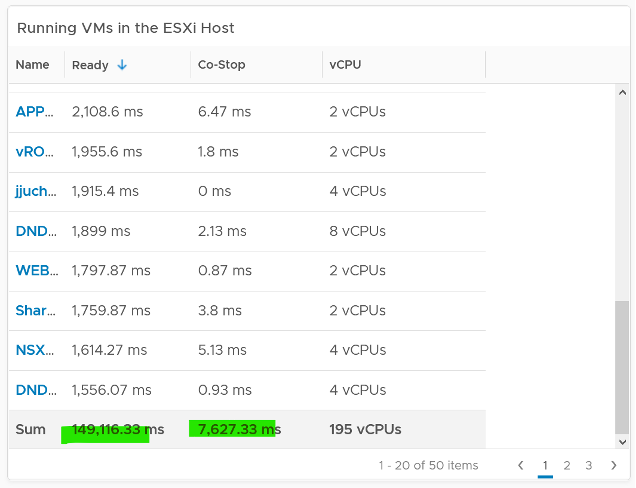
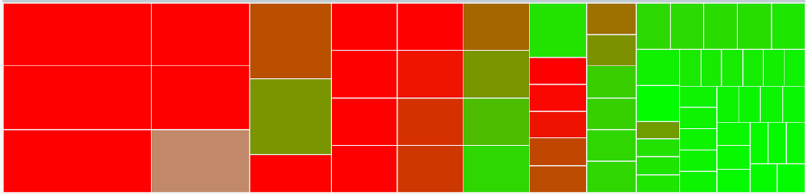
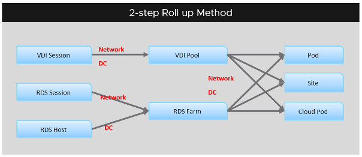

Before we cover the counters, you need to know the various units and how they get:

- rolled up across time (e.g. from 20 second to 5 minutes)
- aggregated across parent (higher level object).

Some common units are milliseconds, MHz, percent, KBps, and KB. Some counters are shown in MHz, which means you need to compare with the ESXi physical CPU _static_ frequency[^1]. In large environments, this can be operationally difficult as you have different ESXi hosts from different generations (and hence, are likely to sport a different GHz). This is also the reason why cluster is the smallest logical building block. If your cluster has ESXi hosts with different frequencies, these MHz-based counters can be difficult to use, as the VMs get vMotion-ed by DRS.

How about milliseconds for CPU? Where does it come from and why?

To answer that, we need to go deep to the ESXi VMkernel scheduler. Think in terms of the passage of time and the amount of CPU cycles that get completed during that time. A CPU core running at 2 GHz will get 2x CPU cycles completed compared with a core running at 1 GHz. The same goes with Hyper Threading. You get less cycles completed when there is a peer thread competing at the same time.

What you think as utilization or usage or demand or used, it will be easier if you see them as cycles, once you make that small paradigm shift.

Let's take VM CPU Ready. The following is taken from ESXi vsish command. It shows that the original, raw counter is actually a running number. To calculate the CPU ready of a given time period, we need to subtract the last number from the first number. To convert to percentage, we divide over the collection, which is 20000 ms in the screenshot.

Complementing units are Stat Type. There are 3 types:

#### Delta

The value is derived from a running counter. What you see is difference between 2 points in time. All the units in miliseconds are of delta type.

#### Rate

The value measures the rate of change, such as throughput per second. Rate is always the average across the 20 second period.
Note: there are metrics with percentage as unit and rate as stat type. I'm puzzled why.

#### Absolute

The value is a standalone number, not relative to other numbers. Absolute can be latest value at 20th second or the average value across the 20 second period.

## Roll-up

The Rollups column is important. Average means the average of 5 minutes in the case of vRealize Operations. What about **Summation**? Why does the number keep going up as you roll up?

It is actually average for those counters where accumulation makes more sense. Let's take an example. CPU Ready Time gets accumulated over the sampling period. vCenter reports counters every 20 seconds, which is 20000 milliseconds. The following table shows a VM has different CPU Ready Time on each second. It has 900 ms CPU Ready on the 5th and 6th second, but has lower number on the remaining 18 seconds.

Over a period of 20 seconds, a VM may accumulate different CPU Ready Time for each second. vCenter sums all these numbers, then divides it by 20,000. This is actually an average, as you lose the peak within the period.

**Latest**, on the other hand, is different. It takes the last value of the sampling period. For example, in the 20-second sampling, it takes the value between 19th and 20th seconds. This value can be lower or higher than the average of the entire 20 seconds period. Latest is less popular compared with average as you miss 95% of the data.

Rolling up from 20 seconds to 5 minutes or higher results in further averaging, regardless whether the rollup technique is summation or average. This is the reason why it is better to use vRealize Operations than vCenter for data older than 1 day, as vCenter averages the data further, into a 0.5 hour average.

Because the source data is based on 20-second, and vRealize Operations by default averages these data, the "100%" of any milisecond data is 20,000 ms, not 300,000 ms. When you see CPU Ready of 3000 ms, that's actually 15% and not 1%.

By default, vRealize Operations takes data every 5 minutes. This means it is **not** suitable to troubleshoot performance that does not last for 5 minutes. In fact, if the performance issue only lasts for 5 minutes, you may not get any alert, because the collection could happen exactly in the middle of those 5 minutes. For example, let's assume the CPU is idle from 08:00:00 to 08:02:30, spikes from 08:02:30 to 08:07:30, and then again is idle from 08:07:30 to 08:10:00. If vRealize Operations is collecting at exactly 08:00, 08:05, and 08:10, you will not see the spike as it is spread over two data points. This means, for vRealize Operations to pick up the spike in its ***entirety*** without any idle data, the spike *may* have to last for 10 minutes.

vRealize Operations is capable of storing the individual 20-seconds data. But that would result in 15x more data. In most cases, what you want is the peak among the 15 data points. This is where a new set of [troubleshooting metrics](/metrics/chapter-6-other-metrics/2.6.1-troubleshooting-metrics/) come in.

The Collection Level in vCenter does not apply to vRealize Operations. Changing the collection level does not impact what counters get collected by vRealize Operations. It collects all counters from vCenter using its own filter, which you can customize via policy.

## Aggregation

Aggregating to a higher-level object is complex as there is no lossless solution. You are trying to represent a range of values by picking up 1 value among them, so you tend to lose the details. The choices of techniques are mean, median, max, min, percentile, and count of. The default technique used is the average() function. The problem with average is it will mask out the problems unless they are widespread. By the time the average performance of 1000 VMs is bad, you likely have a hundred VMs in bad shape.

Let's take an example. The following table shows ESXi hosts. The first host has CPU Ready of 149,116.33 ms. Is that a bad number?

It is hard to conclude. That host has 67 running VMs, and each of those VMs can have multiple vCPU. In total there are 195 vCPU. Each vCPU could potentially experience CPU Ready of 20,000 ms (which is the worst possible scenario).

If you sum the CPU Ready of the 67 VM, what number would you get?

You're right, you get the same number reported by the ESXi host. This means the ESXi CPU Ready = Sum (VM CPU Ready), and the VM CPU Ready = Sum (VM vCPU Ready).

Because it's a summation of the VMs, to convert into % requires you to divide with the number of running VM vCPU.

`ESXi CPU Ready (%) = ESXi CPU Ready (ms) / Sum (vCPU of running VMs)`

Are the CPU Ready equally distributed among the VMs? What do you think?

It depends on many settings, so there is a good chance you get something like the following. This heat map shows the 67 VMs on the above host, colored by CPU Ready and sized by VM CPU configuration. You can see that the larger VMs tend to have higher CPU ready, as they have more vCPU.

You also need to consider performance requirements in analysing millions of data points. Averaging from 100K object every 5 minutes will require a lot of resource. For VMware Horizon, we apply a 2-step roll up technique to minimize the calculation cost. Mathematically, it is less accurate as a small VDI Pool or RDS Farm is treated equally with the large ones. Operationally, just because they are smaller do not mean they are less important.

[^1]: In reality, the CPU frequency varies on a per core basis. It also varies over time. For ease of accounting, we assume it's static for entire box.