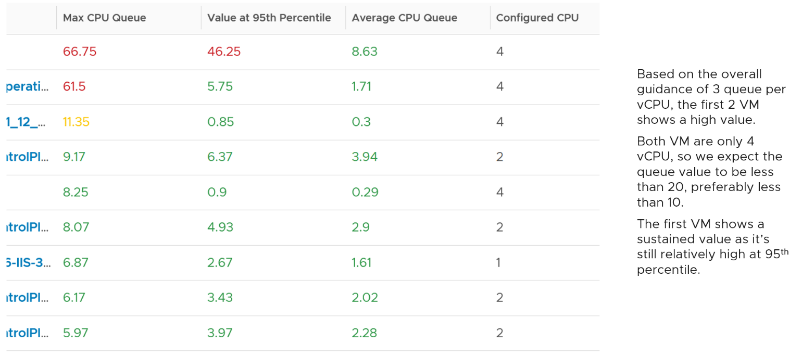
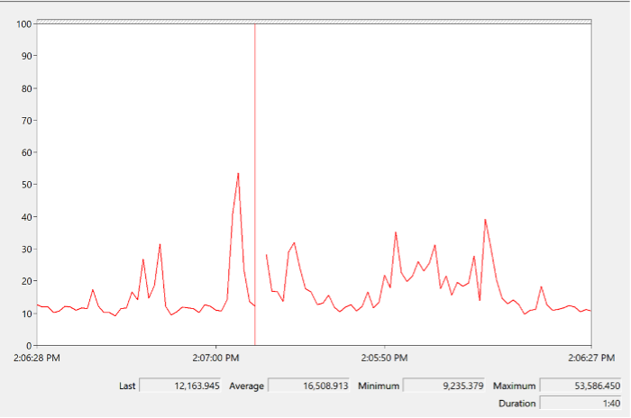
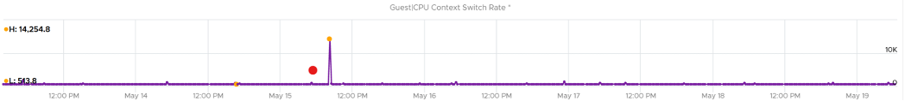
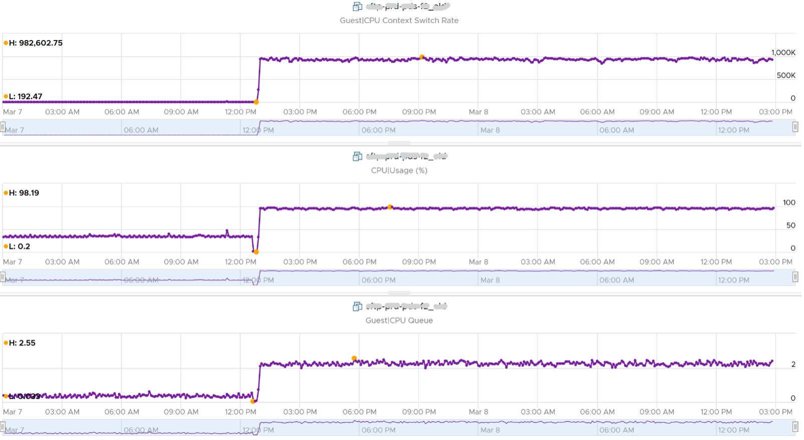
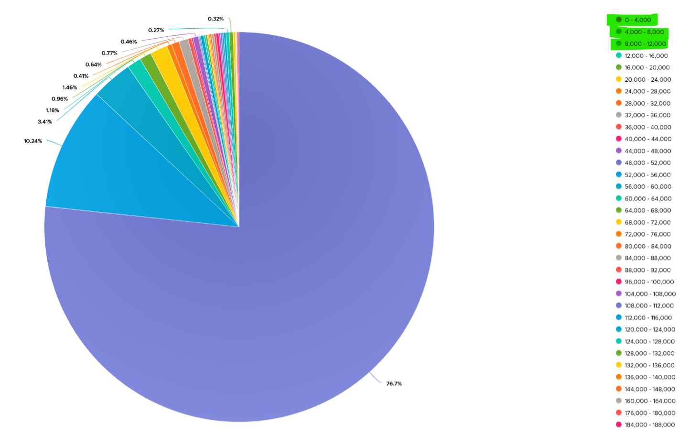
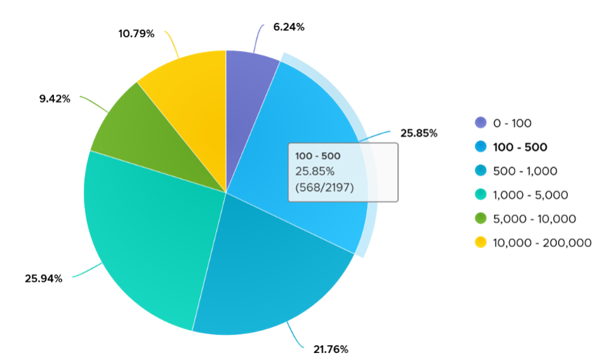
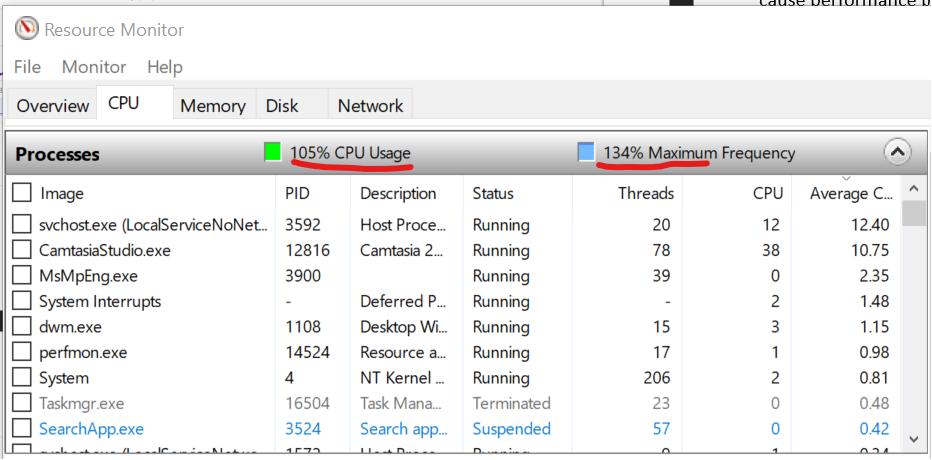

We start with the [contention type of metrics](/operations-management/chapter-2-performance-management/1.2.4-contention-vs-utilization/) as that's the primary metric for performance, followed by utilization type of metrics.

ESXi cannot see how the Guest OS schedules its processes, and hence it can't monitor the Guest OS. ESXi can only see what's being sent out by the Guest. VMware Tools, which runs inside the Guest OS, is able to see inside the Guest OS. VMware Tools 10.3.5 or later and at least vSphere 6.0 P08, 6.5 P03, and 6.7 U1 are required for this.

## Guest OS CPU Run Queue

Number of threads in the processor queue. For Windows, this counter excludes the threads that are running (being executed). For Linux, it includes the threads in the CPU pipeline.

Let's take a VM configured with 8 vCPUs. The Guest OS sees 8 threads so it will schedule up to 8 parallel processes. If there is more demand, it will have to queue them. This means the queue needs to be accounted for in Guest OS sizing.

Because it reports the queue, this is the _primary_ counter to measure Guest OS performance. It tells you if the CPU is struggling to serve the demand or not.

What is a healthy value?

Windows Performance Monitor UI description is not consistent with MSDN documentation (based on Windows Server 2016 documentation). One document states that a sustained processor queue of greater than 2 threads generally indicates processor congestion. However, another states that “sustained processor queue of less than 10 threads per processor is normally acceptable, dependent of the workload”. SQL Server document states 3 as the threshold. Let me know if you have seen other recommendation from Microsoft or Linux.

Windows or Linux utilization may be 100%, but as long as the queue is low, the workload is running as fast as it can. Adding more vCPU will in fact slow down the performance as you have higher chance of [context switching](/metrics/chapter-2-cpu-metrics/2.2.1-guest-os/#guest-os-cpu-context-switch).

There is a single queue for processor time even on computers with multiple processors. Therefore, if a computer has multiple processors, you need to divide this value by the number of processors servicing the workload. That's why Tools reports the total count of the queues. This counter should play a role in the [Guest OS CPU sizing](/operations-management/chapter-3-capacity-management/1.3.12-rightsizing/#guest-os-cpu-sizing).

You should profile your environment, because the number can be high for some VMs. Just look at the numbers I got below, where some VMs have well over 10 queues per vCPU. Share the finding with the VM Owner, as the remediation to reduce the queue could mean changing the application settings.

Let's drill down to see the first VM.

The CPU Run Queue spikes multiple times. It does not match the CPU Usage and CPU Context Switch Rate in pattern. I'm unsure how to explain this so if you know drop me a note. I notice the data collection is erratic though, so let's look at another VM.

The following is a 2 vCPU VM running Photon OS. CPU Queue is high, even though Photon is only running at 50%. Could it be that the application is configured with too many threads that the CPU is busy doing context switching? Notice the CPU Queue maps the CPU Context Switch Rate and CPU Run. In this situation, you should bring it up to the application team attention, as it may cause performance problem and the solution is to look inside. As a proof that it's not because of underlying contention, I added CPU Ready.

This property displays the last observed value only; it is not an average. Windows & Linux do not provide the highest and lowest variants either.

For Linux, we use the value of procs_running from /proc/stat (kernel/system statistics). It shows the number of processes in runnable state. It is same as the value from /proc/loadavg. It is the sum of all CPU thread run queue. The nr_running field includes currently running tasks and ready but not running tasks.

Reference: [Windows](https://msdn.microsoft.com/en-us/library/aa394272(v=vs.85).aspx) and [Linux](http://man7.org/linux/man-pages/man5/proc.5.html).

## Guest OS CPU Context Switch

[CPU Context Switch](https://en.wikipedia.org/wiki/Context_switch) costs performance “due to running the [task scheduler](https://en.wikipedia.org/wiki/Scheduling_(computing)), TLB flushes, and indirectly due to sharing the [CPU cache](https://en.wikipedia.org/wiki/CPU_cache) between multiple tasks”. It's important to track this counter and at least know what's an acceptable behaviour for that specific application.

Based on Windows 10 Performance Monitor documentation, context switches/sec is the combined rate at which all processors on the computer are switched from one thread to another. All else being equal, the more the processors, the higher the context switch.

{}
Thread switches can occur either inside of a single multi-thread process or across processes. A thread switch can be caused either by one thread asking another for information, or by a thread being pre-empted by another, higher priority thread becoming ready to run.
{}

There are context switch counters on the System and Thread objects. vRealize Operations only report the total.

The rate of Windows or Linux switching CPU context per second ranges widely. The following is taken from a Windows 10 desktop with 8 physical threads, which runs around 10% CPU. I observe the value hovers from 10K to 50K.

The value should correlate with CPU “utilization”, since in theory the higher the utilization the higher the chance of CPU context switch. The following chart shows a near perfect corelation. Every time CPU Usage went up, CPU Context Switch also.

CPU context switch can happen even in a single thread application. The following shows a VDI VM with 4 vCPU. I plotted the CPU Usage Disparity vs CPU Context Switch. You can see the usage disparity went up to 78%, meaning the gap between the busiest vCPU and the most idle vCPU is 78%. This was running a security agent, which is unlikely to be designed to occupy multiple vCPU.

Let's plot the context switch at the same period. There is a spike at the same time, indicating that the agent was busy context switching. Note that it does not always have to be this way. The red dot shows there is no spike in context switch even though the vCPU Usage Disparity went up.

The value of CPU Context Switch vary widely. It can go well beyond 0.5 million, as shown in the following table, hence it's important to profile and establish a normal base line for that specific application. What is healthy for 1 VM may not be healthy for another.

You can see from the table that some VM experience prolonged CPU context switch, while others do not. The VM #4 only has a short burst as the value at 95th percentile dropped to 3796. Momentary peak of context switch may not cause performance problem so in general it's wiser to take the value somewhere between 95th and 99th percentile.

Let's drill down to see the first VM. This CentOS VM sporting only 4 vCPU constantly hit almost 1 million context switch. The pattern match CPU Usage.

On the other hand, majority of Guest OS spends well below 10K. I profiled around 2200 production VMs and here is the distribution of their CPU Context Switch. You can see that the values between 0 – 12000 accounts for 80%.

In your environment, you can profile it further. In the following example, I adjusted the bucket threshold by grouping all the values above 10K as one bucket, and splitting 0 – 10K bucket into multiple buckets. You can see more than half has less than 1K CPU Context Switch Rate.

## Linux Steal Time

According to Red Hat documentation, [Steal Time](https://access.redhat.com/documentation/en-us/red_hat_enterprise_linux/7/html/virtualization_deployment_and_administration_guide/sect-kvm_guest_timing_management-steal_time_accounting) is the amount of CPU time needed by the VM that is not provided by the hypervisor. It occurs when the host allocates the CPU resource for its own process or to another guest.

While Linux has this counter, it is 0 when it runs on ESXi because it's not enabled by default. Even if it's enabled, it only accounts for Ready time. It does not account for other time such as CoStop, VM Wait and memory wait.

CPU Ready includes Limit. I have not verified if Linux Steal Time accounts for it.

## Other Guest OS Metrics

Windows 8 and later will report CPU usage >100% in Task Manager and Performance Monitor when the CPU Frequency is higher than nominal speed. The reason for the change is the same with what we have covered so far, which is the need to distinguish amount of work being done. More [here](https://docs.microsoft.com/en-us/troubleshoot/windows-client/performance/cpu-usage-exceeds-100).

Reference: [Windows](https://msdn.microsoft.com/en-us/library/aa394279(v=vs.85).aspx) and [Linux](http://man7.org/linux/man-pages/man5/proc.5.html).