Counters is essentially an accounting of systems in operation. To understand the counter hence requires a knowledge of how the system works. Without internalizing the mechanics, you will have to rely on memorizing.

ESXi Scheduler keeps in mind the following goals:

- To balance load across physical (PCPUs).
- To preserve cache state, minimize migration cost.
- To avoid contention from hardware (HT, LLC, etc.) and sibling vCPUs (from the same VM).
- To keep VMs or threads that have frequent communications close to each other.

At the most basic level, a VM CPU is either being utilized or not being utilized by the Guest OS. At any given moment, it either runs or it does not, there is no walk state.

- When it's being utilized, the hypervisor must schedule it. A multi vCPU VM has multiple schedules, 1 for each vCPU. For each vCPU:
  - If VMkernel has the physical CPUs to run it, then the vCPU gets to Run. The Run counter is increased to track this.
  - If VMkernel has no physical CPUs to run it, then the vCPU is placed into Ready State. The VM is ready, but the hypervisor is not. The Ready counter tracks this.
- When it's not being utilized, there are 2 possible reasons:
  - The CPU is truly idle. It's not doing any work. The Idle Wait counter accounts for it.
  - The CPU is waiting for IO. CPU, being faster than RAM, waits for IO to be brought in. There are 3 sub cases here (CoStop, VM Wait and memory wait), and they will be covered later.

With the above understanding, we're ready to examine the following state diagram. The diagram shows a single schedule (1 vCPU, not the whole VM). It's showing the view from hypervisor (not from inside the Guest OS):

ESXi places each vCPU of the VM in one of the 4 above states. A vCPU cannot be in 2 states **at the same time**. This is fundamental in understanding the formula behind CPU counters.

- Run is when the Guest OS gets to run. It does not check how fast it runs (frequency) or how efficient it runs (hyperthreading). Run measures how long it runs, hence the counter is in milliseconds, not GHz.
- Ready and Co Stop. They are mutually exclusive states. If a vCPU is in CoStop, it is not in Ready state.
- Wait handles both Idle and Wait. The reason is the hypervisor cannot tell whether the Guest OS is waiting for IO or idle. As far as the hypervisor concern, it's not doing anything. This also measures the state where the wait is due to hypervisor IO.

Those of you familiar with Operating Systems [kernel](https://en.wikipedia.org/wiki/Kernel_(operating_system)) will notice that the diagram is similar with a physical OS scheduler state diagram. I'm taking [Huawei Harmony OS](https://device.harmonyos.com/en/docs/develop/kernel/oem_kernal_user_process-0000001050032733) as an example as it's the newest OS and it's designed for a range of device[^1].

Back to our VMkernel 4 possible states, you can conclude that:

`Run + Ready + CoStop + Wait = 100%`

The above is at any given moment. To measure over time and report it (say every 20 seconds), we need to add a time dimension. The following example shows the above state diagram repeated over time, where each block is 1 second.

vCenter happens to use 20000 milliseconds as the reporting cycle, hence 20000 milliseconds = 100%.

The above is per vCPU. A VM with 24 vCPU will have 480,000 as the total every 20 seconds. It matters not if the VM is configured with 1 vCPU 24 vCores or 24 vCPU with 1 vCore each.

You can prove the above by stacking up the 4 counters over time. In this VM, the total is exactly 80000 ms as it has 4 vCPU. If you wonder why CPU Ready is so high, it's a test VM where we artificially placed a limit.

## Ready

Ready tracks the time when a VM vCPU wants to run, but ESXi does not have a physical thread to run it. VMkernel places the VM vCPU into Ready state. Ready also accounts when Limit[^2] is applied, as the impact to the vCPU is the same (albeit for a different reason altogether). When a VM is unable to run due to Limit, it accumulates limbo time when sitting in the limbo queue. Be careful when using a Resource Pool, as it can unintentionally cause limits.

Take note that Ready is unaware of contention due to hyperthreading. The vCPU is not placed in ready state because both threads can execute at the same time. The contention for shared resources happens at low level hardware and essentially transparent to ESXi scheduler. If you are concerned about this certain degradation in throughput when two worlds execute at the same time on the same core, what counter should you use?

You're right. It's CPU Contention. Different purpose, different counter.

Take a look at the high spikes on CPU Ready value. It hits 40%!

Notice the overall pattern of the line chart correlates very well with CPU Usage and CPU Demand. The CPU Usage hit 3.95 GHz but the Demand shot to 6.6 GHz. This is a 4 vCPU VM running on a 2.7 GHz CPU, so its total capacity is 10.77 GHz. Why did Usage stop at 3.95 GHz?

What's causing it?

If your guess is Limit you are right. This VM had a limit set at 4 GHz.

Ready also includes the CPU scheduling cost (normally completed in microseconds), hence the value is not a flat 0 on idle VM. You will notice a very small number. Ready goes down when Guest OS is continually busy, versus when a process keeps waking up and going to sleep, causing the total scheduling overhead to be higher. The following shows Ready is below 0.2% on an idle VM (running at only 0.8%). Notice CoStop is basically flat 0.

In rare case where the application has a lot of micro bursts, CPU Ready can be relatively higher to its CPU Run. This is due to the CPU scheduling cost. While each scheduling is negligible, having too many of them may register on the counter. If you suspect that, check esxtop, as shown below:

CPU Ready tends to be higher in larger VMs, because Ready tends to hit all vCPU at the same time. Instead of thinking of CPU ready in 2D (as shown in the first chart below), think in 3D where each vCPU moves across time. The 2nd chart below shows how the 8 vCPUs move across time better.

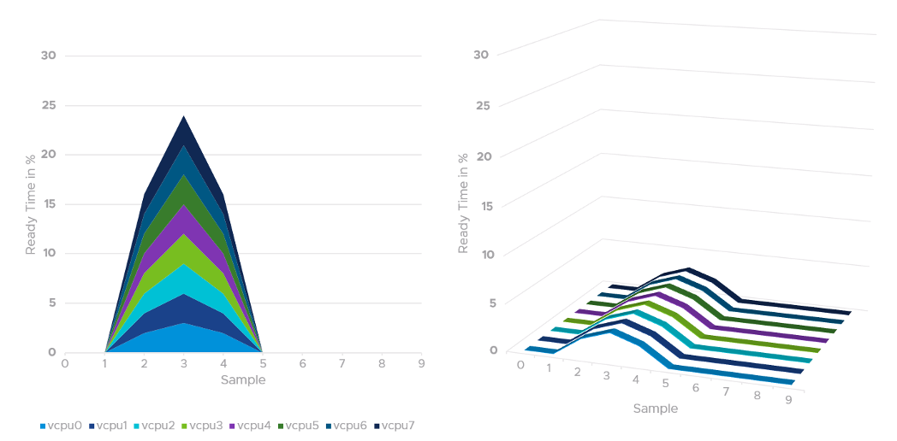

## Co-Stop

CoStop is a different state, hence different counter, than Ready because the cause is different.

CoStop only happens on Simultaneous Multi Processor (SMP) VMs. SMP means that the OS kernel executes parallel threads. This means CoStop does not apply to 1 vCPU VMs, as there is only 1 active process at any given time. It is always 0 on single vCPU VM. 

In a VM with multiple vCPUs, ESXi VMkernel is intelligent enough to run part of the VM vCPUs when it does not have all physical cores to satisfy the large VM demand. At some point, it needs to stop the vCPU, as it's too far ahead of its sibling vCPU (which it cannot serve). This prevents the Guest OS from crashing. The CoStop counters track the time when the vCPU is paused due to this reason. This explains why CoStop tends to be higher on a VM with more vCPUs.

If only one or some vCPU are in ready state, then the remaining ones will soon be co-stopped, until all the vCPU are co-started.

The value of CoStop should be <0.5% in healthy situation. This is based on 63.9 million datapoints, as shown on the following pie chart.

Note that the value of CoStop tends to be larger for large VM. Its value also tends to be smaller than Ready, as shown below. Ready and CoStop may or may not corelate with Usage. In the following chart you can see both the correlation and lack of correlation.

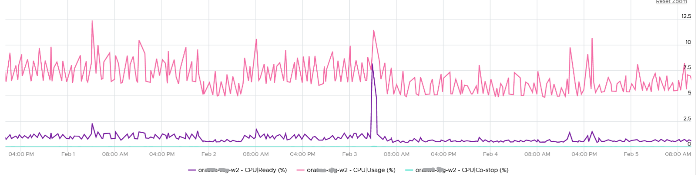

Just like Ready, CoStop happens at the vCPU and not the VM level. When a VM vCPU experiences co-stop, it's because its sibling's vCPU experienced Ready. The sibling vCPU could be Run or still in Ready, but it was behind because it was unable to run. Since it's not CoStop, then it must be Ready.

Guest OS is ***not aware*** of both CoStop and Ready. The vCPU freezes. "What happens to you when time is frozen?"[^3] is a great way to put it. As far as the Guest OS is concerned, time is frozen when it is not scheduled. Time jumps when it's scheduled again.

The metric Guest OS CPU Usage isn't aware of stolen time. For this counter to be aware, its code has to be modified. If you know that Microsoft or Linux has modified this counter, let me know in which version they make the change.

The metric Guest OS Stolen Time accounts for it. But that's in Linux, not Windows. And Linux only measures Ready, not CoStop.

The time it spends under CoStop or Ready should be included in the Guest OS CPU sizing formula as the vCPU wants to run actually.

By the way, there is a performance improvement in the VMkernel scheduler in handling CoStop in ESXi 7.0 Update 1. Prior to the improvement, the application performance dropped after 384 vCPU.

## Wait

There are 3 sub-counters that make up Wait, as seen by the hypervisor.

- Idle. This could be a genuine idle. The Guest OS itself is not running workload on that vCPU
- Swap Wait
- VM Wait

CPU is the fastest component among infrastructure resources, so there are times it must wait for data. The data comes from memory, disk or network. There are also times when there is nothing to do, so the CPU is idle. Whether the Guest OS vCPU is idle or waiting for IO, the VMkernel does not have this visibility. It can only see it as idle. The Idle counter tracks this. Regardless, Idle should not be included in Guest OS sizing as the vCPU is not running.

Because there are 2 levels of IO processing, there are 2 levels of Wait.

- Inside the Guest. Guest OS tracks this as Wait. As the IO is Hypervisor tracks this as VM Wait.
- Outside the Guest. ESXi VMkernel is performing IO. The 2nd level is again not visible to the Guest OS.

Swap Wait tracks the time CPU is waiting for Memory page to come in from ESXi swap.

VM Wait tracks the time CPU is being blocked by other things, such as IO and vMotion. For example, the VMM layer is trying to do something and it's blocked. Snapshot is a common reason here.

Both values of Swap Wait and VM Wait should be near 0%.

Guest OS isn't aware of both VM Wait and Swap Wait. It again experiences freeze. The time it spends under VM Wait and Swap Wait should be included in the Guest OS CPU sizing formula as the VM wants to run actually.

`Run + CoStop + Ready + Wait = 100`

They represent the 4 possible states. This means 20000, as vCenter reports every 20 seconds. vRealize Operations averages 15 of these 20-second averages into a 5-minute average.

VM 2 can run when VM 1 is on CoStop state, Ready state, or Wait state. This is because the physical thread is available.

## Run

Run is when the Guest OS gets to run and process instruction. It is the most basic counter among the 4 CPU utilization counters. It's the ***only*** counter not affected by CPU frequency scaling and hyper threading. It does not check how fast it runs (frequency) or how efficient it runs (SMT).

`Run at VM level = Sum of Run at vCPU levels`

This means the value of CPU Run at VM level can exceed 20000 ms in vCenter.

The following screenshot shows CPU Run higher than [CPU Used](/metrics/chapter-2-cpu-metrics/2.2.2-vm/#used--usage--demand). We can't tell if the difference is caused by power management or hyperthreading, or mix of both.

If the above was all we need to know, monitoring VMware vSphere would have been easy. You wouldn't need a book like this. In reality, the following factors must also be considered:

- Interrupt
- System time
- Power Management or CPU Frequency Scaling
- Simultaneous Multithreading (Hyper Threading as Intel calls it)

Because CPU Run do not take into account this external work, and not aware of CPU speed and HT, we will see in the [right-sizing section](/operations-management/chapter-3-capacity-management/1.3.12-rightsizing/) that this property makes it suitable as input to size the Guest OS.

## Overlap

Time the VM vCPU was interrupted to perform system services on behalf of itself or other VM. Notice the word system services, a process that is part of VMkernel. This means it is not for non-system services, such as vCPU world. That's why the value in general is lower than CPU Ready or even Co-Stop.

When ESXi is running a VM, this activity might get interrupted with IO processing (e.g. incoming network packets). If there is no other available cores in ESXi, VMkernel has to schedule the work on a busy core. If that core happens to be running VM, the work on that VM is interrupted. The counter Overlap accounts for this, hence it's useful metric just like Ready and CoStop counter.

Some documentation in VMware may refer to Overlap as Stolen. Linux Guest OS tracks this as Stolen time.

When VM 1 was interrupted, the Run counter is unaware of this and continues tracking. To the Guest OS, it experiences **freeze**. Time stops for this vCPU, as everything is paused. The clock on motherboard does not tick for this vCPU. Used and Demand do account for this interruption, making them useful in accounting the actual demand on the hypervisor. When the VM 1 runs again, the Guest OS experiences a time jump.

The Overlap counter is useful to troubleshoot performance problem, complementing Ready, CoStop, VM Wait and Swap Wait. Ready does not include Overlap as the VM remains on the Run State (see the CPU State Diagram).

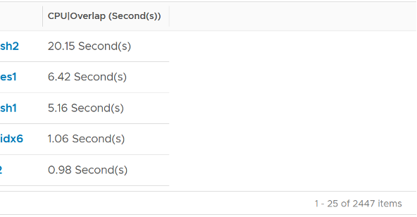

Unit is ms, and it's the summation of the entire 20 seconds, but ***averaged*** over 300 seconds. So the amount at 300 seconds is max 20000 (this is 100%), and must be multiplied by 15 if we want to see the actual average in the 300 second period.

The amount is the sum of all vCPU, so you need to divide by the number of running vCPU. There is also counter at each vCPU level.

The following is a 68 vCPU VM running Splunk. In the last 7 days, it experienced a low but sizeable CPU overlap. 10K is relatively low for a 68 vCPU VM, but it still represents half a vCPU worth of interruption.

Overlap should be included in Guest OS sizing as the Guest OS wants to run actually. It is essentially an unmet Demand.

A high overlap indicates the ESXi host is doing heavy IO (Storage or Network). Look at your NSX Edge clusters, and you will see the host has relatively higher Overlap value versus non IO-intensive VM.

## System

A VM may execute a privilege instruction, or issue IO commands. These 2 activities are performed by the hypervisor, on behalf of the VM.

IO processing differs to non-IO processing as it has to be executed twice. It's first processed inside the Guest OS, and then in the hypervisor network and storage subsystems. ESXi typically uses another core for this work instead of the VM vCPU. ESXi is also performing IOs on behalf of all VMs that are issuing IOs on that same time, not just VM 1. This work has to be accounted for and then charged back to the associated VM. The System counter tracks this. System counter is part of VMX counter.

Regardless, the work has to be charged back to the VM, since CPU Run does not account for it. Since this work is not performed by any of the VM CPU, this is charged to the VM CPU 0. The system services are accounted to CPU 0. You may see higher Used on CPU 0 than others, although the CPU Run are balanced for all the VCPUs. So this is not a problem for CPU scheduling. It's just the way VMKernel does the CPU accounting.

The System counter is not available per vCPU. Reason is the underlying physical core that does the IO work on behalf of the VM may be doing it for more than 1 vCPU. There is no way to break it down for each vCPU. The following vCenter screenshot shows the individual vCPU is not shown when System metric is selected.

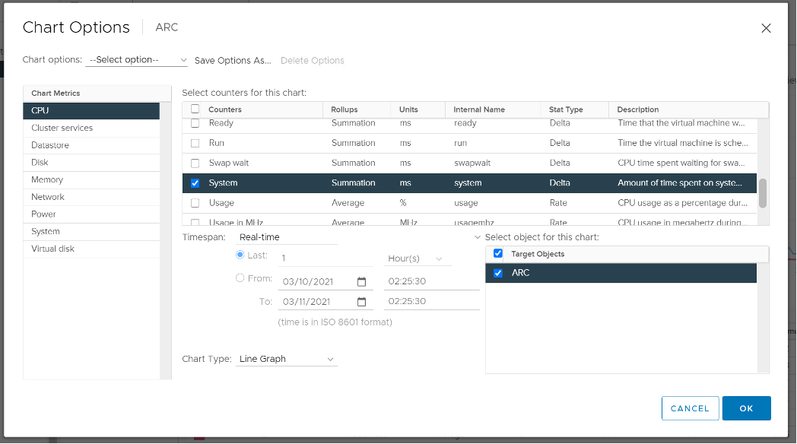

{}
As of vSphere 6.5, Sotrage vMotion effort for the VM being moved is no longer charged to vCPU 0.
{}

Majority of VMs will have System value less than 0.5 vCPU most of the time. The following is the result from 2431 VMs.

On IO intensive VM like NSX Edge, the System time will be noticeable, as reported by [this KB article](https://kb.vmware.com/s/article/59640). In this case, adding more vCPU will make performance worse. The counter inside Linux will differ to the counter in vSphere. The following table shows high system time.

## Simultaneous Multithreading

CPU [SMT](https://en.wikipedia.org/wiki/Simultaneous_multithreading) (Hyper Threading as Intel calls it) is known to deliver higher overall throughput. It increases the overall throughput of the core, but at the expense of individual thread performance. The increase varies depending on the load.

Accounting wise, ESXi records this overall boost at 1.25x regardless of the actual increase, which maybe less or more than 1.25x. That means if both threads are running at the same time, the core records 1.25x overall throughput but each thread only gets 62.5% of the shared physical core. This is a significant drop from the perspective of each VM. From the perspective of each VM, it is better if the second thread is **not** being used, because the VM could then get 100% performance instead of 62.5%. Because the drop could be significant, enabling the latency sensitivity setting will result in a full core reservation. The CPU scheduler will not run any task on the second HT.

The following diagram shows 2 VMs sharing a single physical core. Each run on a thread of the shared core. There are 4 possible combinations of Run and Idle that can happen:

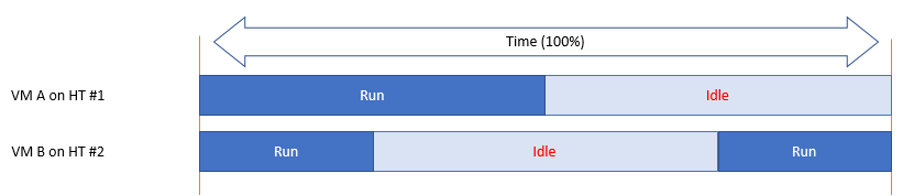

Each VM runs for half the time. The CPU Run counter = 50%, because it's not aware of HT. But is that really what each VM gets, since they have to fight for the same core?

The answer is obviously no. Hence the need for another counter that accounts for this. The diagram below shows what VM A actually gets. The allocation is fixed.

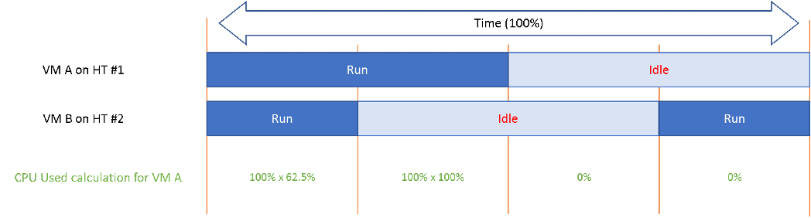

The CPU Used counter takes this into account. In the first part, VM A only gets 62.5% as VM B is also running. In the second part, VM A gets the full 100%. The total for the entire duration is **40.625%**. CPU Used will report this number, while CPU Run will report **50%**.

If both threads are running all the time, guest what CPU Used and CPU Run will report?

62.5% and 100% respectively.

## Used | Usage | Demand

As covered earlier, CPU Run does not account for the following:

- How fast is the "run"? All else being equal, a 5 GHz CPU is 5x faster than a 1 GHz CPU. Throughput impacts utilization. The faster it can complete a task, the shorter it has to work. That's why you see some counters in MHz, because they account for this speed.
- How efficient is the "run"? If there is competing thread running in the same core, the 2 threads have to share the core resource. ESXi accounting records this as 1.25x overall gain, hence each thread drops to 62.5% only. This is a significant drop that should be accounted.
- IO work. IO performed by hypervisor has to be charged to the VM.

This is where [Used](/metrics/chapter-2-cpu-metrics/2.2.2-vm/#used) and [Demand](/metrics/chapter-2-cpu-metrics/2.2.2-vm/#demand) come in. vCenter then adds Usage (MHz) and Usage (%) counters. The following table shows the 5 VM utilization counters.

| Counter | Available at | Unit | Source | CPU Frequency | SMT |
| ------- | ------------ | -----|--------|---------------|-----|
| Run| vCPU level | Millisecond | ESXi | No | No |
| Used | vCPU level VM level (include System) | Millisecond | ESXi | Yes| Yes|
| Usage | vCPU level | MHz | vCenter | Yes | Yes|
| Usage | VM level| % | vCenter | Yes | Yes |
| Demand | VM level | MHz | ESXi | Yes | No|

## Used

CPU Used covers uses cases that CPU Run does not.

- VM Migration. Moving VM to another ESXi requires that you know the actual footprint of the VM, because that's what the destination ESXi needs to deal with.
- VM Chargeback. You should charge the full cost of the VM, and not just what's consumed inside the VM. In fairness, you should also charge the **actual** utilization, and not rated clock speed.

Here is how Used differs to Run:

Based on the above, you can work out the formula for VM level Used, which is:

`VM level Used = Run + System - Overlap + VMX +/- E`

Where **E** is the combination of:

- efficiency gained from CPU Turbo Boost or efficiency loss from power savings. For example, if the frequency is dropped to 40% of the nominal frequency, we consider 60% of the CPU time was stolen.
- 37.5% efficiency loss from CPU SMT.

VMX is typically negligible. It accounts for CPU cycles spent on things like consoling to the VM. In esxtop, System time is charged to the VM VMX world.

Because Used accounts for the actual frequency, you may expect it to be measured in GHz and not millisecond. Think of the number of cycles completed instead of simply frequency. You then convert it back to time. I know it requires a bit of mental mathematics 😊

Quiz:

- Why does the formula state VM level, and not individual vCPU level. What's the reason?
- How will Used compare with Run in general? Do you expect it to be higher or lower? If it's higher, what can cause it?

The impact of [Power Management](/metrics/chapter-2-cpu-metrics/2.2.3-esxi-host/#power-management) can be noticeable. For example, a physical chip comes with 2 GHz as its standard speed. ESXi may increase or decrease this speed dynamically, resulting in Turbo Boost or power saving. If ESXi increases the clock speed to 3 GHz, Used counter will be 50% higher than the Run counter. The Guest OS (e.g. Windows or Linux) is not aware of this performance boost. It reports a value based on the standard clock speed, just like Run does. On the other hand, if ESXi decreases the clock speed to 1.5 GHz, then Used will report a value that is 25% lower than what Run reports.

Let's take an example. What do you notice?

As you can see from the preceding chart, the impact is noticeable. The System and Overlap counters hovers averages <10 ms (negligible as this VM is basically idle), but the gap between Used and Run averages around 20% Used is ~20% higher than Run, likely due to Turbo Boost.

Let's take another example, this time from a busy VM. I've removed System and Overlap as they are also negligible in this example. This is a 32 vCPU VM running Splunk. Notice Used is consistently higher than Run.

Now let's look at the opposite scenario. This VM is a 64 bit Ubuntu running 4 vCPU. Used (ms) is around 44% of Run (ms). The VM had minimal System Time (ms) and Overlap (ms), so Used is basically lowered by both power savings and CPU SMT. In this example, if Run is far from 100% and the application team want faster performance, your answer is not to add vCPU. You should check the power management and CPU SMT, assuming the [contention counters](/metrics/chapter-2-cpu-metrics/2.2.3-esxi-host/#esxi-utilization-counters) are low.

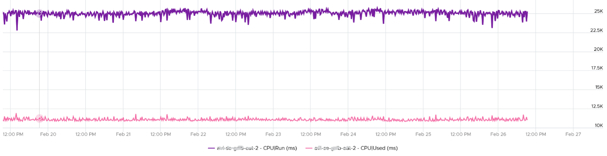

{}
CPU Used has a different formula at VM level and vCPU level. At vCPU level, it does not include System Time. At VM level, it includes the work done by VMkernel that is charged at VM level, such as System and other worlds.
{}

## Usage

There are two counters: Usage (MHz) and Usage (%). These 2 counters do **not** exist in ESXi, meaning they only exist in vCenter. I'm not able to figure out if Usage (%) = Usage (MHz) / VM Static CPU Speed, as I don't have the need yet to use both counters. From the chart below, it appears that they are not 100% identical, but they are _very_ similar.

Let's compare Usage with Used instead. We will compare Usage MHz as that's the raw counter. The percentage value is derived from it.

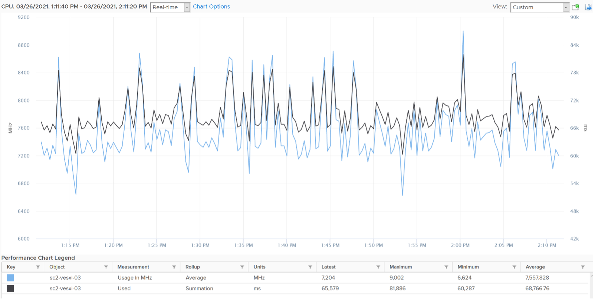

From the preceding chart, we can see they are basically the same, with the difference due to y-axis scales. Formula wise, Usage (MHz) includes all the VM overhead, such as the time spent by VMX process.

vRealize Operations Usage (MHz) and Usage (%) metrics map 1:1 to the respective counters from vCenter.

Note that Usage (%) is capped at 100%. The following is a single vCPU production Windows Server. Both CPU Usage (MHz) and Demand jump to over 100%. Their values are identical for almost 30 days. The VM had near 0% Contention (not shown in chart), hence the 2 values are identical.

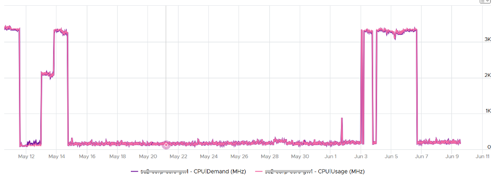

However, when we plot the value in %, we see a different number. Usage (%) is strangely capped at 100%.

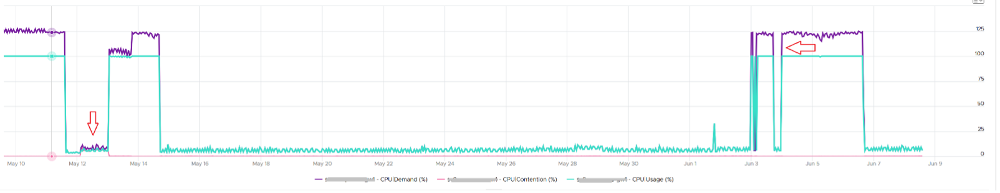

The VM experienced some contention around May 12. That's why Demand was higher than Usage.

## Demand

CPU Demand includes System time, so it reflects the full picture of what VM consumes. It also includes efficiency loss because of frequency scaling. For example, if the frequency is dropped to 40% of the nominal frequency, we consider 60% of the CPU time was stolen. Usage value will be lower by 60% to Demand, all else being equal.

Demand is typically higher than Used by 1.25x. This makes sense as the HT effect is fixed at 1.25x. This means Demand is a the counter to use when you suspect the performance drop is caused by hyper threading. If the issue coincides with a sharp gap between Usage and Demand, that's hyperthreading.

How can Usage be higher than Demand then? Take a look at this vSphere Replication appliance. It replicates every 5 minutes, hence the spike. Notice the spike for Usage is higher but thinner. What's going on?

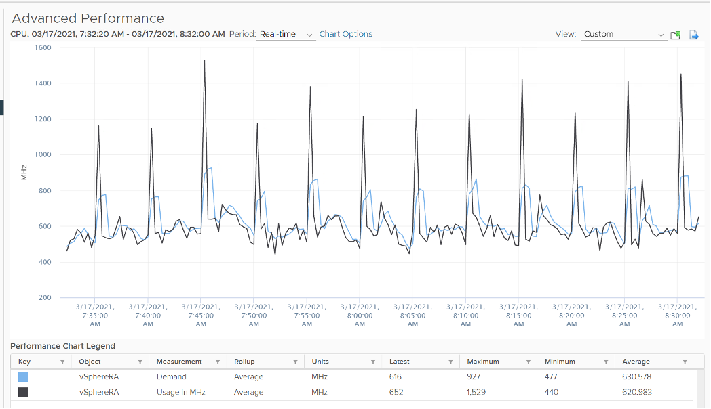

We've disabled hyperthreading in the underlying ESXi, so we can isolate and compare better. Notice the pattern is similar. Demand is averaged over a longer time, giving it a more steady value. That's why the peak is shorter but wider.

Demand could be lower than Run if there is power management savings, as it accounts for speed & efficiency of the run.

Demand (MHz) and Usage (MHz) can exceed 100%. The following is a 32-vCPU hadoop worker node. Notice it exceeds the total capacity multiple times. Demand and Usage are identical as it's the only VM running and the has more than 32 cores, hence there is 0 contention.

Okay, now that you have some knowledge, let's test it 😊

Quiz Time! Looking at the chart below, what could be causing it?

Notice Demand jump while Usage dropped. VM CPU Contention (%) jumped even more. What is going on?

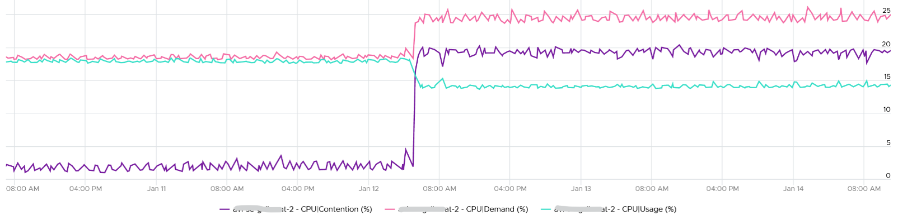

And why is that Contention is much more than Demand – Usage?

Answer at the end of the book!

In older releases of vRealize Operations, this counter used to be computed as:

`Maximum (CPU Utilization for Resources / CPU Active (1 min. average) / Configuration / Hardware / Number of CPUs, CPU Usage) * CPU Total Capacity / 100.`

This is no longer the case as vRealize Operations now simply maps to the vCenter metric.

## Contention

This vRealize Operations metric maps to vCenter CPU Latency (%) counter, which in turn maps to ESXi `#LAT_C` counter. The diagram below shows what it includes. `LAT_C` excludes "Max Limited" in Ready, but it includes CoStop even if the CoStop was the result of Limit. Notice that HT and CPU Frequency are effect and not metrics. You can see the impact of CPU Frequency in [esxtop](http://www.yellow-bricks.com/esxtop/) `%A/MPERF` counter.  

It measures the full possible contention a VM may have, that is not intentionally imposed on the VM by the vSphere Administrator. It considers [CPU SMT](/metrics/chapter-2-cpu-metrics/2.2.3-esxi-host/#esxi-utilization-counters) effect. In ESXi CPU accounting, Hyper Threading is recorded as giving 1.25x throughput. That means when both threads are running, each thread is recorded as only getting 62.5%. This will increase the CPU Contention to 37.5%. All else being equal, VM CPU Contention will be 37.5% when the other HT is running. This is done so Used + Latency = 100%, as Used will report 62.5% when the vCPU has a competing thread running.

In the above scenario, what's the value of CPU Ready?

Yup, it's 0%.

CPU Contention also accounts for power management. What happens to its value when frequency drops by 25%. It can't go to negative right? If you know the answer, let me know!

Because of these 2 factors, its value is more volatile, making it less suitable as a formal Performance SLA. Use CPU Ready for Performance SLA, and CPU contention for performance troubleshooting. You can do a profiling of your environment by calculating the value of CPU Ready at the time CPU Contention hits the highest, and vice versa. The following table only shows 5 VM out of 2500 that I analyzed. These 2 counters do not have good correlation, as they are created for different purpose.

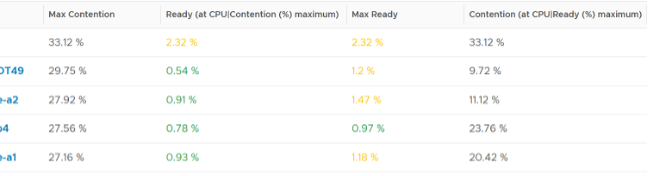

In many cases, the impact of both threads running is not felt by the application running on each thread. If you use CPU Contention as formal SLA, you may be spending time troubleshooting when the business does not even notice the performance degradation.

The following screenshot shows CPU Contention went down when both Ready and CoStop went up.

How about another scenario, where Contention is near 0% but Ready is very high? Take a look at this web server. Both CPU Demand and CPU Usage are similar identical. At around 1:40 am mark, both Demand and Usage showed 72.55%, Contention at 0.29%, but Ready at above 15%. What's causing it?

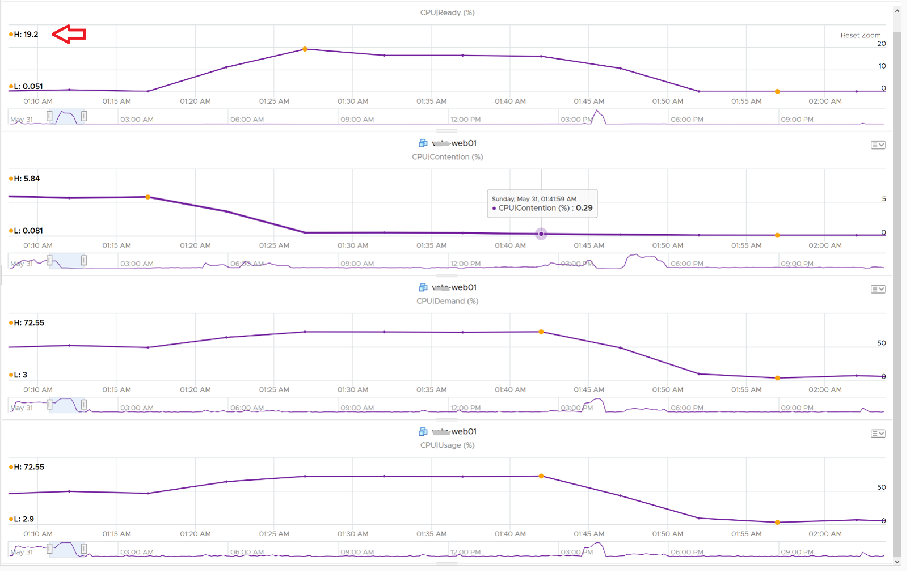

The answer is Limit. Unlike CPU Ready, it does not account for Limit (Max Limited) because that's an intentional constraint placed upon the VM. The VM is not contending with other VMs. [VMware Cloud Director](https://www.vmware.com/products/cloud-director.html) sets limit on VM so this counter will not be appropriate if you aim to track VM performance using Contention (%) metric.

A better and more stable metric to track the contention that a VM experience is `Ready + Co Stop + Overlap + VM Wait + Swap Wait`. Note that the raw metric for all these are millisecond, not GHz.

Where do you use CPU Contention then?

Performance troubleshooting for CPU-sensitive VM.

If the value is low, then you don't need to check CPU Ready, CoStop, Power Management and CPU overcommit. The reason is they are all accounted for in CPU Contention.

If the value is high (>37.5%), then follow these steps:

- Check CPU Run Queue, CPU Context Switch, "Guest OS CPU Usage", CPU Ready and CPU CoStop. Ensure all the CPU counters are good. If they are all low, then it's Frequency Scaling and HT. If they are not low, check VM CPU Limit and CPU Share.
- Check ESXi power management. If they are set to Maximum correctly, then Frequency Scaling is out (you are left with HT as the factor), else HT could be at play. A simple solution for apps who are sensitive to frequency scaling is to set power management to max.
- Check CPU Overcommit at the time of issue. If there is more vCPU than pCore on that ESXi, then HT could be impacting, else HT not impacting. IMHO, it is rare that an application does not tolerate HT as it's transparent to it. Simplistically speaking, while HT reduces the CPU time by 37.5%, a CPU that is 37.5% faster will logically make up for it.

{}
There is a corner case accounting issue in `%LAT_C` that was resolved in ESXi 6.7. VMs with Latency Sensitive = High on ESXi 6.5 or older, will show any "guest idle" time of vCPUs as `LAT_C`, for those VMs the counter should not be relied on. This is a corner case because majority of VM should not be set with this, as it impacts performance of other VMs.
{}

## CPU Usage Disparity

This metric is required to convince the owners of the VM to downsize their _large_ VMs. It's very common for owners to refuse sizing it down even though utilization is low, because they have already paid for it or cost is not an issue.

Let's use an example. This VM has 104 vCPU. In the last 90 days, its utilization is consistently low. The Usage (%) counter never touches 40%. Demand is only marginally higher. Idle (%) is consistently ~20%.

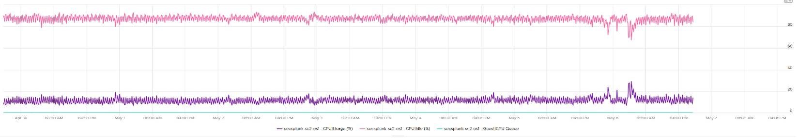

All the key performance counters such as Guest OS CPU Run Queue are low.

Obviously the VM does not need 104 vCPU. How to convince the owner if he is not interested in refund? The only angle left is performance. But then we're faced with the following:

1. CPU Run Queue inside the Guest OS is low. Decreasing CPU will in fact increase it, which is worse for performance.
1. CPU Context Switch is high from time to time.
1. CPU Co-Stop is very low (max of 0.006% in the last 90 days). Decreasing CPU may or may not make it lower. Regardless, it's irrelevant. Same goes with VM Wait and Swap Wait.
1. CPU Ready is very low (max of 0.14% in the last 90 days).

The only hope we have here to convince VM owner is to give insight on how the 104 vCPU are used. There are 2 ends of the spectrum:

1. In 1 extreme end, all 104 are balanced. All are running at that low 20%. This triggers an interesting discussion on why the application is unable to even consume a single vCPU. Is this inefficiency the reason why the app vendor is asking for so many vCPU? Commercially, it's wasting a lot of software license.
1. Unbalanced. Some are saturated, while others are not.
    1. The Peak among vCPU metric will capture if any of them is saturated. This is good insight.
    1. The Min among vCPU is not useful as there is bound to be 1 vCPU among 104 that is running near 0%.
    1. The delta between Max and Min will provide insight on the degree of the usage disparity. Does it fluctuate over time? This type of analysis helps the app team. Without it they have to plot 104 vCPU one by one.

In reality, there could be many combinations in between the 2 extremes. Other insights into the behaviour of the 104 vCPU are:

1. Jumping process. Each vCPU takes turn to be extreme high and low, as if they are taking turn to run. This could indicate process ping pong, where processes either do frequent start/stop, or they jump around from one vCPU to another. Each jump will certainly create context switch, like the cache needs to be warm up. If the target CPU is busy, then the running process was interrupted. 
1. CPU affinity. For example, the first 10 vCPU is always much busier than the last 10 vCPU. This makes you think why, as it's not normal.

Naming wise, vCPU Usage Disparity is a better name than Unbalanced vCPU Usage. Unbalanced implies that they should be balanced, which is not the case. It's not an indication that there is a problem in the guest OS because vRealize Operations lacks the necessary visibility inside the guest OS

## Entitlement

Unlike a physical server, you can configure a Limit and a Reservation on a VM. This is done outside the Guest OS, so Windows or Linux does not know. You should minimize the use of Limit and Reservation as it makes SDDC operations more complex.

Entitlement means what the VM is entitled to. In this example, the hypervisor entitles the VM to a certain amount of CPU. Entitlement is not a fixed value. It's a dynamic value determined by the hypervisor. It varies every second, determined by Limit, Entitlement, and Reservation of the VM itself and any shared allocation with other VMs running on the same host.

Obviously, a VM can only use what it is entitled to at any given point of time, so the Usage counter cannot go higher than the Entitlement counter.

In a healthy environment, the ESXi host has enough resources to meet the demands of all the VMs on it with sufficient overhead. In this case, you will see that the Entitlement and Usage counters will be similar to one another when the VM is highly utilized.

The numerical value may not be identical because of reporting technique. vCenter reports Usage in percentage, and it is an average value of the sample period. vCenter reports Entitlement in MHz and it takes the latest value in the sample period. This also explains why you may see Usage a bit higher than Entitlement in highly-utilized vCPU. If the VM has low utilization, you will see the Entitlement counter is much higher than Usage.

## VM Counters in the Guest

You can provide visibility into the underlying VM to the application team by enabling some CPU counters. The counters are described in [this](https://kb.vmware.com/s/article/2030221) KB article.

## Unmet Demand

This is not a built-in counter. You can create it using vRealize Operations super metric.

While the need for such counter sounds logical, the detail is more complex. What do we need this counter for?

- If it's for Cluster Capacity, then CPU Ready caused by Limit should not be considered. You intentionally place the limit, so the CPU Ready is not caused by the inability of the host.
- If it's for VM Performance, then it's debatable. If you do not include it, you may miss it. If you include it, the solution is to remove the limit. The problem is the limit could be caused by setting in the resource pool where the VM belongs to. For example, if customer only wants to pay for 10 GHz of resource but insists on running more than that, well, performance will definitely take a hit.

The above 2 counters are for CPU slowness. CPU, being the fastest component, typically wait for RAM, Disk and Network.

- CPU Swap Wait. CPU is waiting for Memory. Had RAM were faster, it would have been executed. For example, adding RAM may result in higher CPU usage.
- CPU VM Wait. CPU is waiting for IO (Disk or Network) and other things (e.g. vMotion stun time). Had they been faster, it would have been executed. For example, replacing storage subsystem with much lower latency would result in CPU completing the task in less time. A 10 hour batch job may take 1 hour, so the CPU usage would be 10x. If disk is outside the ESXi, changing the array can have ramification on ESXi usage. So we should account for it.

Should we account for this wait? They are not real demand. It's not an unmet demand. It's a potential demand, which would happen if the other component is improved. Let me know your thought!

CPU Unmet Demand should only care about whether the VM gets to run or not. It should not care about how fast it will run when it gets to run, because it does not know. As a result, we should not account for HT. The demand was met, albeit at efficiency dropped by 37.5% due to HT effect.

The formula I'd propose is Ready + CoStop + Overlap + Swap Wait + VM Wait.

[^1]: Designing an OS for multiple hardware classes is hard. Notice Apple MacOS, iPhone OS, and iPad OS. Google has Android and ChromeOS.

[^2]: Labelled as MLMTD in esxtop. That's Max Limited, not some Multi Level Marketing scam 😊

[^3]: Asked to me by Valentin Bondzio in one of the VMworld where we got to meet. Those were the days!