Hope you like the tour of VM CPU accounting. Can you apply that knowledge into ESXi and explain the following?

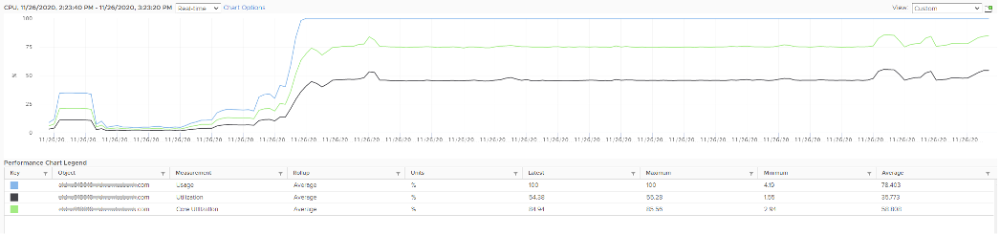

The above is an ESXi host, showing 3 types of utilization counters. One shows 50%, indicating you have more capacity. But the second one shows 100%, indicating you do not have capacity. And the 3rd shows 75%. Which counters do you take for the ESXi CPU “utilization” then?

Notice they have similar pattern, but their **sensitivity** differs.

- Why is Usage (%) = 100% when Utilization (%) is around 47%? The gap is more than double. What could be causing it?
- Why is Utilization (%) fluctuating yet Usage (%) remains constant? Notice both Utilization varies between 45% and 55% while Usage remains flat at 100%
- Why is Core Utilization (%) in the “middle”? What does it actually measure then?

To answer the above, we need to cover some fundamental. Note that we must take the vantage point of ESXi, not VM. Don't mix this with the VM view of the world as they are similar so it's easy to get mixed up. From ESXi physical threads viewpoint, things such as Ready and CoStop are not applicable as the physical threads are provider of resource.

Unlike RAM, CPU performance varies widely among different CPU models. Speed matters in CPU, whereas in RAM we can generally ignore it. DDR5 RAM is faster than DDR4 but for general monitoring reason it can be ignored. Because of this significant difference in CPU, we need to have counters to account for:

- How often it runs. How much the CPU runs in a time period. E.g. if it runs 60% of the time in the last 100 seconds, that means it runs for 60 seconds accumulatively in that period. That's why you see many counters in millisecond. They track the utilization over time.
- How fast it runs. All else being equal, a 5 GHz CPU is 5x faster than a 1 GHz CPU. Throughput impacts utilization. The faster it can complete a task, the shorter it has to work. That's why you see some counters in MHz.
- How efficient it runs. CPU SMP impacts the core efficiency. This is covered more [here](/metrics/chapter-2-cpu-metrics/2.2.3-esxi-host/#esxi-utilization-counters). This efficiency is then translated into MHz, for ease of accounting.

These 3 dimensions of run are the reason why CPU utilization is hard to measure. It becomes “it depends on what you consider”. It can't be a single number. Insisting that the CPU has a single, static, total capacity and use this as the only 100% for all use cases will result in confusion in “utilization” numbers.

ESXi uses 3 types of units: millisecond, MHz and %.

Time is the raw unit, meaning the percentage unit is derived from it and the MHz unit is expressed as the average over time. When we see the CPU demand is 2 GHz at 9:00:00 am what vCenter actually means is it the average from 8:59:40 am, assuming you're looking at the real time chart. Other number on the vCenter UI could be averaged of longer time, else frequent changes could cause unnecessary confusion. 

## Utilization and Core Utilization

Let's dive into the first two fundamental counters. For that, we need to begin with a single physical core in a socket. We also need to start at esxtop, and then move up to vSphere Client UI. The socket can have many cores, we are just interested on 1 core only. It has 2 threads as it supports CPU SMT.

In a time period of say 20 seconds[^1], this core had the following consumption:

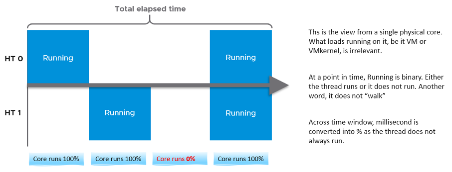

Looking at esxtop, you will see near the top the PCPU Used and PCPU Utilization counters. Note that their values are in percentage, meaning you need to know what they use for 100%.

If you guess that they eventually map into vSphere Client counters Usage (%) and Utilization (%), respectively, you are right. However, you need to know how they map.

PCPU means a physical hardware execution context. That means it is a physical core if CPU SMT is disabled, or a physical thread inside a core if SMT is enabled. It does not mean CPU socket. A single socket with 10 cores and 20 threads will have 20 PCPU counters.

PCPU Utilization (%) tracks is a physical thread is used or not over time. At any given moment, a thread is either running (unhalted) or not (halted). So it's binary (0% or 100%). But over the 20 second period, the value is averaged. So when you see the number as 50%, it does not mean it's running 100% at half the “speed”. It means it's running half the time, for only 10 seconds. Using a human analogy, think of it as a person who is either running or standing, and never walking. It's not considering CPU Frequency.

Core Utilization (%) tracks at the core level. If one of the threads is running, then the value is 100%. At the core level, the average utilization in that entire period is 75%. In the last portion, the core still runs at 100%. The CPU Utilization (%) tracks this. As a result, CPU Utilization (%) is only relevant when hyper-threading is enabled.

Going back to our example, here are metrics reported:

- PCPU Utilization (%) for HT 0 = 10 seconds / 20 seconds = 50%
- PCPU Utilization (%) for HT 1 = 10 seconds / 20 seconds = 50%
- Core Utilization (%) for entire core = 15 seconds / 20 seconds = 75%

Now let's roll this up to the ESXi level. The following show a tiny ESXi with 2 cores, where each core has 2 threads.

The metrics at ESXi level is:

- CPU Utilization (%) = 40 seconds / **80** seconds = 50%.
- CPU Core Utilization (%) = 30 seconds / **40** seconds = 75%

Utilization = 50% because each thread is counted independently. There are 4 threads in the preceding ESXi, each runs 50%, so the average at ESXi level is 50%. This counter basically disregards that HT does not deliver 2x the throughput.

Now let's go back to the chart shown [earlier](/metrics/chapter-2-cpu-metrics/2.2.3-esxi-host/). Can you now explain Utilization (%) and Core Utilization (%)?

Great! Let's move to the next one.

In the following example, this ESXi has no hyper-threading. What do you notice?

Yup, the Core Utilization is identical with Utilization.

Great! You are now ready to tackle the next counters, which are Used (%) and Usage (%).

This vCenter counter essentially maps to PCPU Used (%) counter in esxtop. It considers CPU SMT and CPU Clock Speed. Here is how Utilization (%) and Used (%) are related at PCPU level:

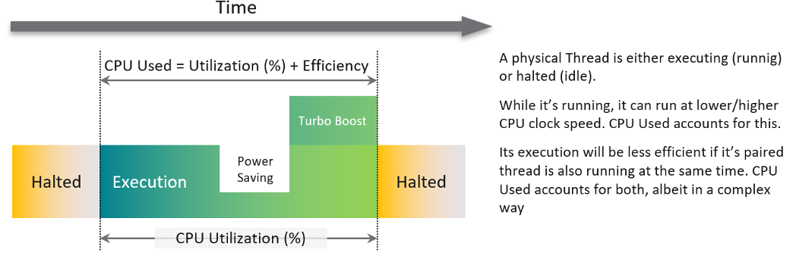

CPU frequency scaling is caused by power management, so let's dive into it.

## Power Management

The 2nd factor that impacts CPU accounting is CPU clock speed. The higher the frequency (GHz), the faster the CPU run. All else being equal, a CPU that run at 1 GHz is 50% slower than when it runs at 2 GHz. On the other hand, Turbo Mode can kick in and the CPU clock speed is higher than stated frequency. Turbo Boost normally happens together with power saving on the same CPU socket. Some cores are put to sleep mode, and the power saving is used to turbo mode other cores. The overall power envelope within the socket remains the same.

**C-State** = idle state, running or varying degrees of components turned off. A CPU chip has many subcomponents, and not all components have to be powered on. Fully running is C0 state. Within this C0 state, there is a further dimension called P-State.

**P-State** = voltage / frequency point. The P0 state is where Turbo Boost happens. There are 14 states, where P13 is the lowest CPU frequency.

In addition, it takes time to wake up from a deep C-State. For details on P-State and C-State, see Valentin Bondzio and [Mark Achtemichuk](https://twitter.com/vmMarkA), [VMworld 2017, Extreme Performance Series](https://www.youtube.com/watch?v=EYggYAwjz3g).

The following screenshot shows ESXi with 14 P-States, where P0 is represented as 2401 MHz. Each row is a Logical CPU. Logical CPU means HT (if it's enabled) or core (if no HT). See Logical CPU 10 and 11. They are running at 100%, and in fact are in Turbo Boost, so obviously both are in C-State C0. The `%A/MPERF` shows Turbo boost. [This](https://www.vmware.com/content/dam/digitalmarketing/vmware/en/pdf/techpaper/performance/whats-new-vsphere65-perf.pdf) was introduced in vSphere 6.5.

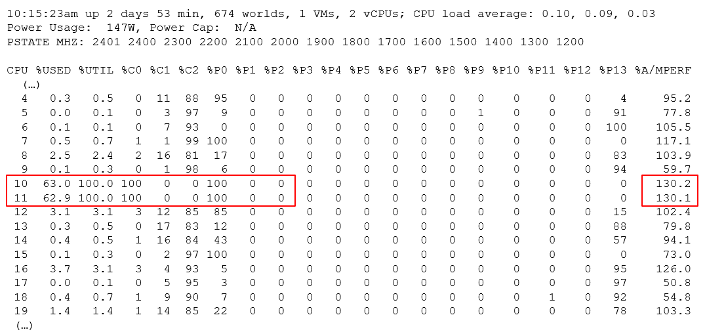

10 and 11 are running 100% in P0 state. **%Util** corresponds to each HT in Core Utilization.

Each core can have its own frequency. This makes rolling up the number to ESXi level more complex. You can't derive one Throughput counter from the other. Each has to be calculated independently at core level.

Does it mean we should always set power management to maximum?

No. ESXi uses power management to save power without impacting performance. A VM running on lower clock speed does not mean it gets less done. You only set it to high performance on latency sensitive applications, where sub-seconds performance matters. VDI, VoIP, video calling, Telco NFV are some examples that are best experienced with low latency.

## Used

Now that we have covered CPU Clock Speed, we can add this dimension into the same scenario above. For that, we will go back to our tiny ESXi:

In Core 0, the first thread was running at half the CPU frequency in the first period. While Utilization (%) records this as 100% run, Used (%) is aware of this reduction and records 50% instead. In the 4th period, the thread is competing with another thread. Used (%) recognises the drop in efficiency and register 50% instead of 100%. Personally, I'd prefer this to register 62.5%.

On the other hand, when Turbo Boost increases the clock speed by 1.5x on the 2nd thread, Utilization (%) is unaware and record 100%, but Used registered 150%. Take note that the value at ESXi level is capped at 100%.

In a simplistic example, the above is how Used considers both hyperthreading and CPU scaling.

With this knowledge, now the screen on vCenter client UI will be clearer.

You see both the Capacity of 35.18 GHz and Used of 11.3 GHz. There is no concept of Usable Capacity in vSphere, so the Free amount is basically Capacity – Used.

vCenter shows Used in GHz. The value is actually CPU Usage, as the Used counter is supposed in percentage or millisecond. The CPU capacity is `summary.hardware.numCpuCores x summary.hardware.cpuMhz`.

The Used CPU is `summary.quickStats.overallCpuUsage`.

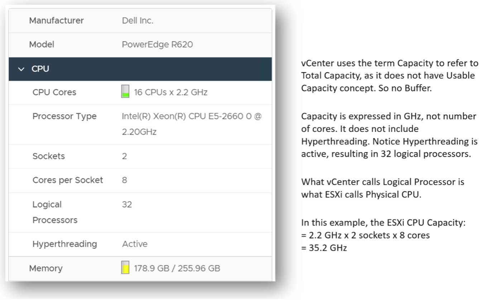

The value above is likely some average of say 5 minutes as it remains static for a while and it does not exactly match the number below as the roll up period is not the same.

CPU Idle (ms) + CPU Used (ms) = 100%, where 100% = no of physical cores x 20000 ms.

Used does not count the threads, meaning each core has 20000 as 100%, not 40000.

Can you guess how many physical cores the following ESXi has?

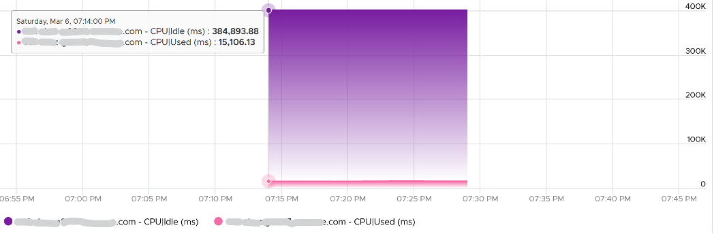

Answer: 20 cores, 40 threads.

Notice the total sum is constant at 400K ms. Divide this by 20K ms and you get 20 cores. While the graph shows the line is slightly above 400K, the sum of the 2 values shown is actually 400,000.01 ms.

If you want to verify with vCenter, the following ESXi host has 16 cores 32 threads. Notice the sum is ~320000 ms, not 640000 ms.

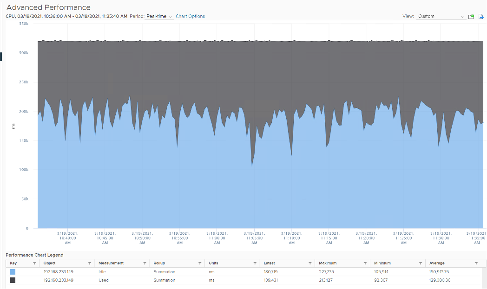

## Usage

vCenter adds this counter, meaning it does not exist at ESXi level. If you see in esxtop, you will find Used (%) and Utilization (%) but not Usage. Usage basically maps to Used, but showing in MHz. This is great as using millisecond is hard to account for “how fast you run” and “how efficient you run”. With MHz, we can plot the value across time.

Let's see if Used (ms) = Usage (MHz).

To prove it, we plot 180 data points from each, and compare the average. For completeness, let's compare the latest value too.

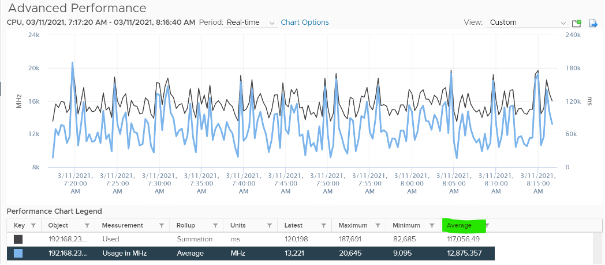

Let's compare the above value to prove the formula. We need to translate them into a common unit for comparison.

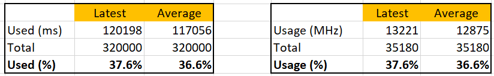

Bingo!

Both the average values and the latest values match.

Just like Used, Usage tops out at 100% when all cores run at least one thread at nominal frequency, even if there is still "headroom" for Turbo Boost or scheduling "capacity" on other threads. This is why its value will be lower than Core Utilization if there is power savings, as shown below.

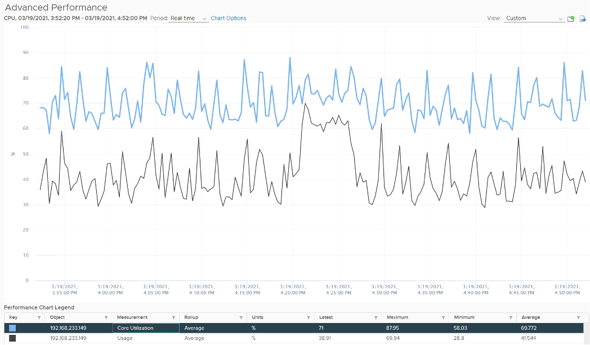

ESXi CPU Usage (%) = CPU Usage (MHz) / CPU Total Capacity (MHz), where Total Capacity = total cores x nominal clock speed. It does not consider hyper threading. This accounting technique of removing hyperthreading is consistent with Used.

The following chart prove the above equation.

When is Usage (%) higher than Core Utilization (%)?

The answer has to be Turbo Boost. The following shows an ESXi where Usage is consistently higher than Core Utilization (%) in the last 24 hours. Notice that the value of Usage was capped at 100%. It did not breach 100%

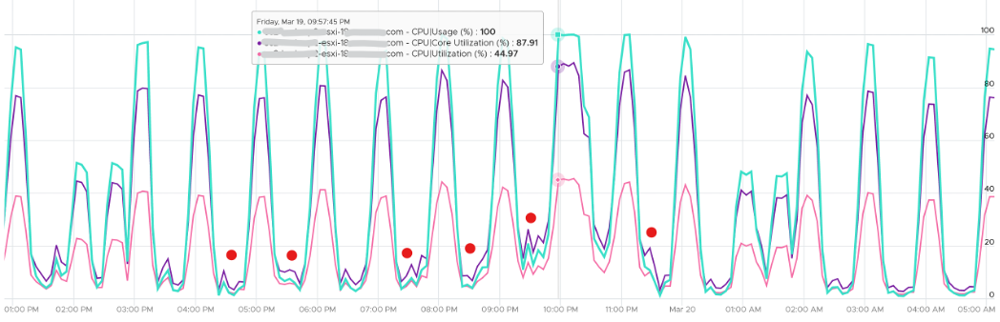

I've marked some areas of the above chart with red dot. Those areas is where Usage turns out to be lower than Core Utilization.

Why?

The answer is power saving, which typically happens on low utilization. In an aggressive power savings, Usage can even be lower than Utilization, as shown below. This makes sense, as the idles cores consumes are run at lower frequency, hence the average at ESXi level is low.

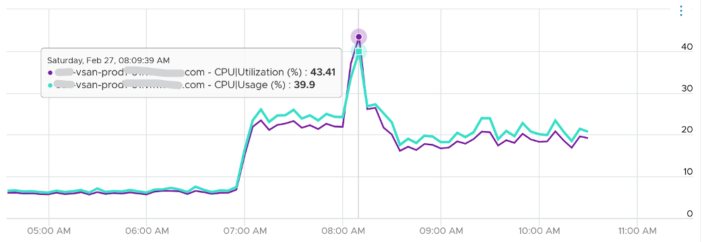

## Demand

Demand looks at different context than Utilization/Used/Usage. It looks at the VM world, not the physical cores. As a result, its value tends to be higher than all the other counters. It does not include the VMkernel load, so at lowly utilization, Demand will be lower than Usage.

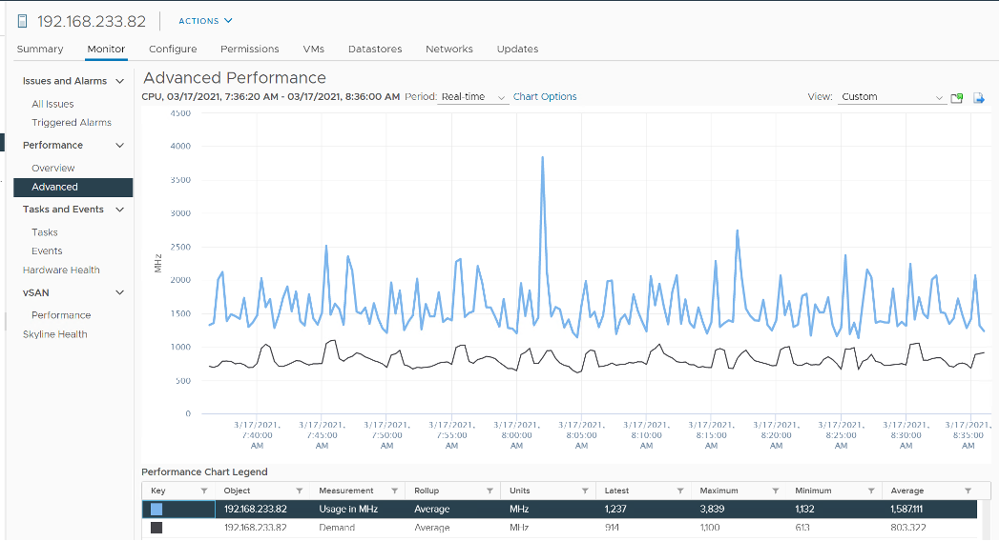

One good thing about Demand metric is it can go above 100%. All the other counters are capped at 100%. Demand lets you see how high above 100% the demand. It does not mean the VM is experiencing performance, as there is Turbo Boost and Hyperthreading to assist.

In older release of vRealize Operations, this counter used to be computed as `Sum ( VM CPU / Host Demand for Aggregation ) + CPU Overhead`. This is no longer the case as vRealize Operations now simply maps to vCenter metric.

## ESXi “Utilization” counters

Let's summarise the counters we have covered so far. vCenter provides 6 counters to account for the utilization of ESXi CPU. Since esxtop uses the Used (%) metric but ESXi uses the Used (ms) metric in the vCenter client, I'm including both.

| Counter | Available at | Unit| Source | CPU Speed|
| ------- | ------------| ----- | ----- | -------- |
| Utilization | Thread level | % | ESXi| No |
| Used | Thread level| ms| ESXi| No |
| Used| Thread level| %| esxtop only| Yes|
| Core Utilization| Thread level|%| ESXi|No|
| Usage | Thread level | % | vCenter | Yes |
| Usage in MHz | Host level| MHz| vCenter| Yes|
| Demand| Host level| MHz| ESXi |Yes|

You know that **only** Utilization (%) and Used (%) exist at the thread level because they are the only one you see at esxtop[^2], as shown below.

With so many counters, which one should you choose?

Let's now evaluate all the possible scenarios so you can compare the values returned by the counters. We will use a simple ESXi with 2 cores. Each core has 2 threads. In each of the scenario, a thread is either running or not running. There is no partial run within a thread as that's mathematically covered in our scenarios.

I will also use 20000 ms as that's more familiar. The following table shows an ESXi with 2 cores. There are 6 possible permutations in their utilization.

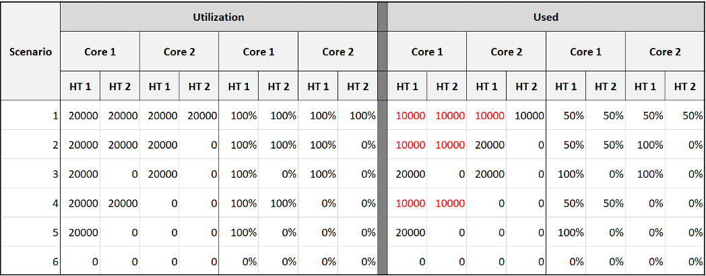

The table shows clearly that Used splits the Utilization into 2 when both threads are running.

Look at scenario 1. While Utilization charges 20000 ms to each thread, Used charges 10000. To me, this is not intuitive as ESXi considers HT to deliver 1.25x. Personally I find 12500 easier to understand. The good news is this number is normalized back when it is rolled up to the ESXi host level.

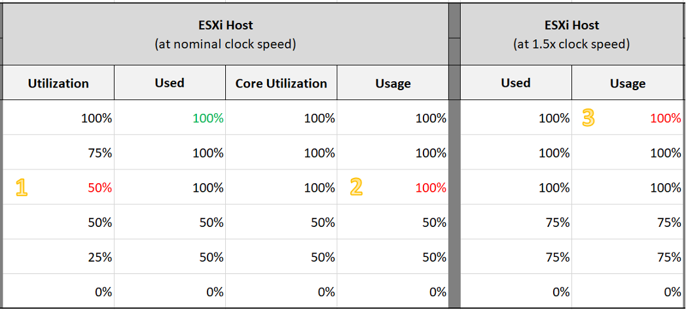

Look at the first row, especially the cell in green.

Do you notice something strange with the value of Used (%)?

Yes, it's no longer 50%. It's 100%. The reason is the accounting does not count each thread as 100%. So each core has 20000 and not 40000. If you say that is similar behaviour to Core Utilization, you're right.

I highlighted with a yellow number 3 areas that you need to pay attention to:

1. Utilization is only showing 50% when both cores are utilized. I prefer this to show 80% as HT only delivers 1.25x not 2x.
1. Usage goes up too fast. It's already showing 100% when there is still 25% room left. I prefer this to show 80% to reflect the headroom.
1. The CPU is already 1.5x its frequency, due to Turbo Boost. Usage does not reflect this as the value is capped at 100%. I prefer this to show 150%, to distinguish it from the other 100%. The good part is Demand will be 150%.

Let's take some ESXi hosts running production workload to see how the values compare in real world. Each row represents an ESXi host. What's your conclusion from reviewing the following table?

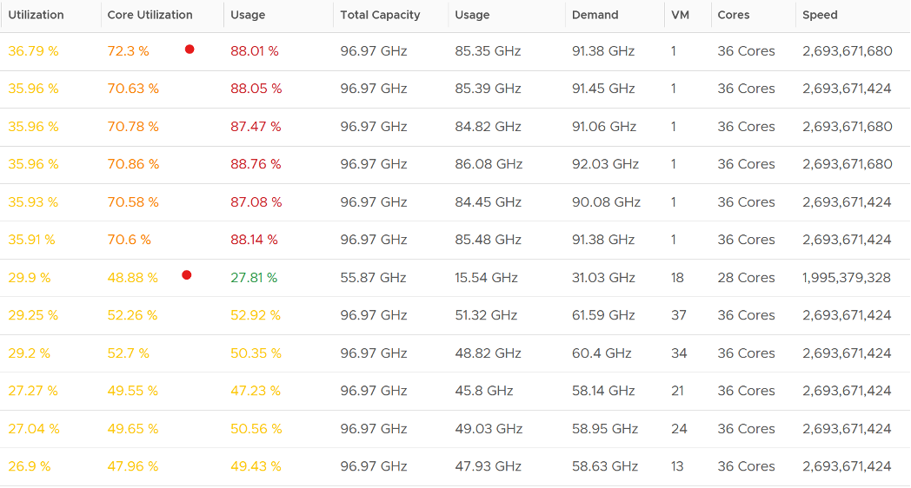

I've marked two of the rows with a red dot.

- The first one happens because of CPU scaling. Not all cores are busy, since Core Utilization shows 72%. The busy ones were dynamically boosted by VMkernel by an average of 21%, hence the Usage counter registers 88%
- The second example is the opposite. This ESXi is not even 50% utilized, as the core utilization shows 48.88%. VMkernel decides that it could complete the job with less power, and clocks down by an average of 43%.

Notice that Usage (%) does not count the hyperthreading. The Total Capacity metric is simply based on cores x nominal speed.

Now that we know more, which ones should we use and how?

The answer depends on the purpose (capacity or performance), and _your_ answer to the following question. There is no right and wrong.

1. Say you have an ESXi with 60 cores, 120 threads. What's the capacity? 60 logical CPU or 120 logical CPU? ESXi can run 120 vCPU worth of VMs concurrently, meaning the VMs won't experience CPU Ready. Sure, they will run slower but that's a performance, and not capacity question. It would be the same as having a slower hardware, as the VMs are not put in ready state.
1. The above CPU is 2 GHz, with static power management. That means both Turbo Boost and power savings will happen concurrently. Some cores will run above 2 GHz, while the idle ones run below 2 GHz to ensure the total power envelope of the CPU remains optimized. So what's the capacity? By right, it should reflect reality of each core, but that visibility is only available at esxtop. For ease of accounting, let's agree the capacity is fixed at 2 GHz. Do you have 120 GHz or 240 GHz? Or you want to use 60 cores x 2 GHz x 1.25 = 150 GHz to account for HT only delivering 1.25x? 

My personal take is you have 120 logical CPU but 150 GHz, as the combined throughput is neither 120 GHz nor 240 GHz. To me, this is a balanced approach that recognise that HT does indeed deliver additional capacity, but not wrongly assumes they deliver 2x.

For CPU clock speed, as it fluctuates across time and varies per core, I recommend you ignore it so the Total Capacity does not become a variable. This also lets you see if the CPU is on Turbo Boost. The limitation of this approach is your demand metric likely exceed 100% when Turbo Boost kicks in.

#### Capacity

I'd use Utilization (%) for aggressive and Core Utilization (%) for conservative.

- Frequency scaling is not relevant; hence I do not use Usage. Usage will also inflate the numbers as VMkernel will take advantage of turbo boost. The drawback of this approach is you may see a different number to what vCenter uses as it uses Usage.

- If Core Utilization is not yet 100% or Utilization is not yet 50% then there is still physical cores available. You can go ahead deploy new VMs.

- If Core Utilization = 100% (meaning Utilization is at least 50%) then review Utilization and ensure it's not passing your threshold. I'd keep it around 80% - 90% per ESXi, meaning the level at cluster level will be lower as we have HA host.

- If you want to see the number in GHz, then use Usage and Total Capacity. Just don't be alarm if Usage hits 100%. Check the contention counters, as always!

#### Performance

- I'd use Utilization (%) but will accompany it with the contention metrics. Since it's about performance troubleshooting, I'd set the threshold around 90% - 95%.

For Capacity, you can also add Demand (%) counter to see how high above 100%. The following shows it exceeds 100% but only marginally and momentarily. When Demand passes 100% it means the CPU is running hot (high power consumption) and both threads are busy. Buying more cores or higher frequency could result in the VMs running faster, assuming CPU is the gating factor.

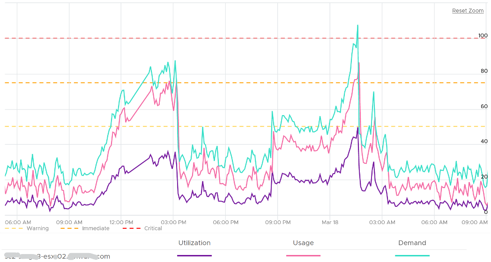

## Other Counters

We've covered the key counters. Let's now look at the rest of the counters

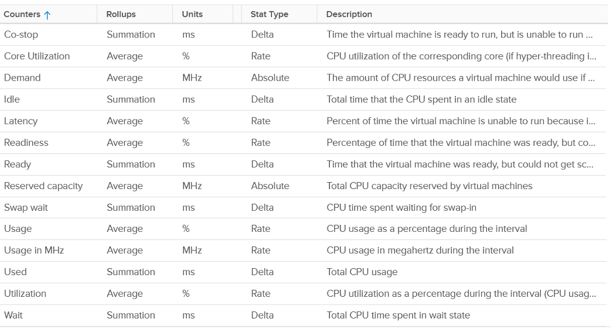

## ESXi Peak Core CPU Usage

Is any of the physical threads running hot?

An ESXi with 72 CPU cores will have 144 logical processors. Hence it's possible that one of them is running hot, while the rest is not. You will not be able to see that single core peak at ESXi Host level as it's the **average** of 144 metrics. If you are concerned that any of them is running hot, you need to track the peak among them.

Peak CPU Core Usage (%) tracks the highest CPU Usage among the CPU cores. A constantly high number indicates that one or more of the physical cores has high utilization. So long the highest among any cores at any given time is low, it does not matter which one at a specific point in time. They can take turn to be hot, it does not change the conclusion of troubleshooting. Max() is used instead of 95thpercentile as both result in the same remediation action, and Max() can give better early warning.

The unbalanced value among the cores is not needed because unbalance is expected when utilization is not high. When a VM runs, it runs on a few cores, not spread out to all ESXi cores. It's more efficient to schedule that way, as will requires less context switches.

## CPU Architecture

As CPU architecture moves towards [System on a Chip](https://en.wikipedia.org/wiki/System_on_a_chip) design, it's important not to assume that a CPU socket is a simple and linear collection of cores. Take a 64-core [AMD EPYC](https://www.amd.com/system/files/documents/overview-amd-epyc7003-series-processors-microarchitecture.pdf) for example. It's actually made of 8 Core Complex Dies. From the following diagram, you can see that a thread on CCD 0 is relatively close to a thread that runs on the same CCX, but far to a thread that runs on another CCD. You can see an example of the performance impact [here](https://blogs.vmware.com/performance/2020/04/amd-epyc-rome-application-performance-on-vsphere-series-part-1-sql-server-2019.html).

Another consideration you need to be aware of is [NUMA](https://en.wikipedia.org/wiki/Non-uniform_memory_access).

[^1]: I use 20 second as it's a familiar number. That's what you see in the real time chart in vCenter client, and 20000 ms is often used as the 100% when converting millisecond unit to percentage.

[^2]: Source: VMworld presentation HCP2583 by Richard Lu and Qasim Ali