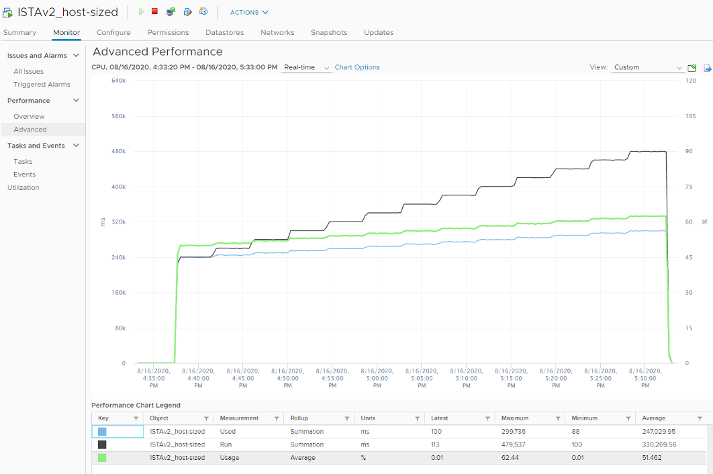
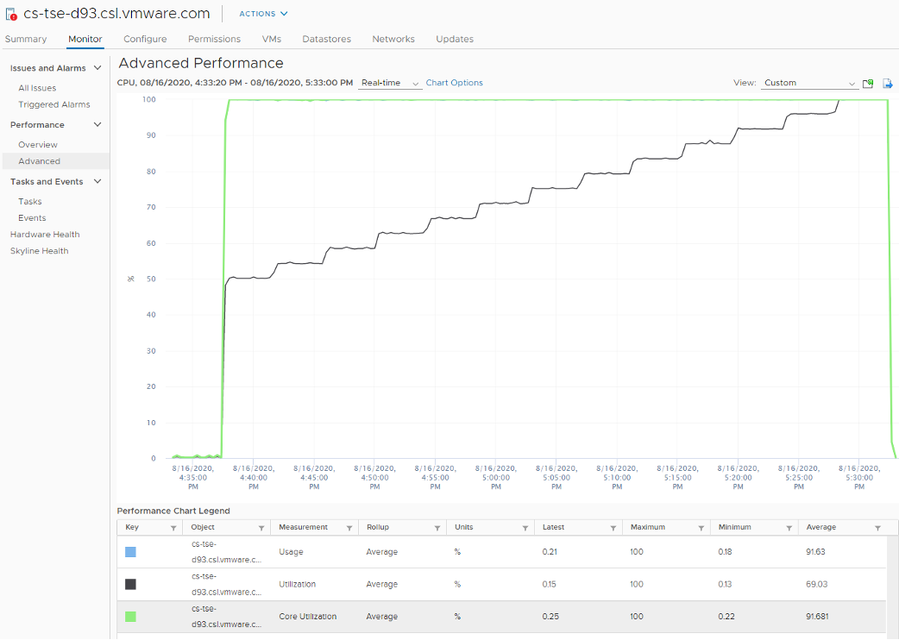

By now I hope you vrealize that the various "utilization" metrics in the 4 key objects (Guest OS, VM, ESXi and Cluster) varies. Each has their own unique behaviour. Because of this, you are right to assume that they do not map nicely across the stack. Let's test your knowledge with an example. 

## Guest OS

Review the following chart carefully. It's my physical desktop running Windows 10. The CPU has 1 socket 4 cores 8 threads, so Windows see 8 logical processors. You can see that Microsoft Word is not responding as its window is greyed out. The Task Manager confirms that by showing that none of the 3 documents are responding. Word is also consuming a very high power, as shown in the power usage column.

It became unresponsive because I turned on change tracking on a 400-page document and deleted hundreds of pages. It had to do a lot of processing and it did not like that. Unfortunately I wasn't able to reproduce the issue after that.

At the operating system system, Windows is responding well. I was able to close all other applications, and launched Task Manager and Snip programs. I suspect because Word does not consume all CPUs. So if we track at Windows level, we would _not_ be aware that there is a problem. This is why process-level monitoring is important if you want to monitor the application. Specific to hang state, we should monitor the state and not simply the CPU consumption.

From the Windows task bar, other than Microsoft Word and Task Manager, there is no other applications running. Can you guess why the CPU utilization at Windows level is higher than the sum of its processes? My guess on why Windows show 57% while Word shows 18.9% is Turbo Boost. The CPU counter at individual process level does not account for it, while the counter at OS level does.

I left it for 15 minutes and nothing change. So it wasn't that it needed more time to process the changes. I suspect it encountered a CPU lock, so the CPU where Word is running is running at 100%. Since Windows overall only reports 57%, it's important to track the peak among Windows CPU. This is why vRealize Operations provides the peak value among the VM vCPU.

## VM vs ESXi

Review the following chart carefully. Zoom in if necessary.

The vCenter chart[^1] above shows a VM utilization counters. It's a large VM with 24 vCPU running controlled CPU test. The power management is fixed so it run at nominal clock speed. This eliminates CPU frequency scaling factor.

It starts at 50% "utilization", with each vCPU pinned to a different physical core. It then slowly ramps up over time until it reached 100%.

Can you figure out why the three counters moved up differently? What do they measure?

Now let's look at the impact on the parent ESXi. It only has a single VM, but the VM vCPU matches the ESXi physical cores. The ESXi starts at 50% "utilization", then slowly ramp up over time until it reached 100%.

Can you figure out why the 3 counters moved up differently? What do they measure? As usual, answer can be found at [Part 4](/miscellaneous/chapter-1-quiz-answers/).

## ESXi Utilization vs Contention

ESXi "utilization" does not correlate to ESXi "contention". The 4 highlighted area are examples where the metrics don't correlate, even go the opposite way in some of them. Can you guess why?

As usual, answer in [Part 4](/miscellaneous/chapter-1-quiz-answers/).

[^1]: Provided by Valentin Bondzio