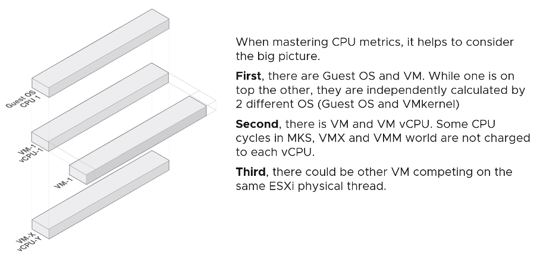
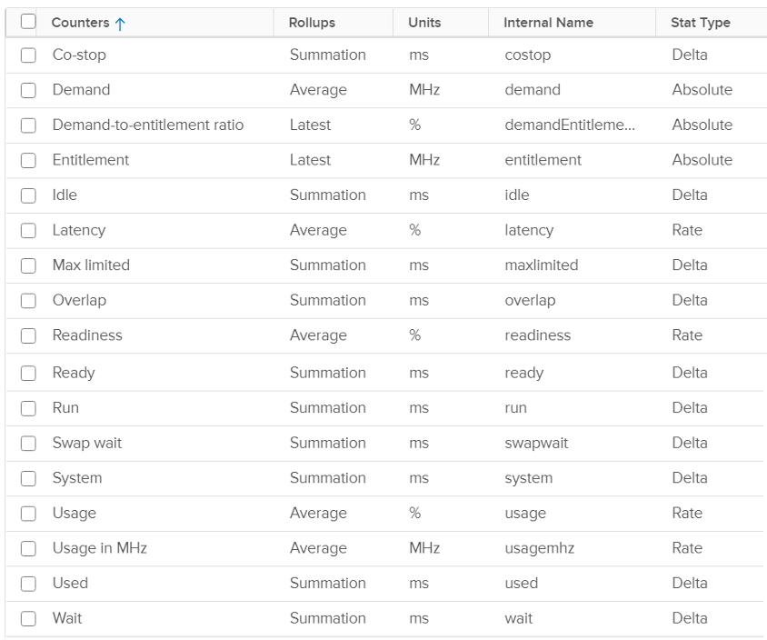

### 第2章

# CPU 衡量指标

这 [细微差别](/zh/metrics/chapter-1-overview/2.1.1-nuances-in-metrics/) 您之前看到的是由于附加层的性质。下面的信息图显示了虚拟化带来的多个元素。它帮助我理解衡量指标，因此分享。

VM 的 CPU 计数器与来宾操作系统中的不同。例如，vCenter 提供了 5 个计数器来说明 VM CPU 的利用率，但没有一个直接映射到 Windows/Linux CPU 利用率。 ESXi 中的 CPU 计数器也不仅仅是其正在运行的 VM 和 VMkernel 的总和。

以下屏幕截图显示了 VM 的 CPU 计数器。与Windows等Guest OS相比，您是否注意到缺少什么和增加了什么？继续并打开 Windows PerfMon 或 SysInternal 并进行比较，您会很快发现主要差异。

马上，您会注意到 Windows 中不存在流行的计数器，例如 Ready、CoStop 和 Overlap。原因是 VM 和来宾 OS 具有不同的优势。

当 VMkernel 取消调度 VM 以处理同一物理线程或内核上的其他内容（例如其他 VM、内核中断）时，来宾操作系统不知道它为什么会被中断。事实上，它会遇到运行在物理核心上的特定 vCPU 的冻结时间。再次安排时间时，时间会跳跃。由于这种独特的可见性，在正确的层使用正确的衡量指标很重要。以下是来宾操作系统可以看到和看不到的内容：

不同的有利位置导致不同的计数器。这会在您根据 VM 内部发生的情况确定大小时产生复杂性，但根据 ESXi 上 VM 占用空间之外发生的情况进行回收。换句话说，您调整来宾操作系统的大小并回收 VM。

这两层都需要监控，因为每一层都测量不同的性能问题。因此，必须安装 VMware Tools，因为 VMkernel 无法提供对来宾操作系统的可见性。默认情况下，VMware Tools 每 20 秒向 ESXi 主机报告有关来宾的统计信息。

{}