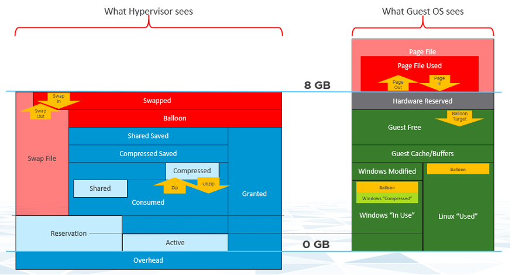
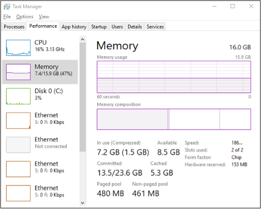

The following diagram compares the memory counters between VM and Guest OS,

Right off the bat, you will notice that popular counters such as Consumed, Shared, and Reservation do not exist in Windows. The reason is VM and Guest OS have different vantage points.

Let’s take an example with a simple Microsoft Windows server running Active Directory. It has 4 GB of memory as it’s just serving a small number of objects in the Singapore office lab. Take a look at the following table, where I compared the counter from inside the Guest OS and the VM memory active counter. 

There are four periods above where I made changes inside Windows. Let’s step through them.

| Period | What happened |
| ------ | ----------------------|
| A	| Microsoft AD server in normal running condition. vCenter is reporting low utilization, around 15-20%. Note vCenter users the Active metric, not Consumed.|
| B | I installed the vRealize Operations agent, which is based on the open source Telegraf. This gives the Guest OS metric, which is shown by the blue color. The agent collects data every 5 minutes, hence the regular spike. So far so good. Notice the value from VM Active metric jumps to 100%. That’s fine, but then it stays at 100% for more than 12 hours. All I did was installing a small collection agent and that’s it.  I actually got an alarm in vCenter, even though the VM does not need the RAM obviously. What happened here prove that the Active counter is based on sampling, and that sampling could be wrong.More on that here. |
|C| The next morning, I decided to generate some load as the pattern does not change at all. Since Windows has not been patched for a long time, I started Windows patch. The entire process is mostly downloading and installing, which last for several hours. The two metrics show no correlation at all. |
| D| After several hours, the entire Windows update process is completed. |

Let’s now look inside the VM. I will use another VM to show a different example. This time around, I will take an idle VM so we can see how the counters behave. An idle VM will have minimal or 0 activity.

You can see that this Windows Server 2016 VM has 16 GB, but 0 GB is active. It is expected as we know the Guest OS is idle as nothing is installed. vCenter is showing the data correctly. So far so good….

What do you think you will see inside Windows? Will the In Use counter show that it’s using 0 GB or somewhere near there? 

You know that it won’t show 0 GB as it’s impossible that any OS does not use any memory while it’s running. But what number will the **In Use** counter show?

It’s showing 7.2 GB. If you look at the chart, it portrays that it has been constantly or actively using that much of memory. In reality, we know it’s idle. The other proof is Windows actually compressed 1.5 GB of this 7.2 GB.

I hope the above simple experiments shows that you should use the right counter for the right purpose. 

The following diagram shows that the Guest OS and VM counters do not map to each other. Neither the VMkernel nor the Guest OS have full visibility into each other.

ESXi Host cannot see how the Guest OS manages its memory pages, how it classifies the pages as Use, Modified, Cache and Free. ESXi also cannot see the virtual memory (page file). 

ESXi can only see when the Guest OS performs reads or writes. That’s why vSphere VM main counters are basically what is active recently and what has been active. The first one is called Active, the second is called Consumed. All other counters are about ESXi memory management, and not about VM memory utilization. VM memory utilization impacts ESXi memory management, but they are clearly not the same thing. 