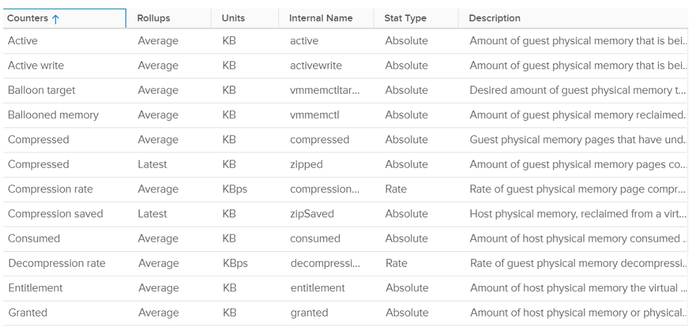
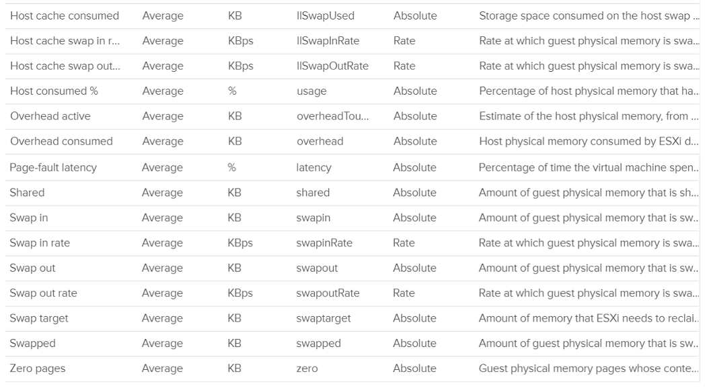
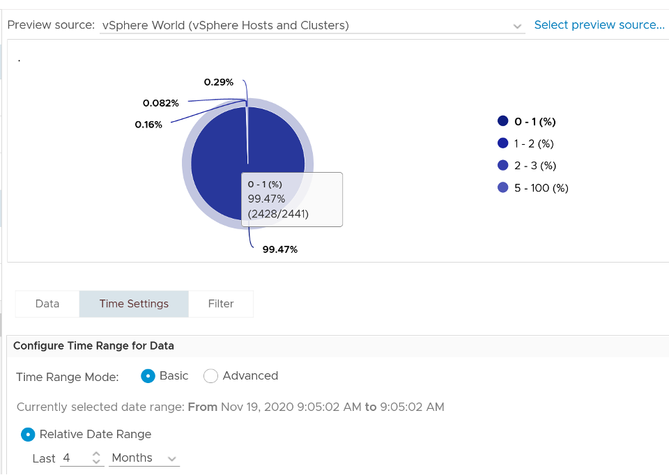
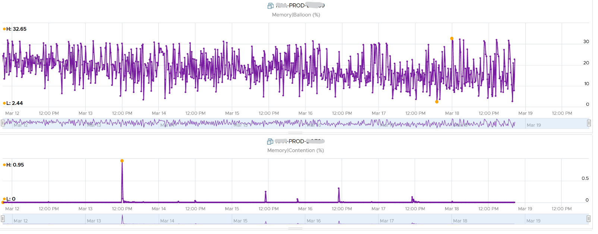
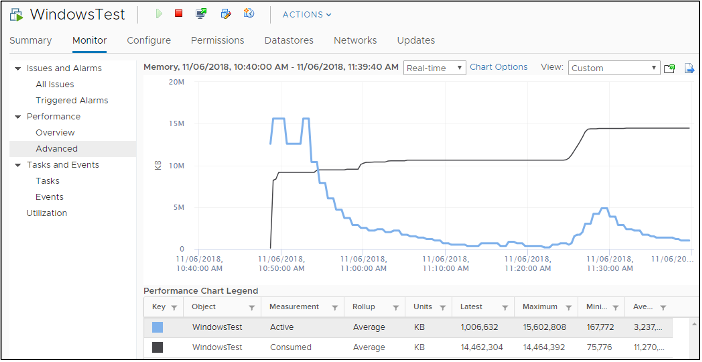
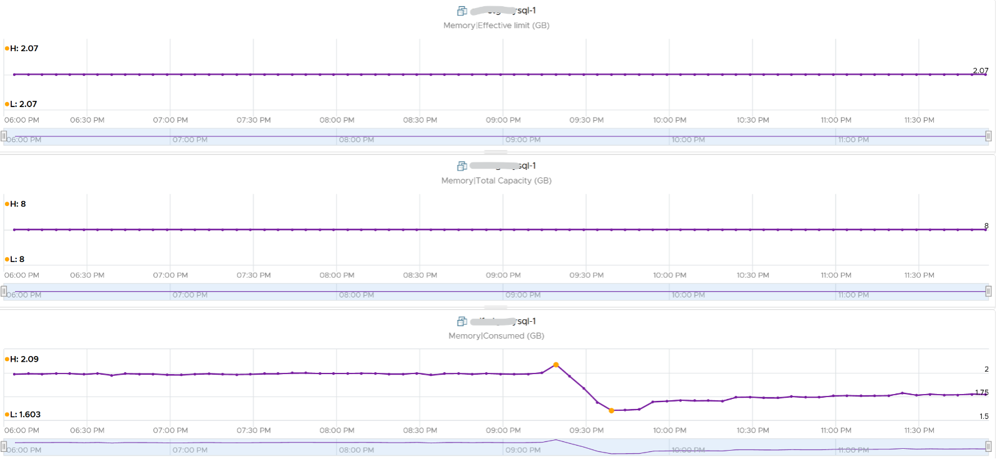
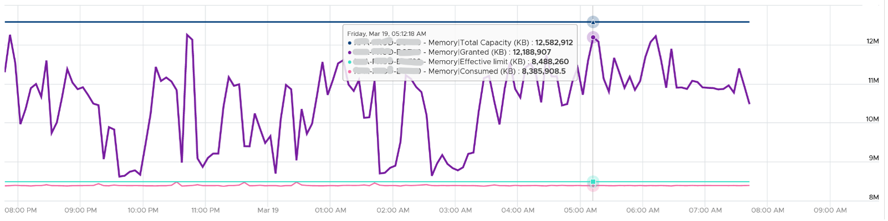

The following screenshot shows the memory counters of a VM. Compared with Guest OS such as Windows, can you notice what's missing and what's added? Go ahead and open Windows PerfMon or SysInternal and compare, and you will quickly notice major differences.

## Contention

This is the only performance counter for memory. Everything else does not actually measure latency. They measure utilization, because they measure the disk space occupied. None captures the performance, which is how fast that memory page is made available to the CPU.

Consider the hard disk space occupied. A 90% utilization of the space is not slower than 10%. It's a capacity issue, not performance.

If a page is not in the physical DIMM, the VM has to wait longer. It could be in Host Cache, Swapped or Compressed. It will take longer than usual. vSphere tracks this in 2 counters: CPU Swap Wait and RAM Latency.

- CPU Swap Wait tracks the time for Swapped In.
- RAM Latency tracks the percentage of time VM waiting for Decompressed and Swapped In. The RAM Latency is a _superset_ of CPU Swap Wait as it caters for more scenarios where CPU has to wait. vRealize Operations VM Memory Contention metric maps to this.

Latency is >1000x lower in memory compared to disk, as it's CPU basically next to the CPU on the motherboard. Time taken to access memory on the DIMM bank is only around 200 nanoseconds. Windows/Linux does not track memory latency. The closest counter is perhaps page fault. The question is does page fault includes prefetch? If you know, let me know please.

Does it mean we don't track balloon, swapped and compressed?

No.

The higher the value is for balloon, swapped, and compressed, the higher the chance of a performance hit happening in the future if the data is requested. The severity of the impact depends on the VM memory shares, reservation, and limit. It also depends upon the size of the VM's configured RAM. A 10-MB ballooning will likely have more impact on a VM with 4 GB of RAM than on one with 512 GB.

Latency does not include balloon as that's a different context. In addition, the hypervisor is not aware of the Guest OS internal activity.

In an environment where you do not do memory overcommit and place limit, the chance of hitting memory contention will be basically 0. You can plot the highest VM Memory Contention counter in all clusters and you will basically see a flat line. That would be a lot of line charts, so I'm using a pie chart to analyze 2441 VM in the last 4 months. For each VM, I took the highest value in the last 4 months. Only 13VM had its worst VM Contention above 1%.

These counters reduce the value of the Compressed metric and/or Swapped metric, and increase the value of Consumed & Granted.

The counter is called `%LAT_M` in esxtop. CPU Contention is called `%LAT_C`.

## Balloon

Balloon is Guest OS kernel driver. It allocates physical memory in the Guest OS. The Guest OS cannot use these pages. This physical memory in the Guest OS is not backed up by physical memory in ESXi, hence it is available for other VMs. When ESXi is no longer under memory pressure, it will notify the Balloon to release its requested page inside Guest OS. This is a proactive mechanism to reduce the chance of the Guest OS doing paging. Balloon will release the page inside the Guest OS. The Balloon counter for the VM will come down to 0.

Guest OS will start allocating from the Free Pages. If insufficient, it will take from Cache, then Modified, then In Use. This does not cause performance problem. What will cause performance is when the ballooned page is requested by Windows or Linux. The following shows a VM that is heavily ballooned as limit was imposed on it. Notice the actual performance happens rarely.

Just because Balloon asks for 1 GB of RAM, does not mean ESXi gets 1 GB of RAM to be freed. It can be less if there is TPS.

To use ballooning, Guest OS must be configured with sufficient swap space.

Guest OS initiate memory reallocation. Therefore, it is possible to have a balloon target value of 0 and balloon value greater than 0. The counter _Balloon Target_ tracks this target, so if you see a nonzero value in this counter, it means that the hypervisor has asked this VM to give back memory via the VM balloon driver. This does not necessarily indicate a reduction of performance, as it depends upon whether the memory page released by the balloon driver is a free one or not. If it is from the free memory, then the Guest OS does not need to perform a page out to meet the request of its balloon driver. If it is not, then the Guest OS will page out, and this can impact performance.

Balloon is a memory request from ESXi. So it's not part of the application. It should not be included in the Guest OS sizing, hence it's not part of reclamation.

Balloon impacts the accuracy of Guest OS sizing. However, there is no way to measure it.

- When Balloon driver asks for pages, Guest OS will allocate, resulting in In Use to go up. This is because the balloon driver is treated like any other processes.
- If the page comes from Free, then we need to deduct it from In Use.
- If the page comes from In Use, then we can't simply deduct the value of In Use. Guest OS pages out, so we need to add Page Out or Cache.

## Compressed or Swapped

This counter tracks the amount of RAM that is subjected to the compression process. It does not track what the resultant compressed amount. There are 2 levels of compression (4:1 and 2:1), so a 4 KB page may end up as 1 KB or 2 KB. If the compression result is less than that, the page will be swapped instead as that's a cheaper operation.

You may notice that there is no compression target. We have a balloon target and swap target, so we should expect a compression target too. Right?

Not really. Because both swap and compression work together to meet the swap target counter, the counter should actually be called Compression or Swap target.

The Consumed counter includes this metric. To be accurate, the Compressed counter should track the result of the compression, as that's the actual amount consumed by the compressed pages.

It is possible to have balloon showing a zero value while compressed or swapped are showing nonzero values-even though in the order of ESXi memory reclamation techniques, ballooning occurs before compression. This indicates that the VM did have memory pressure in the past that caused ballooning, compression, and swapping then, but it no longer has the memory pressure. Data that was compressed or swapped out is not retrieved unless requested, because doing so takes CPU cycles. The balloon driver, on the other hand, will be proactively deflated when memory pressure is relieved.

Compressed and Swapped are different from ballooning, as the hypervisor has no knowledge of the free memory inside the Guest OS. It will randomly compress or swap. As a result, any value in this counter indicates that the host is unable to satisfy the VM memory requirement.

There are other compression related metrics that are provided. So I have not used them

| Counters | Description |
| ---------| ----------- |
| **Average Compressed** | Average amount of compressed memory in the reporting period. In vCenter case, this is the average of the last 20 seconds. In vRealize Operations case, this is the average of the last 5 minutes.|
| **Latest Zipped** | Last amount of compressed memory in the reporting period. In vCenter case, this is data in the 20th second. vRealize Operations then averages 15 of these datapoints to make a 300 second average.|
| **Zip Saved** |  |
| **Compression Rate** | |
| **Decompression Rate** | |

Which one should you pay attention to?

The answer always goes back to: when you see the value, what are you going to do about it? Basing on the purpose or use case helps in applying the metrics in the context of operations.

## Consumed

Consumed = Granted - Saving from Sharing

Consumed does not include overhead memory, although this number is practically negligible.

Consumes includes memory that might be reserved.

This tracks the ESXi Memory mapped to the VM. ESXi assigns large pages (2 MB) to VM whenever possible; it does this even if the Guest OS doesn't request them. The use of large pages can significantly reduce TLB misses, improving the performance of most workloads, especially those with large active memory working sets.

The above is one reason why the Consumed metric is higher than the Guest OS In Use. The other reason is it contains pages that were active (and no longer active), but still mapped to the VM.

Here is a screenshot comparing Windows 10 Task Manager memory counters with vRealize Operations Memory \ Non Zero Active (KB) and Memory \ Consumed (KB). As you can see, none of the counters match.

When a Guest OS frees up a memory page, it normally just updates its list of free memory, it does not release it. This list is not exposed to the hypervisor, and so the physical page remains claimed by the VM. This is why the Consumed counter in vCenter remains high when the Active counter has long dropped.

It is a common mistake to think they are calculated in a similar, and simply differ based on aggressive vs conservative. The following test shows Active going down while Consumed going up!

Consumed is affected by Limit. The following is a VM configured with 8 GB RAM but was limited to 2 GB.

## Active

This is a widely misunderstood counter. ESXi calls this Touch as it is better represents the purpose of the metric. Note that vCenter still calls it Active, so I will call it Active.

This counter is often used to determine the VM utilization, which is not what it was designed for. To know why, we need to go back to fundamental. Let's look at the word Active. It is an English word that needs to be quantified before we can use it as metric. There are 2 dimensions to consider before we apply it:

- Definition of active. In RAM context, this means read or write activity. This is similar to disk IOPS. The more read/sec or write/sec to a page, the more active the page is. Note that the same page can be read/written to many times in a second. Because a page may be accessed multiple times, the actual active pages are lower. Example: a VM reads 100 pages and writes 200 pages. However, 50 of the writes are on the page that were read. In addition, there are 10 pages that were read multiple times. Because of these 2 factors, the total active pages are far fewer than 300 pages. If the page is average 4 KB, then the total active is way less than 1200 KB.
- Active is time bound. Last week is certainly not active. Is 300 seconds ago active? What exactly, is recent? 1 second can be defended as a good definition of recent. IOPS is always measured per second, hence the name IOPS.

Applying the above understanding, the active counter is actually a rate, not a space. However, the counter reported by vCenter is in KB, not KB/s.

To translate from KB/s to KB, we need to aggregate based on the sampling period. Assuming ESXi samples every 2 seconds, vCenter will have 10 sampling in its 20 second reporting period. The 10 samplings can be sampling the same identical pages, or completely different ones. So in the 20 seconds period, the active memory can be as small as 1 sampling, or as large as 10 samplings.

Examples:

- First 2 seconds: 100 MB Active
- Next 2 seconds: 150 MB Active

In the above 4 seconds, the active page ranges from 150 MB to 250 MB.

Each sampling is done independently, meaning you could be sampling the same block again. But the value is then averaged it with previous samples. Because sampling and averaging takes time, Active won't be exact, but becomes more accurate over time to approximate the amount of active memory for the VM. This number is typically different from Guest OS working set estimate. Sometimes the difference may be big, because Guest OS and VMkernel use different working set estimate algorithm. Also, Guest OS has a different view of active guest physical memory, due to ballooning and host swapping. Note that ballooned memory is considered inactive, so, it is excluded from the sampling.

If you plot vRealize Operations in vCenter real-time performance chart, you will see 12 peaks in that one hour line chart. The reason is vRealize Operations pulls, process, and writes data every 5-minutes. The chart for CPU, disk and network will sport the same pattern. This is expected.

But if you plot the memory counters, be it total active, active write or consumed, you will not see the 12 peaks. This is what I got instead.

Consume is completely flat and high. Active (read and write) and Active Write (write only) is much lower but again the 12 peaks are not shown.

Can you figure it out?

My guess is the sampling size. That's just a guess, so if you have a better answer let me know!

vCenter reports in 20 seconds interval. In vRealize Operations, this metric is called Memory \ Non Zero Active (KB). vRealize Operations takes 15 of these data and average them into a 300-second average. In the 300 second period, the same page can be read and written multiple times. Hence the active counter over reports the actual count.

Quiz: now that you know Active over reports, why is it lower than Consumed? Why is it lower than Guest OS counters?

As usual, answer to the quiz is at the end of the book.

Both Active and Consumed are not suitable for sizing the Guest OS. They are VM level counters, with little correlation to the Guest OS memory usage. Read [Guest OS Used counter](/metrics/chapter-3-memory-metrics/2.3.3-guest-os/#in-use) for the counter we should use.

The reason is the use case. It is not about the IOPS. It is about the disk space used. Guest OS expects the non-active pages to be readily available. Using Active will result in a lot of paging.

Reference: [Active Memory](https://blogs.vmware.com/vsphere/2013/10/understanding-vsphere-active-memory.html) by [Mark Achtemichuk](https://blogs.vmware.com/vsphere/author/mark_achtemichuk).

## Granted

The amount of memory that has been provided to the VM, meaning mapped to ESXi machine memory. It is the amount of virtual memory that is backed by machine memory. It includes Shared memory but exclude Overhead because Overhead is functionally beyond what the VM see.

The VM total memory footprint is Granted + Ballooned + Swapped + Compressed + not touched + Overhead.

Not touched means the VM never uses the page since it's powered on. This happens because:

- The VM never use it at all.
- The page was reclaimed by the balloon driver, and the VM never touched it since then.

Memory is not granted to the VM until it has been touched once. In the case of Linux, which does not zero out pages upon boot, the counter may not jump immediately upon OS start. For Windows, you may see that Consumed shoots up ahead of Granted. When Windows writes zeroes to initialize the pages, VMkernel is smart enough to do a copy-on-write, so all the pages are pointing to the same physical page. This results in the Consumed counter being higher than the Granted counter, as Granted only counts the physical page once. After a while, as the pages are replaced with actual data, the Granted counter will go up as each of the new pages is backed by large pages (common in Windows 2008 and Windows 7).

If you use Limit, which you should not, you may want to know if the VM needs more than the limit amount. Granted is the counter for that, as shown in the following. This VM is a Windows 2016 server. It's configured with 12 GB of RAM, hence the Granted metric does not exceed that.

The Granted counter tends to have a stable value as it only goes down if the host is under memory pressure.

Entitlement = Granted + Overhead.

The Zero counter tracks all pages with just zeroes on them (unused pages).

## Shared

There are 2 types of shared pages:

- Intra-VM sharing: sharing within the same VM. By default, each page is 4 KB. If Guest OS uses the Large Page, then it's 2 MB. The chance of sharing in 4 KB is much higher than 2 MB.
- Inter-VM sharing. Due to security concern, this is by default disabled in vSphere.

A commonly shared page is certainly the zero page. This is a page filled with just zeroes.

For accounting purpose, the Shared page is counted in full for each VM. Example:

**VM 1**: 1 GB private, 100 MB Shared within itself, 10 MB shared with other VMs (it does not matter how many and what VMs).

The 100 MB is the amount that is being shared. If not shared, they would consume 100 MB. But how much is actually consumed as a result of this sharing?

The 10 MB is shared with other VMs. VM 1 could be sharing 1 MB each with 10 other VMs, or the entire 10 MB with just 1 VM. The Shared counter merely counts that this 10 MB is being shared. VM 1 definitely consumes this 10 MB, and it's not sharing within itself.

Shared includes zero pages.

Shared Saved metric tracks the estimated amount of machine memory that are saved due to page sharing.

Because the ESXi machine page is shared by multiple Guest OS physical pages, this metric charge "1/ref" page as the consumed machine memory for each of the guest physical pages, where "ref" is the number of references. So, the saved machine memory will be "1 - 1/ref" page. For example, if there are 4 pages pointing to the same physical DIMM, then the savings is 3 pages worth of memory.

## NUMA Metrics

These counters are not exposed in vCenter. It's available in esxtop

| Counters | Description |
| --------- | ---------- |
| **NUMA Migration** | The number of NUMA migrations that have occurred since the VM's creation |
| **Local Memory** | The amount of the VM's memory that is on the local NUMA nodes. |
| **Remote Memory** | The amount of the VM's memory that is on the remote NUMA nodes. Remote memory access is slower as it has to go through another CPU. Hence, ideally this amount is 0. You increase the chance by making the Configured RAM small. A VM whose configured memory is larger than the ESXi RAM attached to a socket have higher chance of having remote memory.|