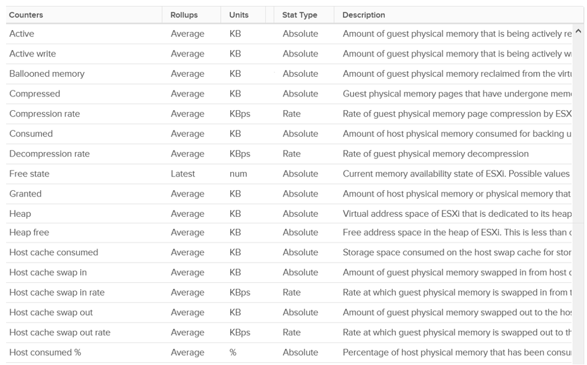
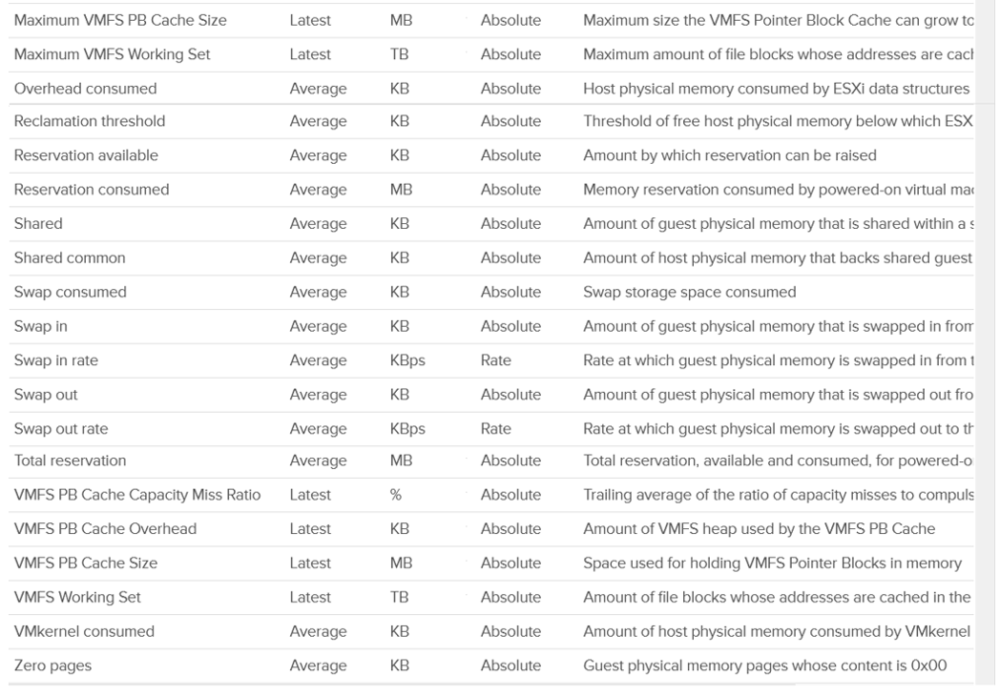
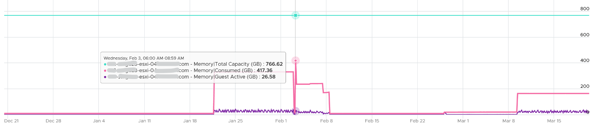
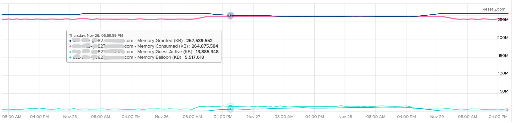
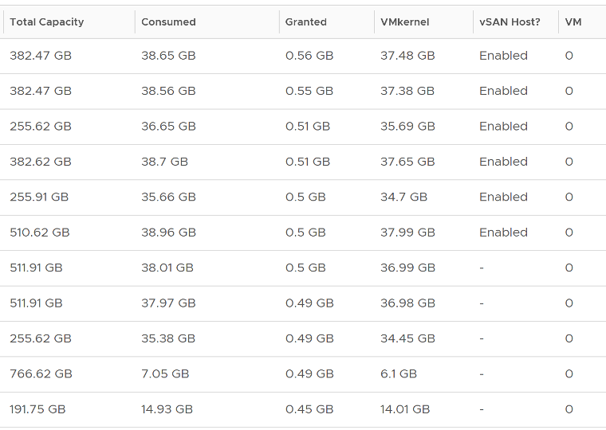
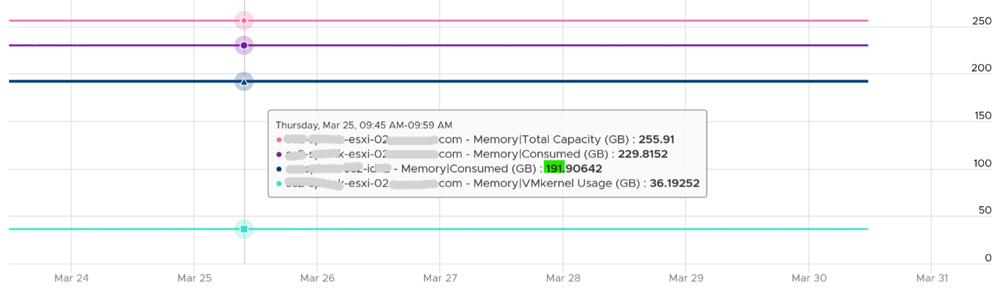
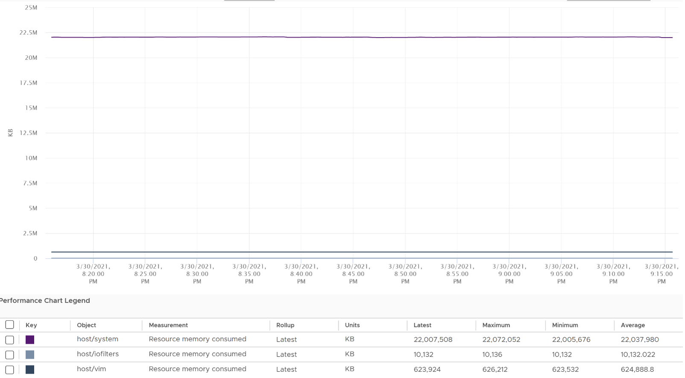
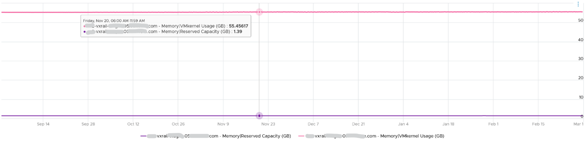

vCenter provides even more counters at ESXi level: 38 counters for RAM plus 11 for VMkernel RAM. VMkernel has around 50 processes that are tracked. As a result, a cluster of 8 ESXi can have > 800 counters just for ESXi RAM! Most of them are not shown as a percentage, making it difficult to compare across ESXi with different memory sizes.

The following shows all the metrics. I had to stitch multiple screenshots so you can see them in one view. 

Which counters are for performance? 

Which counters are for capacity?

Total = VMkernel + VM + Overhead + Free, where:
- Total is the hardware memory as reported by BIOS to ESXi
- VMkernel is the memory used by VMkernel and its loadable modules such as vSAN
- VM is the memory used by VM
- Overhead is the hypervisor virtualization overhead on each VM.

Just like any other modern-day OS, VMkernel uses RAM as cache as it's faster than disk. So the Consumed counter will be near 100% in overcommit environment. This is a healthy utilization. 

Just because the host is low on free physical RAM does not mean that the VMs are performing poorly. Even the presence of swapping out does not mean VMs are performing poorly when the swapped memory is not being accessed by the OS. Poor VM performance only happens when the VM experiences contention. 

## Balloon Threshold

Balloon is a leading indicator that an ESXi is under memory pressure, hence it’s one of the primary counters you should use in capacity. Assuming you’re not using Limit to artificially cap the resource, you should ensure that the balloon amount does not cause VM to experience contention.

We know that contention happens at hypervisor level, not at VM level. The VM is feeling the side effects of the contention, and the degree of contention depends on each VM's shares, reservation and utilization. ESXi begins taking action if it is running low on free memory. This is tracked by a counter called State. The State counter has five states, corresponding to the Free Memory Minimum (%) value

<table style="width:100%;"><colgroup><col style="width: 13%" /><col style="width: 12%" /><col style="width: 34%" /><col style="width: 39%" /></colgroup><thead><tr class="header"><th><strong>ESXi State</strong></th><th><strong>Threshold</strong></th><th><strong>1 TB ESXi</strong></th><th><strong>Example based on ESXi with 1 TB RAM</strong></th></tr></thead><tbody><tr class="odd"><td>High</td><td>300%</td><td>32.4 GB</td><td rowspan="5">
First, we calculate the Free Memory Minimum value. There is many website to help you with this, such as <a href="https://blogs.virtualmaestro.in/2020/06/02/vmware-vsphere-7-x-memory-reclamation-part-2-mem-memminfreepct/">this</a>.

For 1 TB, the value is 10.8 GB.
</td></tr><tr class="even"><td>Clear</td><td>100%</td><td>10.8 GB</td></tr><tr class="odd"><td>Soft</td><td>64%</td><td>6.9 GB. Balloon starts here</td></tr><tr class="even"><td>Hard</td><td>32%</td><td>3.5 GB. Compress/Swap starts here</td></tr><tr class="odd"><td>Low</td><td>16%</td><td>1.7 GB. Block execution</td></tr></tbody></table>

Using the example above, let’s see at which point of utilization does ESXi triggers balloon process. 

| ESXi State | 512 GB ESXi | 1 TB ESXi| 1.5 TB ESXi|
| ----------- | ------- | ------| -------|
|Balloon Threshold | 3.7 GB | 6.9 GB | 10.2 GB|
|Threshold	| 508.3 GB	| 0.99 TB | 1.49 TB|
|Threshold in %	| 99.3%	|99.3%	|99.3%|

As you can see from all the 3 ESXi, balloon only happens after at least 99% of the memory it utilized. It’s a very high threshold. Unless you are deliberately aiming for high utilization, all the ESXi should be in the high state. 

In addition, the spare host you add to cater for HA or maintenance mode will help in lowering the overall ESXi utilization. Let’s use example to illustrate

- No of ESXi in a cluster = 12
- Provisioned for HA = 11
- Target ESXi memory utilization = 99% (when HA happens or planned maintenance)
- Target ESXi memory utilization = 99% x 11 / 12 = 90.75% (during normal operations)

Using the above, you will not have any VM memory swapped as you won’t even hit the ballooned stage. If you actually see balloon, that means there is limit imposed.

The Low Free Threshold (KB) counter provides information on the actual level below which ESXi will begin reclaiming memory from VM. This value varies in hosts with different RAM configurations. Check this value only if you suspect ESXi triggers ballooning too early. 

ESXi memory region can be divided into three: Used, Cached and Free
- Used is tracked by Active. Active is an estimate of recently touched pages. 
- Cached = Consumed - Active. Consumed contains pages that were touched in the past, but no longer active. I'm not sure Ballooned pages are accounted in Consumed, although logically it should not. It should go to Free so it can be reused.
- Free = Total Capacity - Consumed.

The nature of memory as cache means the active part is far lower than the non-active part. It’s also more volatile. The following shows an ESXi with low memory usage, both active and consumed, in the last 3 months.

Let’s look at an opposite scenario. The following ESXi is running at 100%. It has granted more memory than what it physically has. Initially, since the pages are inactive, there is no ballooning. When the active rise up, the consumed counter goes up and the balloon process kicks in. When the VM is no longer using the pages, the active counter reflects that and ESXi begin deflating the balloon and giving the pages back.

I shared in the VM memory counter that just because a VM has balloon, does not mean it experiences contention. You can see the same situation at ESXi level. The following ESXi shows a constant and significant balloon lasting at least 7 days. Yes the worst contention experienced by any VM is not even 1%, and majority of its 19 VMs were not experiencing contention at all.

## Key Metrics

vCenter provides Active (KB), Active write (KB), Consumed (KB), Granted (KB), and Usage (%) for utilization counters. Consumed is the amount of memory used on the host. It includes both VM memory and hypervisor memory. In other words, Consumed = Total host memory - Free host memory.

Consumed includes the VMkernel consumed, not just the VM consumed. The following example shows ESXi hosts with no running VM, so the Consumed counter is mostly made up of VMkernel. From the table, you can see that Consumed = VMkernel Consumed + Granted.

I’ve sorted them by the Granted counter, as I’m not expecting it to have any values. Granted at the host is the total of the granted counters of VMs running on the host, so it should be 0 in this case. It includes the shared memory. My guess the extra memory is for non-VM user world process.

Let’s take one of the ESXi to see the value over time. This time around, let’s use vCenter instead.

You can verify that ESXi Consumed includes its running VMs Consumes by taking an ESXi with a single running VM. The ESXi below has 255 GB of total capacity but only 229 GB is consumed. The 229 GB is split into 191 GB consumed by VM and 36 GB consumed by VMkernel.

The VMkernel consumption is the sum of the following three resource pools.

Memory shared is the sum of all the VM memory pages that are pointing to a shared page. Memory shared common is the sum of all the shared pages. As a result, Memory shared common is at most half the value of Memory shared, as sharing means at least two blocks are pointing to the shared page. If the value is a lot less than half, then you are saving a lot. Today's ESXi hosts are sporting the hardware-assisted memory virtualization from Intel or AMD. With this technology, VMkernel uses large pages to back the VM memory. As a result, the possibility of shared memory is low, unless the host memory is highly utilized. In this state, the large pages are broken down into small, shareable pages. So you can also use the Memory shared common counter to track for signs of host memory under pressure. 

The Heap counter shows the memory used by VMkernel heap and other data. This is normally a constant and small value.

Demand, especially unmet Demand, is hard to measure as RAM is a form of storage. RAM does not have Ready or CoStop concept, as it’s a disk space. ESXi uses 3 levels to manage demand:
- **TPS**: this happens automatically even if ESXi has plenty of RAM as it makes sense to do so. It’s not an indicative of unmet demand. Sharing the same page is the right thing to do, and not something that should be started only when physical pages are running low.
- **Balloon**: this is the first sign of unmet demand. It happens proactively, before ESXi is unable to meet Demand. Ballooning reduces cache. It does not mean ESXi unable to meet Demand. Demand is not met when Contention happen. That's the only time it is not met. 
- **Compress/Swap**: this happens proactively too. It does not mean VMs were contending for RAM. It merely means ESXi Consumed is very high. That Consumed can contain a lot of cache.

`Demand = Consumed + Balloon + Compression + Swap`

Reserved Capacity (MB) only counts reservation. Therefore, the value will be a lot lower than Total capacity if you do not use reservation. Note that it does not includes memory reserved by VMkernel, which varies from 2 GB to 64 GB. The following shows an ESXi with vSAN. This box has 1.5 TB RAM, and VMkernel usage is steady at 55 GB for at least 6 months. Reservation is very low at 1.4 GB, but it’s also steady.

ESXi Reserved = the amount of machine memory that is currently reserved. It is the sum of reservation setting of the groups + the overhead reservation of the groups + minfree metric.

Managed = the total amount of machine memory managed by VMKernel. VMKernel "managed" memory can be dynamically allocated for VM, VMKernel, and User Worlds.

| Counters | Description |
| --------- | ---------- | 
| Shared | Sum of VM Shared + VMkernel Shared If two VMs each have 500 MB of identical memory, the shared memory is 1 GB.|
| Shared Common | Machine memory (host memory) savings (KB) - Shared|
|Swap In |  | 
| Swap In Rate |  | 	
| Swap Out |  | 
| Swap Out Rate	|  | 
| Swap Used | Sum of memory swapped of all powered on VMs and vSphere services on the host.|
| Usage / Usable (%) | Memory Consumed by VMs / memory provisioned * 100% 
It does not include memory overhead, while consumed (%) does.|
