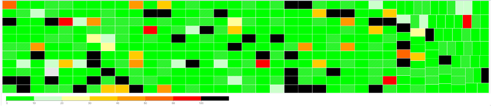
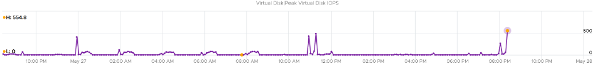
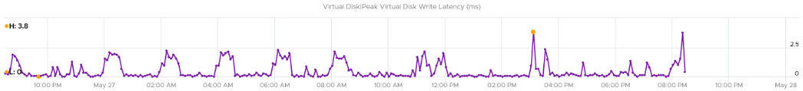

Virtualization increases the complexity in monitoring storage performance. Just like memory, where we have more than one level, we have multiple levels for storage. At the highest level, we have VMs. A VM typically has 2-3 virtual disks (or even RDMs), such as OS drive, paging file drive, and data drive. A large database VM will have even more.

We are interested in data both at the VM level, and at the individual virtual disk level. If you are running a VM with a large data drive (for example, Oracle database), the performance of the data drive is what the VM owner cares about the most. At the VM level, you get the average of all drives; hence, the performance issue could be obscured.

Latency can happen when IOPS and throughput are not high, because there are multiple stacks involved and each stack has their own queue. It begins with a process, such as a database, issuing IO request. This gets processed by Windows or Linux storage subsystem, and then send to the VM storage driver.

**Below the VM**, we have the ESXi storage subsystem and the storage adapter. We do not include ESXi in our discussion of storage counters as in general it is not a cause of storage bottleneck. Yes, the VMkernel prioritizes and queues the I/Os, but all these operations should be less than 1 millisecond. If the I/O is held at the kernel, there is a good chance that the physical device latency is more than 10 milliseconds.

**Below the ESXi**, we have the datastore level. What you can see at this level, and hence how you monitor, depends on the storage architecture. We will cover the centralized storage architecture first as it is a more deployment. We will cover the distributed architecture separately due to major differences in monitoring.

**Below the datastore**, we have the physical storage. The datastore is normally backed one to one by a LUN, so what we see at the datastore level matches with what we see at the LUN level. Multiple LUNs reside on a single array.

In a typical shared storage, multiple VMs run on the same ESXi, and multiple VMs share a datastore. So it is common to have an I/O blender effect, where sequential writes on individual vmdk files become random writes at the datastore level. It also changes the read/write ratio. This can occur in either VMFS or NFS. This certainly increase complexity in troubleshooting. Complexity also increases when the IO needs to go over the network, especially across different physical data centers asynchronously.

If you are using IP storage, take note that Read and Write do not map 1:1 to Transmit (Tx) and Receive (Rx) in Networking counters. Read and Write are both mapped to Transmit counter as the ESXi host is issuing commands, hence transmitting the packets.

## Contention Metrics

The main counters for performance are IOPS and latency. The rest is supporting counters, typically used in troubleshooting. Latency is part of contention counters, which includes disk queue, outstanding IO (queued), aborted SCSI commands, and dropped frame.

For Storage, the counter for contention is clear. First, ensure that you do not have packet loss for your IP Storage, dropped FC frames for FC protocol, or SCSI commands aborted for your block storage. They are a sign of contention as the datastore (VMFS or NFS) is shared. The counters Bus Resets and Commands Aborted should be 0 all the time. As a result, it should be fine to track them at higher level objects. Create a super metric that tracks the maximum or summation of both, and you should expect a flat line.

Once you have ensured that you do not have packet loss on IP Storage or aborted commands on block storage, use the latency counter and outstanding IO for monitoring. For troubleshooting, you will need to check both read latency and write latency, as they tend to have different patterns and value. It’s common to only have read or write issue, and not both.

Total Latency is not Read Latency + Write Latency, because it is not a simple summation. In a given second, a VM issues many IOPS. For example, the VM issues 100 reads and 10 writes in a second. Each of these 110 commands will have their own latency. The “total” latency is the average of these 110 commands. In this example, the total latency will be more influenced by the read latency, as the workload is read dominated.

## Guest OS Disk Queue

This counter tracks the queue inside Linux or Windows storage subsystem. It’s not the queue at SCSI driver level, such as LSI Logic or PVSCSI. If this is high then the IO from applications did not reach the underlying OS SCSI driver, let alone the VM. If you are running VMware storage driver, such as PVSCSI, then discuss with VMware Support.

For Windows, the number is the snapshot at the collection period. For example, if the collection is every 5 minute, then it’s number on the 300th second, not the average of 300 numbers.

Interestingly, Window documentation said that “Multispindle disk devices can have multiple requests active at one time, but other concurrent requests await service. Requests experience delays proportional to the length of the queue minus the number of spindles on the disks. This difference should average less than two for good performance.”

I plot the disk queue among ~1K VMs. It’s interesting to see see some are very high.

Disk Queue should be less than 10 in most cases, but it can spike to well above 1000. Below are typical examples, where the current queue is not even 0.01.

The following shows the spike. A few of these VM exceeded 1000 IO in the queue.

Let’s take one of the VMs and drill down. This VM has regular spikes, with the last one exceeding 1000.

Their values should correlate with disk outstanding IO. However, the values are all low. That means the queue happens inside the Guest OS. The IO is not sent down to the VM.

Which in turn should have some correlation with IOPS, especially if the underlying storage in the Guest OS (not VM) is unable to cope. The queue is caused by high IOPS which cannot be processed.

Finally, it would manifest in latency. Can you explain why the latency is actually still good?

It’s because that’s from the IO that reaches the hypervisor. The IO that was stuck inside Windows is not included here.

The application feels latency is high, but the VM does not show it as the IO is stuck in between.