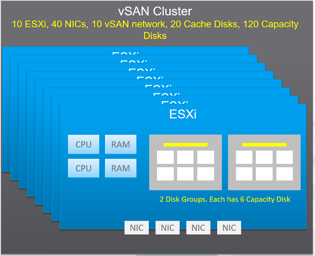
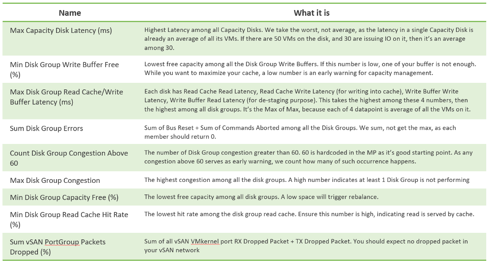
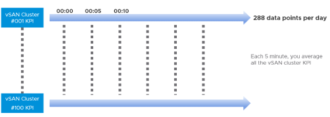
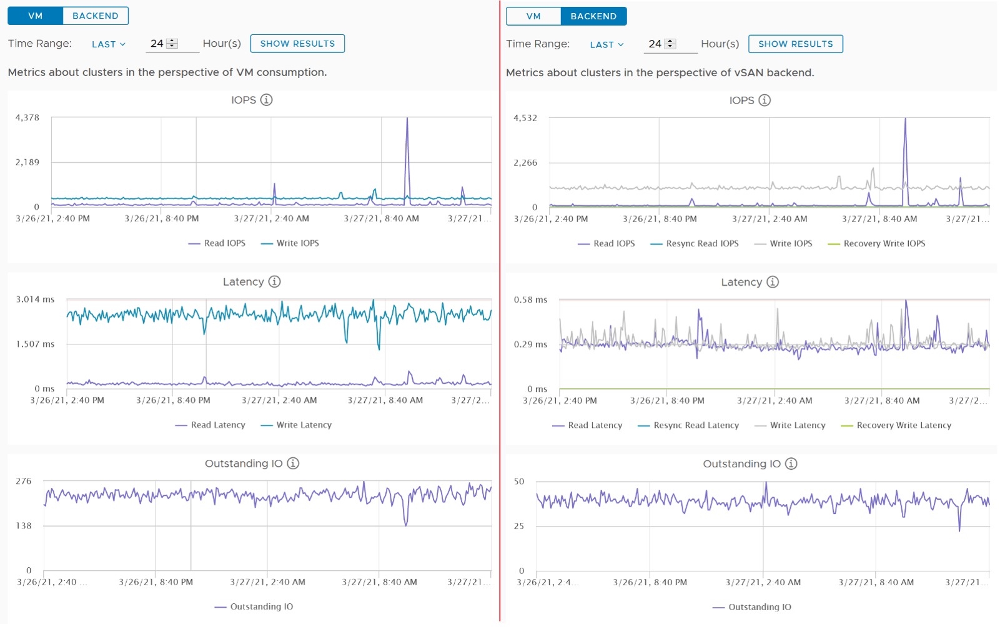

## Performance Monitoring

While vSAN provide storage service, it requires network to deliver that. So we need to look at both storage and network in analysis. vSAN is basically a collection of ESXi Hosts, so we need to consider compute metrics also.

A large vSAN cluster can have many components. Each of these components can have multiple performance metrics. The total number of KPI can reach hundreds of metrics. Take the following example, which is a 10 node cluster.

Here are some of the questions you want to ask in day-to-day operations:

- Is any of the ESXi hosts in the cluster running high CPU utilization?
- Is any of the ESXi hosts running high Memory utilization?
- Is any of the NIC cards in any of the ESXi hosts running high utilization?
  - In the above example, with 4 NIC cards per ESXi, you have 40 TX + 40 RX metrics.
- Is the vSAN VMkernel network on any of the ESXi hosts congested?
- Is the Read Cache on any of the Disk Grups sufficient? If you have a lot of cache miss, it can impact performance.
- Is the Write Buffer on any of the Disk Grups sufficient?
- Is the Cache Tier performing fast? Each disk has 4 metrics: Read Cache Read Latency, Read Cache Write Latency, Write Buffer Write Latency, Write Buffer Read Latency. Since there are 20 disks, you need to check 80 counters
- Are the Capacity Disks performing fast? Check both Read and Write latency as they typically have different results.
  - In our example above, there are 120 x 2 = 240 counters.
- Is any of the Disk Groups running low on space?
- Is any of the Disk Groups facing congestion? You want to check both the max and count the number of occurrences > 60.
- Is there outstanding IO on any of the Disk Group?

If you add them up, you are looking at 530 metrics for this vSAN cluster. And that’s just 1 point in time. It will be difficult to show hundreds of datapoint on a screen, even if you can color code them all. We need a way to zoom in on the early warning.

The above is just a point in time. What if you want to see the trend over time? In 1 month you are looking at 530 x 8766 = 4.6+ millions data points. And that’s just 1 cluster. So there is a need for a better technique.

vRealize Operations use the formula Min(), Max(), and Count() to pick the early warning. This was covered earlier in [this section](/operations-management/chapter-2-performance-management/1.2.4-contention-vs-utilization/). It combines the key metrics into a set of KPI. With these vSAN KPIs, you only have 12 metrics to check instead of 530, without losing any insight. In fact, you get better early warning, as we hide the average. Early Warning is critical as buying hardware is more than a trip to local DIY hardware store.

The following tables show the KPIs and their formula.

From the above, we need to reduce it to a single metric so we can report many vSAN clusters. The following diagram shows why.

If you want to crack the vSAN KPI, reach out to me.

## Performance Troubleshooting

The above KPI metrics are good enough for monitoring. It tells you if there is a problem. To know what’s causing the problem, you need to dig deeper. The first step is to recognise that there are two broad layers: VM layer and backend layer.

I’ve put the two screens side by side for ease of comparison. What do you notice?

Just like other storage subsystems, you will expect the latency & outstanding IO at the backend layer to be lower. This is because it’s a subset of the entire path taken by the IO command of the VM.

Let’s dive deeper to peel the layer. The following diagram shows the key components and how the latency counters are measured. It visualizes the hardware and software component using different box style.

- **Software**: VM, vSAN software and Network kernel loadable module
- **Hardware**: IO Controller Card, Cache Disk, Capacity Disk, and Network Card

The white arrows show a single Write command, and the yellow arrow show a single read command. Both have double arrows to show the acknowledgement when the command has been completed.

- The write request is written to the cache disk, and acknowledged. The destaging to capacity disk is done post acknowledgement, hence it’s not part of the VM disk latency. In this example, we are showing that the writing happens to be on local ESXi host.
- The read request is shown as remote so we can cover both local and remote scenarios. Notice the read does not touch the local IO Controller Card. It goes into the network subsystem, which drives the physical network card. On the destination host, the vSAN software will first read from the cache. If there is a miss, it will read from the capacity disk.

## Other Metrics

The Percentage of VM with disk latency metric on vSAN datastore object will not include virtual disks not residing on the vSAN datastore. It only gets from vSAN datastores. Example:

- VM 1 has 2 virtual disks, one on vSAN, one of RDM LUN
- VM 2 has 2 virtual disks, one on vSAN, one of VMFS datastore

In the above example, the formula will ignore the latency from the virtual disks on RDM LUN and VMFS datastore.

In the What If scenario:

- Guest File System | Utilization is the metric used to determine VM consumption (without the vSAN overhead due to FTT)