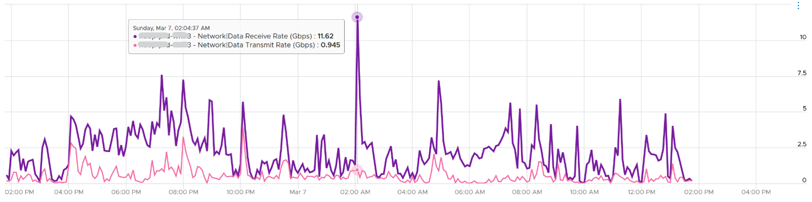

From performance and capacity management point of view, network has different fundamental characteristics to compute or storage. The key differences are summarized below.

|       | Compute or Storage | Network |
| ---- | -------- | -------|
| Net available resource to VM |Relatively high | Low |
| Resource allocation at VM level| Granular | Coarse |
| Hardware | Single purpose| Multi-purpose |
| Nature | A node | An interconnect|
| Upper Limit| Yes | No|
| Monitoring | Simpler | Harder|

Let’s explain the above in more detail, starting from the first difference.

At the end of the day, the net available resources to the VMs arewhat we care about. What the IaaS platform used is considered an overhead. The more ESXi VMkernel, NSX, vSAN, vSphere Replication use, the lesser you have left for the business workload.

An ESXi host has a fixed specification (for example, 2 CPUs, 36 cores, 256 GB RAM, 2 x 10 GE NIC). This means we know the upper physical limit. How much of that it available to the VMs? Another word, what is the usable capacity for the business workload? 

- For compute, the hypervisor consumes a relatively low proportion of resources. Even if you add a software-defined storage such as Virtual SAN, you are looking at around 10% total utilization but depends on many factors.
- The same cannot be said about network. Mass vMotion (for example, when the host enters maintenance mode), storage vMotion (in IP storage case), VM provisioning or cloning (for IP storage), and Virtual SAN all take up significant network bandwidth. In fact, the non-VM network takes up the majority of the ESXi resources. If you have 2 x 10 GE NIC, majority of it is not used by VM. The following screenshot shows that VM only gets 100 shares out of 500 shares. So the overhead can be as high as 80%!

The second difference with network is the resource that is given to a single VM itself. 
- For compute, we can configure a granular size of CPU and RAM. For the CPU, we can assign one, two, three, four, etc. vCPUs. 
- With network, we cannot specify the vNIC speed. It takes the speed of the ESXi vmnic assigned to the VM port group. So each VM will either see 1 GE or 10 GE or 25 GE (you need to have the right vNIC driver, obviously). You cannot allocate another amount, such as 500 Mbps or 250 Mbps in the Guest OS. In the physical world, we tend to assume that each server has 10 GE and the network has sufficient bandwidth. You cannot assume this in a virtual data center as you no longer have 10 GE for every VM at the physical level. It is shared and typically oversubscribed. 
- A network intensive VM can easily hit 1 Gbps for both egress and ingress traffic. The following chart shows a Hadoop worker node receiving more than 5 Gbps worth traffic multiple times. You need to be careful in sizing the underlying ESXi if you want to run multiple VMs. While you can use Network I/O Control and vSphere Traffic Shaping, they are not configuration property of a VM.

The third difference is that the hardware itself can provide different functionalities. 

- For compute, you have servers. While they may have different form factors or specifications, they all serve the same purpose—to provide processing power and a set of working memory for hypervisor or VM. 
- For network, you have a variety of network services (firewall and load balancer) in addition to the basic network functionalities (switch, router, and gateway). You need to monitor all of them to get a complete picture. These functionalities can take the form of software or hardware.

The fourth difference is the nature of network. 
- Compute and storage are nodes. When you have a CPU or RAM performance issue on one host, it doesn't typically impact another host on a different cluster. The same thing happens with storage. When a physical array has a performance issue, generally speaking it does not impact other arrays in the data center.
- Network is different. A local performance issue can easily be a data center-wide problem. Here is a good [read](https://blog.ipspace.net/2019/05/real-life-data-center-meltdown.html) by shared [Ivan Pepelnjak](https://www.ipspace.net/About_Ivan_Pepelnjak).

The fifth difference is the upper limit.
- Determining CPU or RAM workload is easy: there is a physical limit. This makes capacity management possible, and aids in performance troubleshooting.
- While network has a physical limit, it can be misleading to assume it is available to all VMs all the time. Because the physical capacity of the network is shared, you have a dynamic upper limit for each workload. The VM Network port group will have more bandwidth when there is no vMotion happening. Furthermore, each VM has a dynamic upper limit as it shares the VM Network port group with other VMs.
- The resource available to VM also varies from host to host. Within the same host, the limit changes as time progresses. Unlike Storage I/O Control, Network I/O Control does not provide any counters that tell you that it has capped the bandwidth. 
- In many situations, the bandwidth within the ESXi host may not be the smallest pipe between the originating VM and its destination. Within the data center, there could be firewalls, load balancers, routers, and other hops that the packet has to go through. Once it leaves the data center, the WAN and Internet are likely to be a bottleneck. This dynamic nature means every VM has its own practical limit.

The sixth difference is monitoring and troubleshooting
- A distributed system is harder to monitor than a single node, especially if workload varies among the components that make up the system.
- The network resource available to VM also varies from host to host. Within the same host, the limit changes as time progresses. Unlike Storage I/O Control, Network I/O Control does not provide any counters that tell you that it has capped the bandwidth.
- NIOC can help to limit the network throughput for a particular workload or VM. If you are using 10 GE, enable NIOC so that a burst in one network workload does not impact your VM. For example, a mass vMotion operation can saturate the 10 Gb link if you do not implement NIOC. In vCenter 7, there is no counter that tracks when NIOC caps the network throughput. As a result, vRealize Operations will not tell you that NIOC has taken action.

Because of all these differences, the way you approach network monitoring should also be different. If you are not the network expert in your data center, the first step is to partner with experts.