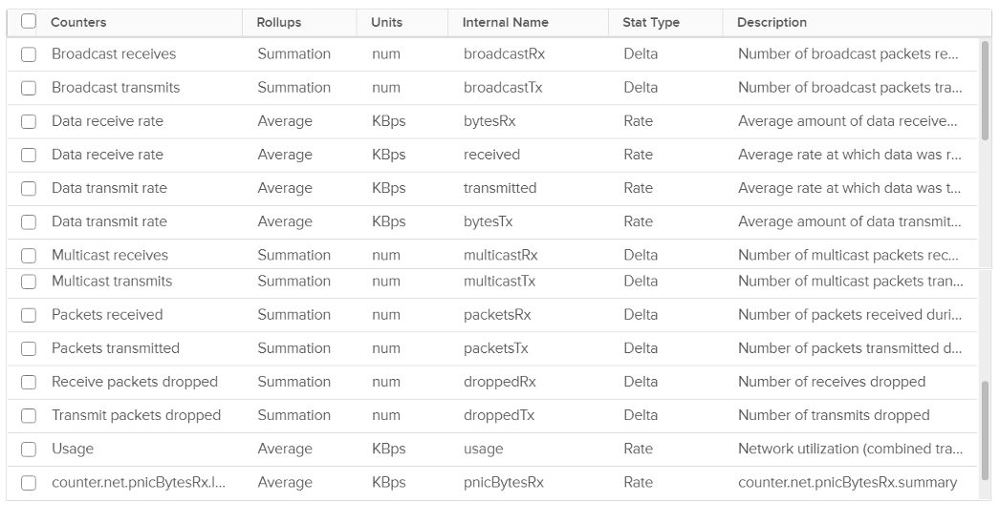

The following screenshot shows the counters vCenter provides for the Network at a VM layer. The counters are available at each individual vNIC level and at the VM level. Most VMs will only have 1 vNIC, so the data at VM level and vNIC level will be identical. The vNICs are named using the convention "400x". That means the first vNIC is 4000, the second vNIC is 4001, and so on.

As usual, let’s approach the counters starting with Contention. There is no Latency counter so you cannot track how long it takes for a packet to reach its destination. There are, however, counters that track packet loss. For TCP connection, dropped packet needs to be retransmitted and therefore increases network latency from application point of view. vCenter does not provide a counter to track packet retransmit. 

Network latency could be impacted by CPU. CPU might not fast enough to process the packet. In VM, this could also be due to the VM having CPU contention.

Besides unicast traffic, which should form the bulk of your network, vSphere also provides information about broadcast traffic and multicast traffic. If you are not expecting any of this traffic from certain VMs (or clusters) and want to be alerted if it does occur, you can create a group for the objects and then apply a super metric. The super metric would add the four counters that capture broadcast and multicast. You should expect a flat line as the total should be near 0.

Just in case you’re not aware of these KB articles.
- [Packet loss in Guest OS using VMXNET3](https://kb.vmware.com/s/article/2039495): When using the VMXNET3 driver on a VM on ESXi, you see significant packet loss during periods of very high traffic bursts. The VM may even freeze entirely. This issue occurs when packets are dropped during high traffic bursts. This can occur due to a lack of receive and transmit buffer space or when receive traffic which is speed constrained.
- [esxtop show dropped packets](https://kb.vmware.com/s/article/1010071): The network screen output in esxtop show dropped receive packets (%DRPRX) at the virtual switch port. They are actually dropped between the virtual switch and the guest operating system driver. The dropped packets can be reduced by increasing the Rx buffers for the virtual network driver.