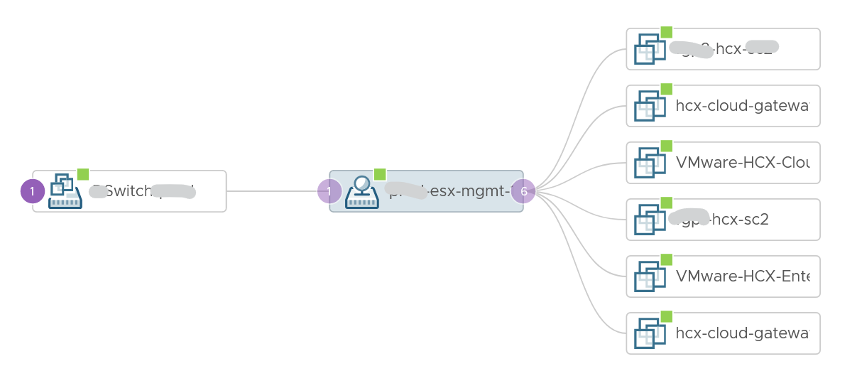

vSphere network is by nature distributed. Each ESXi contributes to the physical NIC. This represents the physical capacity as each NIC cards have a limit, such as 25 Gbps full duplex. Distributed switch and its port groups span across these independent network cards, and dynamically share the cards. This distributed and dynamic nature makes it practically impossible to define and measure network capacity and performance. Unbalanced can happen among ESXi or physical NIC. In a sense, it’s like distributed storage (e.g. vSAN). 

vCenter does not provide information at the individual port group level. This makes monitoring difficult, as you cannot slice the data from the switch point of view. vRealize Operations addresses that by providing the necessary counters at the Distributed Switch level and its Port Groups. It shows a relationship between ESXi, the port group and the switch.

You can drill down into a port group, and see the VMs connected to that port group

Capacity management does not apply to a port group, since its upper limit (also known as the physical capacity) can vary by even a minute. You can use static binding if that helps in capacity and performance management.

At the physical layer, you need to use adapter to gain visibility. This gets you interesting metric such as CRC errors, input drop (system unable to cope with incoming packets), input error (likely due to physical layer issues, such as bad hardware, a noisy line, a bad connection, or incorrect data conversion), interface reset (due to issues such as congestion on the line), output drop (system tries to hand off a packet to a transmit buffer but it has no more buffers). More is covered [here](https://www.cisco.com/E-Learning/bulk/public/tac/cim/cib/using_cisco_ios_software/07_basic_commands_tasks.htm). 

You should expect error to be 0 or below 1%.