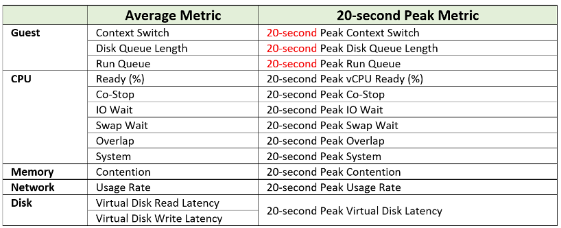

vRealize Operations collects and stores data every 5 minutes. This is good enough for monitoring use case, but not for troubleshooting. 300-second average is not granular enough, as performance problem may not be sustained that long. Even a performance issue that last days may consist of ***repeated micro bursts***. I check if repeated burst exist by profiling a few thousand VMs. Here are some of the results. I compare 3 metrics (disk latency, network througput and CPU context switch).

The peak column is based on 20-second average. So it’s 15x sharper than the 300-second average. It gives better visibility into the micro burst. If the burst exists, you will see something like this, where the 20-second shows much worse value consistently.

This is where the 20-peak counters come in. vRealize Operations 8.3 sports a set of 12 metrics that captures the highest 20-second **average** in any given 5-minute period (the default collection interval). Why only 12 and how are they chosen?

Take a look at the table below. It shows a VM with 2 virtual disks. Each disk has its own read latency and write latency, giving us a total of 4 counters. 

While vRealize Operations collects every 300 seconds, it actually grabs 15 data points. Why 15? Those 15 matches the 20-second that vCenter produces. Each 20-second data point is an average of the entire 20 seconds, not a point in time such as the 20th second. So all along, vRealize Operations actually has 20-second visibility. However, it ***averages*** these 15 data points, losing the 20-second granularity.

What vRealize Operations 8.3 does is to add a new metric. It does not change the existing metric, because both have their own purpose. The 5-minute average is better for your SLA and performance guarantee claim. If you guarantee 10 ms disk latency for every single IOPS, you’d be hard pressed to deliver that service. These new counters act as early warning. It’s an internal threshold that you use to monitor if your 5-minute SLA is on the way to be breached.

vRealize Operations 8.3 takes the peak of these 15 data points, and stores them every 5 minutes. It does not store all 15 data points, because that will create a lot more IOPS and consume more storage. It answers the question “Does the VM or Guest OS experience any performance problem in any 20-second period?”

Having all 20-second data points are more natural to us, as we’re used to 1 second in Windows and 20 second in vCenter performance charts. But how does that additional 14 data points change the end remediation action? If the action you take to troubleshoot is the same (e.g. adjust the VM size), why pay the price of storing 15x more data points?

If you need to store them all, vRealize Operations Cloud does it for you. Note that it’s limited to 7 days, while this technique lets you store for 6 months as it’s just like any other regular metric.

In the case of virtual disk (as opposed to say memory), a VM can have many of them. A database VM with 20 virtual disks will have 40 peak counters. That also means you need to check each one by one. So vRealize Operations 8.3 takes the peak among all virtual disks read and writes. It does the same thing with vCPU. A monster VM with 64 vCPU will only have 1 metric, but this metric is the highest among 64 virtual CPU. There is no need to have visibility into each vCPU as the remediation action is the same. Whether it’s vCPU 7 or vCPU 63 that has the problem, it does not change the conclusion of troubleshooting in most cases.

The next question is naturally why we picked the above 12. You notice they are only VM counters. No ESXi, Resource Pool, Datastore, Cluster, etc counters. The reason is the counters at these “higher-level” objects are mathematically an average of the VMs in the object. A datastore with 10 ms disk latency represents a normalized/weighted average of all the VMs in the datastore. Another word, these counters give less visibility than the 12 above, and they can be calculated from the 12. And 1 more reason: 

You troubleshoot VM, not infrastructure. If there is no VM, there is no problem 😊

Among the 12 counters, you notice only 1 counter tracks *utilization*. The other 11 tracks *contention*. The reason is covered here. 

Why are Guest OS level metrics provided? Because they do not have VM equivalent, and they change the course of troubleshooting. If you have high CPU run queue, you look inside Windows and Linux, not at the underlying ESXi Host as it’s transparent to the host.

For CPU, the complete set of contention is provided. There are 6 counters tracking the different type of contention or wait that CPU experiences.

For Memory, popular metrics such as Consumed, Active, Balloon, Swap, Compress, Granted, etc are not shown as they do not indicate performance problem. Memory Contention is the only counter tracking if the VM has memory problem. VM and Guest OS can have memory problem independently. In future, we should add Guest OS memory performance counters, if we find a good one. Linux and Windows do not track memory latency, only track memory disk space consumption, throughput and IOPS. These 2 OSes do not track latency, which unfortunately is the main counter for performance. 

For Network, vCenter does not have latency and re-transmit. It has dropped packet, but unfortunately this is subject to false positive. So we have to resort to utilization metric. In future, we should add packets per second.

The following screenshot shows the actual name of the 12 metrics in vRealize Operations 8.4.

Lastly, just in case you ask why we do not cover Availability (e.g. something goes down), it’s because this is better covered by events from Log Insight.