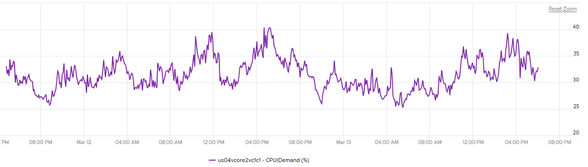

The metrics at cluster level is basically an aggregation of its ESXi plus cluster specific features, such as HA, DRS and capacity buffer. 

This means by definition the metrics are averaged numbers. So be careful as there can be ESXi or VM that has issue but obscured in the cluster wide average. Even the so-called total or summation is mathematically an average. For example, the Total CPU Wait counter is the sum of all ESXi CPU Wait counters, which in turn is the sum of all the VMs. At the end you get a large number, which you need to normalize and convert into average. Since you divide it against the cluster total, you get average. 

vRealize Operations sports a few leading indicators to help you detect problem early.

##### CPU

- Worst VM CPU Ready (%)
- Worst VM CPU Overlap (ms)
- Worst VM CPU Co-Stop (%)
- Percentage of VMs facing CPU Ready (%)
- Percentage of VMs facing CPU Co-Stop (%)
- CPU Ready > 1%

##### Memory

- Worst VM Memory Contention (%)
- Percentage of VMs facing Memory Contention (%)

##### Disk
- Worst VM Disk Latency (ms)

Percentage of VMs facing Disk Latency is not included as that should be a percentage of the datastore, not the cluster. The reason is if there is a population problem, you troubleshoot the datastore not the cluster(s) mounting it.

## Performance Troubleshooting

There is a common misconception that you cannot have performance issue when cluster has low utilization. We introduced that problem here. 

Performance is unmet demand. VM 01 can face very high contention when all other VMs on the same cluster face no contention. 

It is possible for VMs in the cluster to suffer from poor performance, while the cluster utilization is low. One main reason is cluster utilization looks at the provider layer (ESXi), while performance looks at individual consumer (VM). The following cluster has 32 ESXi supporting 2357 VM. The average demand across the cluster is <40%. Since it has 32 ESXi and 2357 VM, we can retire 8 ESXi or add 1K VM. 



And yet the VMs in the clusters are facing contention. Both VM CPU Ready and CPU CoStop are high.


## Cluster and Disk

A shared datastore is typically shared by all the ESXi in a cluster, so the VMs can around without doing storage vMotion. Some datastores are further shared by multiple clusters, and a cluster in turn may have multiple datastores. This can cause confusion on what numbers to show at different levels.


The same approach has to be applied to IOPS. Cluster A should report IOPS that it performs, and not the total IOPS from all clusters. 

## Projection

- **Usable Capacity** = Total Capacity - (vSphere HA reservation + capacity buffer).
- **Total Capacity** = The sum of all the physical cores in MHz. It does not take into account Hyper-Threading. It does not take into account CPU power Management.

Capacity buffers defined in vRealize Operations policy (default 0%).

**CPU Usable Capacity**

```text
= CPU \ Demand \ Usable Capacity after HA and Buffer (GHz) 
= Sum ( ESXi CPU \ Capacity Available to VMs ) * ( 100 – Cluster HA CPU Failover ) % 
Memory Usable Capacity (KB) 
= Memory \ Demand \ Usable Capacity after HA and Buffer (GB)
= ( Sum ESXi Memory | Capacity Available to VMs ) * ( 100 - Cluster HA Memory Failover) % 
```

##### Capacity Remaining

**Capacity Remaining** = Usable Capacity - (MAX Value of upper confidence interval of Long Term Forecast within a user defined Planning Window)

**Long Term Forecast** = Forecast of (Usage and Contention (aka Demand) + Overhead (if applicable). Forecast is based on ARIMA, DFT, Spike and Plateau models. A year's worth daily aggregated (currently average) data is used, with more weight given to more recent data (this feature is called exponential decay). A limitation is it won’t handle workload with annual cycle.

Note that the value of will be set to 0 if during the given collection cycle the demand breaches the usable capacity. This is because at that moment there is really no capacity. This can cause fluctuating value of Capacity Remaining metric if the load regularly touches the usable capacity threshold.

##### Time Remaining
Time from now to when the upper confidence interval of Long Term Forecast intersects/crosses Usable Capacity. If no intersection is seen, then the value is set to 366 days

##### Cluster Demand
Cluster CPU Demand contain only limits, Memory utilization contains limits and reservations. CPU Reservation is excluded as it’s on demand.

##### ESXi CPU overhead

ESXi CPU overhead = CPU \ Overhead (MHz)

This reservation is actually a raw counter from vCenter. ESXi needs to guarantee that the kernel has the resources for itself and does it by reservation (as opposed to by priority).

There is another counter that tracks the actual VMkernel overhead

##### ESXi memory overhead
= Memory \ ESX System Usage (KB)

##### ESXi usable memory
= CPU\ Capacity Available to VMs

##### ESXi usable CPU
= Memory\ Capacity Available to VMs