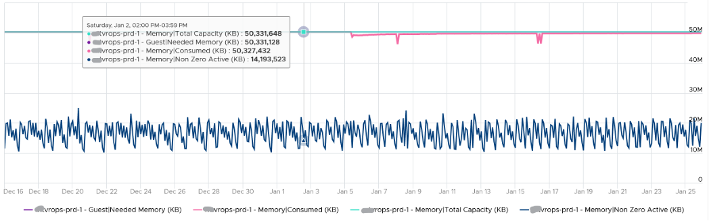
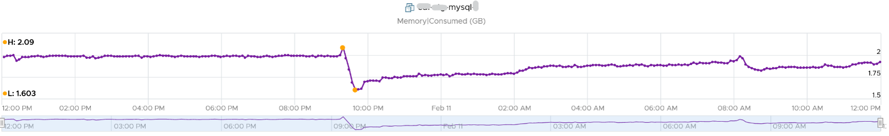
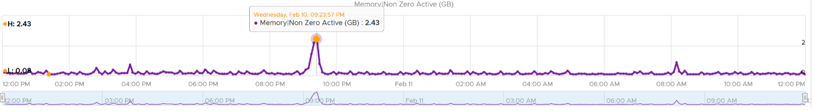
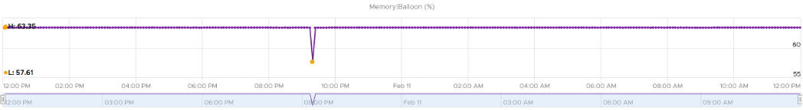

## VM CPU Demand

The reason why Demand metric jumps while Usage drops is contention. The VM experiences contention, which includes hyperthreading sharing. I should have included the screenshot of CPU Ready, CoStop, Overlap, VM Wait and Swap Wait.

From the chart you can see that the formula for VM CPU Contention \> Demand - Usage. Contention (%) is around 20% when Demand is 25% and Usage is 15%. The reason is Contention accounts for both CPU frequency and hyper threading, while the difference between Demand and Usage is hyper-threading.

## VM CPU vs ESXi CPU Metrics

#### At the start of the test

- The VM runs 12 vCPU, but each vCPU was pinned to each ESXi core. So all cores are 100% utilized, but each running 1 thread.

- VM CPU Run (ms) is 240K milliseconds, which is 20K milliseconds x 12 (half of its 24 vCPU).

- VM CPU Used (ms) is also at 240K milliseconds. There is no loss from overlap, the VM does not do much IO, and no efficiency loss/gain due to HT.

- VM CPU Usage is 50%.

- So at this point, all 3 counters of VM CPU are 50%.

- The counter at ESXi tells a different story. The ESXi Core Utilization (%) immediately went up to 100% while Utilization went up to only 50%. The reason is Core Utilization measures whether the core is used or not. It's unaware of HT.

- Usage (%) is identical to Core Utilization in this case.

- On the other hand, ESXi Utilization (%) looks at if each thread HT is running or not. It does not care about the fact that the 2 threads share a core, and simply roll up to ESXi level directly from thread level. This is why it's showing 50% as it only cares whether a thread is running or not, at any point in time.

#### During Ramp Up period

- VM is being ramped up steadily. You can see all 3 counters went up in steps.

- VM CPU Run (ms) ramps up from 240K to 480K. All 24 vCPU has 20K ms value, which equals to 100%.

- VM CPU Used (ms) barely moved. From 240K to 300K. That's 1.25x, demonstrating that Used understands HT only delivers 1.25x throughput.

- VM CPU Usage (%) ramp up from 50% to 62.5%, also demonstrating awareness of contention due to HT.

- Used (ms) = Usage (%)

- ESXi CPU Usage (%) counter stayed flat at 100%. The reason is all 12 cores were already busy. That means VM CPU Usage (%) is aware of HT, but ESXi CPU Usage (%) is not.

- ESXi CPU Core Utilization (%) matches VM Run. Both went 2x.

#### Towards the end of the run

- VM CPU Run is at 480K ms. This counter is suitable for VM Capacity sizing, as it correctly accounts that each vCPU is used by Guest OS.

- VM CPU Used is at 300K milliseconds, which is 62.5%

- VM CPU Usage (%) is at 62.5%. On average, each of the VM vCPU only gets 62.5%. If you use this for your VM capacity, you will get the wrong conclusion as it's already running 100%

- ESXi CPU Usage (%) is at 100%. This makes it suitable from Capacity viewpoint, albet too conservative. It is not suitable from Performance, as you can not tell if there is still room.

- ESXi CPU Utilization (%) is at 100%. Because it tracks the ramp correctly, it can be used from Performance. You can use it for Capacity, but take note that 100% means you get performance hit from. In fact, at 50% the HT effect will kick in.

## VM Active Memory

Active is lower than Consumed and Guest OS In Use counters because they do not actually measure how actively the page is used. They are measuring the disk space used, so it contains a lot of inactive pages. You can see it in the general pattern of Consume and Guest OS used counters. The following is vRealize Operations appliance VM. Notice how stable the metrics are, even over millions of seconds.

## ESXi CPU Contention vs Utilization

These are the reasons why they don't match:

- One looks at physical CPU, the other the virtual CPU. One looks at ESXi, while the other looks at VM.
- Limit may impact the VM, either directly or via resource pool
- CPU pinning, although this is rarely happen
- Unbalanced utilization. There are many VMs in this host. Their experience will not be identical.

## Mystery of VM Memory

This behaviour confuses me so if you know the answer let me know please. This 64-bit CentOS VM runs My SQL and is configured with 8 GB of RAM. However, a limit is set at 2 GB hence you saw consumed does not exist 2 GB.

Can you explain the dip in Consumed at around 9:30 pm? It went down from 2.09 GB to 1.6 GB, and then slowly going back up. Why did it suddenly consume 400 MB less in the span of 20 minutes? Both the configured limit and the runtime limit do not change. They are main at a constant 2 GB. This makes sense, else the Consumed would not be able to slowly go up again.

My guess is there must be activity by the VM and pages were compressed to make room for the newly requested pages. The Non Zero Active counter shows that there are activities.

The pages that are not used must be compressed or swapped. The Swapped value is negligible, but the Compressed metric shows the matching spike.

But what puzzles me is why did balloon go down by around 400 MB but then goes up immediately?

