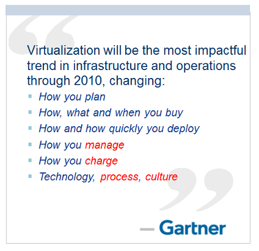
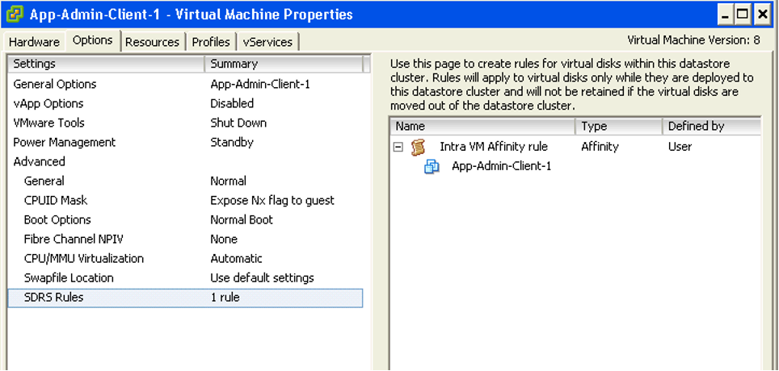

In this chapter, we will dive into why seemingly simple technology, an X86 machine virtualized, has a large ramification for the IT industry. In fact, it is turning a lot of things upside down and breaking down silos that have existed for decades in large IT organizations. We will cover the following topics:

- Why virtualization is not what we think it is
- Virtualization vs Partitioning

- A comparison between a physical server and a virtual machine

## Journey into the Virtual World

It is the era of the cloud. Who does not know what a VM is? Even a business user who has never seen one knows what it is. It is just a physical server, virtualized. Nothing more.

Wise men say that small leaks sink the ship. We think that's a good way to explain why IT departments who manage physical servers well struggle when the same servers were virtualized.

We can also use Pareto principle (80/20) rule. 80% of a VM is identical to physical server. But it's the 20% differences that hit you. We will highlight some of this "20% portion", focusing on areas that impact data center management.

The change caused by virtualization is much larger than the changes brought forward by previous technologies. In the past two or more decades, we transitioned from mainframes to the client/server-based model to the web-based model. These are commonly agreed upon as the main evolutions in IT architecture. However, all of these are just technological changes. It changes the architecture, yes, but it does not change the operation in a fundamental way. Both the client-server and web shifts did not talk about the "journey". There was no journey to the client-server based model. However, with virtualization, we talk about the virtualization journey. It is a journey because the changes are massive and involve a lot of people. That's why the evolution toward multi-cloud operations is also called a journey.

Gartner correctly predicted the impact of virtualization in 2007. More than 1 decade later we still have not completed the journey. Proving how pervasive the change is, here is the following summary on the article[^1] from Gartner:

Notice how Gartner talks about change in culture. So, virtualization has a cultural impact too. In fact, if your virtualization journey is not fast enough, look at your organization's structure and culture. Have you broken the silos? Do you empower your people to take risk and do things that have never been done before? Are you willing to flatten the organization chart?

The siloes that have served you well is likely your #1 barrier to multi-cloud.

So why exactly is virtualization causing such a fundamental shift? To understand this, we need to go back to the basics, which is what exactly virtualization is. It's pretty common that senior IT management have a misconception about what this actually is.

Take a look at the following comments. Have you seen them in your organization?

- "VM is just Physical Machine virtualized. Even VMware said the Guest OS is not aware it's virtualized and it does not run differently."
- "It is still about monitoring CPU, RAM, Disk, Network. No difference."
- "It is a technology change. Our management process does not have to change."
- "All of these VMs must still feed into our main Enterprise IT Management system. This is how we have run our business for decades and it works."

If only life was that simple, we would all be 100 percent virtualized and have no headaches! Virtualization has been around for decades, and yet most organizations have not mastered it. The proof of mastering if you have completed the journey and have reached the highest level of virtualization maturity model.

Although virtualization looks similar on the cover to a physical world, it is completely re-architected *under the hood*.

## Virtual Machine vs Physical Machine

VM is not just a physical server virtualized. Yes, there is a P2V process. However, once it is virtualized, it takes on a new shape. That shape has many new and changed properties, and some old properties are no longer applicable or available. The following is an old screenshot, taken years ago. Can you spot properties that do not exist in physical server?

Let's highlight some of the properties that do not exist in a physical server. I'll focus on those properties that have an impact on management, as management is the topic of this book.

| Properties | Physical Server | VM |
| --- | --- | --- |
| **BIOS** | A unique BIOS for every brand and model. Even the same model (for example, HP DL 380 Generation 9) can have multiple versions of BIOS. BIOS needs updates and management, often with physical access to a data center. This requires downtime.| This is standardized in a VM. There is only one type, which is the VMware motherboard. This is independent from the ESXi motherboard. VM BIOS needs far less updates and management. The inventory management system no longer needs the BIOS management module.|
| **Virtual Hardware** | Not applicable | This is a new layer below BIOS. It needs an update on every vSphere release. A data center management system needs to be aware of this as it requires a deep knowledge of vSphere. For example, to upgrade the Virtual Hardware, the VM has to be in the power-off stage. |
| **Drivers** | Many drivers are loaded and bundled with the OS. Often, you need to get from respective hardware vendors for the latest drivers. All these drivers need to be managed. This can be complex operation, as they vary from model to model and brand to brand. The management tool has rich functionalities, such as checking compatibility, rolling out drivers, rolling back if there is an issue, and so on. | Relatively fewer drivers are loaded with the Guest OS; some drivers are replaced by the ones provided by VMware Tools. Even with NPIV, the VM does not need the FC HBA driver. VMware Tools needs to be managed, with vCenter being the most common management tool. |

With all the above differences, how does it impact the hardware upgrade process?

| Physical Server | VM |
| --- | --- |
| Downtime required. It is done offline and is complex. OS reinstallation and updates are required, hence it is a complex project in the physical world. Sometimes, a hardware upgrade is not even possible without upgrading the application. | It is done online and is simple. Virtualization decouples the application from hardware dependency. A VM can be upgraded from a 5-year-old hardware to a new one, moving from the local SCSI disk to 10 Gb FCoE, from dual core to a 18-core CPU. So yes, MS-DOS can run on 10 Gb Ethernet accessing SSD storage via the PCIe lane. You just need to perform vMotion to the new hardware. As a result, the operation is drastically simplified. |

In the preceding table, we compared the core properties of a physical server with a VM. Every server needs storage, so let's compare the storage properties.

| Physical Server | VM |
| --- | --- |
| For servers connected to SAN, they can see the SAN and FC fabric. They need HBA drivers and have FC PCI cards, and have multipathing software installed. Normally needs an advanced filesystem or volume manager to RAID local disk. | No VM is connected to FC fabric or the SAN. VM only sees the local disk. Even with N_Port ID Virtualization (NPIV) and physical Raw Device Mapping (RDM), the VM does not send FC frames. Multipathing is provided by vSphere, transparent to VM.
There is no need for RAID local disk. It is one virtual disk, not two. Availability is provided at the hardware layer. |
| Backup agent and backup LAN needed in the majority of cases. | Not needed in the majority of cases, as backup is done via vSphere VADP API. Agent is only required for application-level backup. |

Big difference in storage. How about Network and Security?

In vSphere, a VM is connected to a distributed virtual switch. It is not directly connected to the physical NIC in your ESXi host. The ESXi host's physical NICs become the virtual switch's uplinks instead. This means that the traditional top-of-rack (TOR) switch has been entirely virtualized. It runs completely as software. This means the management software needs to understand the distributed vSwitch and its features.

| Physical Server | VM |
| --- | --- |
| NIC teaming is common. Typically needs two cables per server. | NIC teaming provided by ESXi. VM is not aware and only sees one vNIC. |
| Guest OS is VLAN aware. It is configured inside the OS. Moving VLAN requires reconfiguration. | VLAN is generally provided by vSphere, and not done inside the Guest OS. This means VM can be moved from one VLAN to another with no downtime. With network virtualization, VM is moving from VLAN to VXLAN.
| The AV agent is installed on Guest, and can be seen by the attacker. | An AV agent runs on the ESXi host as a VM (one per ESXi). It cannot be seen by the attacker from inside the Guest OS.|
| AV consumes OS resources. AV signature updates cause high storage throughput. | AV consumes minimal Guest OS resources as it is offloaded to the ESXi Agent VM. AV signature updates do not require high IOPS inside the Guest OS. The total IOPS is also lower at the ESXi host level as it is not done per VM.|

Lastly, let's take a look at the impact on management. As can be seen next, even the way we manage a server changes once it is converted into a VMs

| Properties | Physical Server | VM |
| --- | --- | --- |
| **Approach on Monitoring** | An agent is commonly deployed. It is typical for a server to have multiple agents. In-Guest counters are accurate as the OS can see the physical hardware. A physical server has an average of 5 percent CPU utilization due to the multicore chip. As a result, there is no need to monitor it closely. | An agent is typically not deployed. Certain areas such as application and Guest OS monitoring are still best served by an agent. The key in-Guest counters are not accurate as Guest OS does not see the physical hardware. A VM has an average of 50 percent CPU utilization as it is right sized. This is 10 times higher when compared with a physical server. As a result, there is a need to monitor closely, especially when physical resources are oversubscribed. Capacity management becomes a discipline in itself. |
| **Approach on Availability** | HA is provided by "clusterware" such as Microsoft Windows Server Failover Clusters (WSFC) and Veritas Cluster Server (VCS). Clusterware tends to be complex and expensive. Cloning a physical server is a complex task and requires the boot drive to be on the SAN or LAN, which is not typical. Snapshot is rarely done, due to cost and complexity. We find only very large IT departments practice physical server snapshot. | HA is a built-in core component of vSphere. From what we see, most clustered physical servers end up as just a single VM as vSphere HA is good enough. Cloning can be done easily. It can even be done live. The drawback is that the clone becomes a new area of management. Snapshot can be done easily. In fact, this is done every time as part of backup process. Snapshot also becomes a new area of management as they tend to be forgotten.|
| **Company Asset** | The physical server is a company asset and it has book value in the accounting system. It needs proper asset management as components vary among servers. Here, the annual stock-take process is required. | VM is not an asset as it has no accounting value. A VM is like a document. It is technically a folder with files in it. Stock-take process is no longer required as the VM cannot exist outside vSphere.|

[^1]: The link from Gartner no longer works, so I guess you gotta trust me now. 