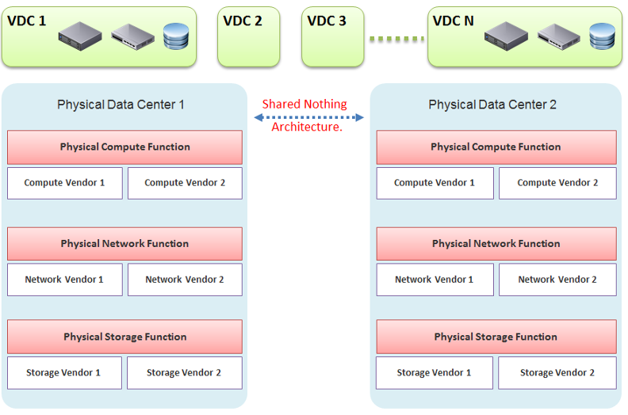

We covered how a VM differs drastically to a physical server. Now let's take a look at the big picture, which is at the data center level. A data center consists of three major functions-compute, network, and storage. Security is not a function on its own, but a key property that each function has to deliver. We use the term compute to represent processing power namely CPU and Memory. In today's data centers Compute is also used when referencing converged infrastructure, where the server and storage have physically converged into one box. The industry term for this is Hyper-Converged Infrastructure (HCI). You will see later in the book that this convergence impacts how you architect and operate SDDC.

VMware has moved to virtualize the network and storage functions as well, resulting in a data center that is fully virtualized and thus defined in the software. The software is the data center. This has resulted in the term SDDC. The book will make extensive comparison with the physical data center. For ease of reference, let's call the physical data center Hardware-Defined Data Center (HDDC).

In SDDC, we no longer define the architecture in the physical layer. The physical layer is just there to provide resources. These resources are not aware of one another. The stickiness is reduced, and they become a commodity. In many cases, the hardware can even be replaced without incurring downtime to the VMs running on top.

The next diagram shows one possibility of a data center that is defined in the software. We have drawn the diagram to state a point, so don't take this as the best practice for SDDC architecture. In the diagram, there are many virtual data centers (we draw three due to space in the book). Each virtual data center has its own set of virtual infrastructure (server, storage, network and security). They are independent of one another.

A virtual data center is no longer contained in a single building bound by a physical boundary. Although long distance WAN bandwidth and latency are still limiting factors in 2021, the main thing here is you can architect your physical data centers as one or more logical data centers. You should be able to automatically, with just a few clicks in VMware Site Recovery Manager, move thousands of servers from data center A to data center B; alternatively, you can perform DR from four branch sites to a common HQ data center.

In our example, the virtual data centers run on top of two physical data centers. Large enterprises will probably have more than that (whether it is outsourced or not is a different matter). The two physical data centers are completely independent. Their hardware is not dependent on one another.

- In the Compute function, there is no stretched cluster between 2 physical sites. Each site has its own vCenter. There is no need to protect vCenter with DR.

- In the Network function, there is no stretched VLAN between 2 physical sites. You do not have to worry about spanning tree or broadcast storm hitting multiple data centers. The physical sites can even be on a different network. Site 1 might be 10.10.x.x network, while Site 2 might be 20.20.x.x.

- In the Storage function, there is no array-based replication. Replication can be done independently from a storage protocol (FC, iSCSI, or NFS) and VMDK type (thick or thin). vSphere has built-in host-based replication via TCP/IP, named simply vSphere Replication. It can replicate individual VMs, and provides finer granularity than LUN-based replication. You might decide to keep the same storage vendor and protocol, but that's your choice, not something forced upon you.

We have drawn two vendors for each layer to show the message that hardware does not define the architecture. They are there to support the function of that layer (for example, Compute Function). So, you can have 10 vSphere clusters: 3 clusters could be Vendor A, and 7 clusters could be Vendor B.

We are taking the "shared-nothing architecture" approach. This is a good thing, because you contain the failure domain. [Ivan Pepelnjak](https://www.linkedin.com/in/ivanpepelnjak/), an authority on data center networking architecture, states [here](http://blog.ipspace.net/2012/10/if-something-can-fail-it-will.html) that "Interconnected things tend to fail at the same time."

Let's summarize the key differences between SDDC and HDDC. To highlight the differences, We're assuming in this comparison the physical data center is 0% virtualized and the virtual data center is 100% virtualized. For the virtual data center, we're assuming you have also adjusted your operation, because operating a virtual data center with a physical operation mindset results in a lot of frustration and suboptimal virtualization. This means your processes and organization chart have been adapted to a virtual data center.

As data center wide Disaster Recovery (DR) is the litmus test that defines whether your data center is HDDC or SDDC, let's start with this.

| **HDDC**                                                                                                                                                                                                          | **SDDC**                                                                                                                                                                                                                                                                    |
|-------------------------------------------------------------------------------------------------------------------------------------------------------------------------------------------------------------------|-----------------------------------------------------------------------------------------------------------------------------------------------------------------------------------------------------------------------------------------------------------------------------|
| Data center migration is a major and expensive project.                                                                                                                                                           | The entire Virtual DC can be replicated and migrated. We have a customer who performed long distance vMotion over 8 weekends, hence achieving data center migration with 0 downtime.                                                                                        |
| Architecturally, DR is done on a per-application basis. Every application has its own bespoke solution.                                                                                                           | DR is provided as a *service* by the platform. It is one solution for all applications. This enables data center-wide DR.                                                                                                                                                   |
| The standby server on the DR site is required. This increases the cost. Because the server has to be compatible with the associated production server, this increases complexity in a large environment.          | No need for a standby server. The vSphere cluster on the DR site typically runs the non-production workload, which can be suspended (hibernate mode) during DR. The DR site can be of a different server brand and CPU.                                                     |
| DR is a manual process, relying on a run book written manually. It also requires all hands on deck. An unavailability of key IT resources when disaster strikes can impact the organization's ability to recover. | The entire DR steps can be automated. Once management decides to trigger DR, all that needs to be done is to execute the right recovery process in VMware Site Recovery Manager (SRM). No manual intervention.                                                              |
| A complete DR dry run is rarely done, as it is time consuming and requires production to be down.                                                                                                                 | A DR dry run can be done frequently, as it does not impact the production system. This is made by possible by having a virtual network that isolate the VMs participating in DR dry run. As a result, the dry run can even be done on the day before the actual planned DR. |
| The report produced after a DR exercise is manually typed. It is not possible to prove that what is documented in the Microsoft Word or Excel document is what actually happened in the data center.              | The report is automatically generated, with no human intervention. It timestamps every step, and provides a status whether it was successful or not. The report can be used as audit proof                                                                                  |

## Compute Function

<table><colgroup><col style="width: 50%" /><col style="width: 50%" /></colgroup><thead><tr class="header"><th>HDDC</th><th>SDDC</th></tr></thead><tbody><tr class="odd"><td>1,000 physical servers (just an example, so we can provide a comparison).</td><td>The number of VM will be more than 1,000. It may even reach 2,000 VMs . The number of VMs is higher for multiple reasons: VM sprawl; the physical server tends to run multiple applications or instances whereas VM runs only one; DR is much easier and hence, more VMs are protected.</td></tr><tr class="even"><td>Growth is relatively static and predictable, and normally it is just one way (adding more servers).</td><td>The number of VMs can go up and down due to dynamic provisioning.</td></tr><tr class="odd"><td>Downtime for hardware maintenance or a technology refresh is a common job in a large environment due to component failure.</td><td>Planned downtime is eliminated with vMotion and storage vMotion.</td></tr><tr class="even"><td>5% to 10% average CPU utilization, especially in the CPU with a high core count.</td><td>~50% utilization for both VM and ESXi.</td></tr><tr class="odd"><td>Racks of physical boxes, often with a top-of-rack access switch and UPS. The data center is a large consumer of power.</td><td>Rack space requirements shrink drastically as servers are consolidated and the infrastructure is converged. There is a drastic reduction in overall space and power, although power consumption per rack is higher.</td></tr><tr class="even"><td>Low complexity. Lots of repetitive work and coordination work, but not a lot of expertise required.</td><td>High complexity. Less quantity, but deep expertise required. A lot less number of people, but each one is an expert.</td></tr><tr class="odd"><td>Availability and performance monitored by management tools, which normally uses an agent. It is typical for a server to have many agents.</td><td>Availability and performance monitoring happens via vCenter Server, and it's agentless for the infrastructure. All other management tools get their data from vCenter Server, not individual ESXi or VM. Application-level monitoring is typically done using agents within the Guest OS.</td></tr><tr class="even"><td>
The word cluster generally means two or more servers joined with a heartbeat and shared storage, which is typically SAN.

In another context, the word cluster means a single application using shared-nothing hardware. A typical example here is Hadoop cluster.
</td><td>The word cluster has a different meaning. It's a group of ESXi hosts sharing the workload. Normally, 8 to 16 hosts, not 2 - 4.</td></tr><tr class="odd"><td>High Availability (HA) is provided by clusterware, such as Microsoft MSCS and Veritas. Every cluster pair needs a shared storage, which is typically SAN. Typically, one service needs two physical servers with a physical network heartbeat; hence, most servers are not clustered as the cost and complexity is high.</td><td>HA is provided by vSphere HA. All VMs are protected, not just a small percentage. The need for traditional clustering software has reduced, and a new kind of clustering software emerges. It has full awareness of virtualization, and integrates with vSphere using vSphere API.</td></tr><tr class="even"><td>Fault Tolerance is rarely used due to cost and complexity. You need specialized hardware to achieve it.</td><td>Fault tolerance is an on-demand feature as it is software-based. For example, you can temporarily turn it on during batch jobs run.</td></tr><tr class="odd"><td>Anti-Virus is installed on every server. Management is harder in a large environment.</td><td>Anti-Virus runs as an Agent VM per ESXi Host. It is agentless to the Guest OS and hence, is no longer visible by malware. A popular solution is Trend Micro Deep Security.</td></tr></tbody></table>

## Storage Function

| **HDDC**                                                                                                                                                                                                                                                                                                             | **SDDC**                                                                                                                                                                                                                                                                                                                                                                                                                                                                               |
|----------------------------------------------------------------------------------------------------------------------------------------------------------------------------------------------------------------------------------------------------------------------------------------------------------------------|----------------------------------------------------------------------------------------------------------------------------------------------------------------------------------------------------------------------------------------------------------------------------------------------------------------------------------------------------------------------------------------------------------------------------------------------------------------------------------------|
| 1,000 physical servers (just an example, so we can provide a comparison), where IOPS and capacity do not impact each another. A relatively static environment from a storage point of view because normally, only 10 percent of these machines are on SAN/NAS due to cost.                                           | It has a maximum of 2,000 interdependent VMs, which impact one another. A very dynamic environment where management becomes critical because almost all VMs are on a shared storage, including distributed storage.                                                                                                                                                                                                                                                                    |
| Every server on SAN has its own dedicated LUN. Some data centers, such as databases, may have multiple LUNs.                                                                                                                                                                                                         | Most VMs do not use RDM. They use VMDK and share the VMFS or NFS datastore. The VMDK files may reside in different datastores.                                                                                                                                                                                                                                                                                                                                                         |
| Storage migration is a major downtime, even within the same array. A lot of manual work is required.                                                                                                                                                                                                                 | Storage migration is live with storage vMotion. Intra-array is faster due to VAAI API.                                                                                                                                                                                                                                                                                                                                                                                                 |
| Backup, especially in the x64 architecture, is done with backup agents. As SAN is relatively more expensive and SAN boot is complex at scale, backup is done via the backup LAN and with the agent installed. This creates its own problem as the backup agents have to be deployed, patched, upgraded, and managed. | The backup service is provided by the hypervisor. It is agentless as far as the VM is concerned. Most backup softwares use VMware VADP API to back up by taking snapshot. Windows Volume Shadow Services (VSS) provides application-consistent backups through quiesing application during backup execution. Non-VSS environments can use pre-post thaw scripts to stop necessary services prior to VM snapshot to provide crash-consistent backups of applications and underlying OS. |
| The backup process creates high disk I/O, impacting the application performance. Because the backup traffic is network intensive and carries sensitive data, an entire network is born for backup purposes.                                                                                                          | Because backup is performed outside the VM, there is no performance impact on the application or Guest OS. There is also no security risk, as the Guest OS Admin cannot see the backup network.                                                                                                                                                                                                                                                                                        |
| Storage's QoS is taken care of by an array, although the array has no control over the demand of IOPS coming from servers.                                                                                                                                                                                           | Storage's QoS is taken care of by vSphere Storage I/O Control, which has full control over every VM.                                                                                                                                                                                                                                                                                                                                                                                   |

## Network Function

| HDDC                                                                                                                                                                                                                                                                          | SDDC                                                                                                                                                                                                                                                                |
|-------------------------------------------------------------------------------------------------------------------------------------------------------------------------------------------------------------------------------------------------------------------------------|---------------------------------------------------------------------------------------------------------------------------------------------------------------------------------------------------------------------------------------------------------------------|
| The access network is typically 1 GE, as it is sufficient for most servers. Typically, it is a top-of-rack entry-level switch.                                                                                                                                                | The top-of-rack switch is generally replaced with the end-of-row distribution switch, as the access switch is completely virtualized. ESXi typically uses 10 GE, with some having 4x 10 GE connection.                                                              |
| VLAN is normally used for segregation. This results in VLAN complexity.                                                                                                                                                                                                       | VLAN is not required (traffic within the same VLAN can be controlled) for segregation by NSX.                                                                                                                                                                       |
| Impacted by the spanning tree.                                                                                                                                                                                                                                                | No Spanning Tree.                                                                                                                                                                                                                                                   |
| A switch must learn the MAC address as it comes with the server.                                                                                                                                                                                                              | No need to learn the MAC address as it's given by vSphere.                                                                                                                                                                                                          |
| Network QoS is provided by core switches.                                                                                                                                                                                                                                     | Network QoS by vSphere and NSX.                                                                                                                                                                                                                                     |
| DMZ Zone is physically separate. Separation is done at the IP layer. IDS/IPS deployment is normally limited in DMZ due to cost and complexity.                                                                                                                                | DMZ Zone is logically separate. Separation is not limited to IP and done at the hypervisor layer. IDS/IPS is deployed in all zones as it is also hypervisor-based.                                                                                                  |
| No DR Test network is required. As a result, the same hostname cannot exist on DR Site, making a true DR Test *impossible* without shutting down production servers.                                                                                                          | DR Test Network is required. The same hostname can exist on any site as a result. This means DR Test can be done anytime as it does not impact production.                                                                                                          |
| Firewall is not part of the server. It is typically centrally located. It is not aware of the servers as it's completely independent from it.                                                                                                                                 | Firewall becomes a built-in property of the VM. The firewall policy follows the VM. When a VM is vMotion-ed to another host, the policy *follows* it and is enforced by the hypervisor.                                                                             |
| Firewall scales vertically and independently from the workload (demand from servers). This makes sizing difficult. IT ends up buying the biggest firewall they can afford, hence increasing the cost.                                                                         | Firewall scales horizontally. It grows with demand, since it is deployed as part of the hypervisor (using NSX). Upfront cost is lower as there is no need to buy a pair of high-end firewall upfront.                                                               |
| Traffic has to be deliberately directed to the firewall. Without it, the traffic "escapes" the firewall.                                                                                                                                                                      | All traffic passes the firewall as it's embedded into the VM and hypervisor. It cannot "escape" the firewall.                                                                                                                                                       |
| Firewall rules are typically based on the IP address. Changing the IP address equals changing the rules. This results in a database of long and complicated rules. After a while, the firewall admin dare not delete any rules as the database becomes huge and unmanageable. | Rules are not tied to the IP address or hostname. This makes rules much easier. For example, we can say that all VMs in the Contractor Desktop pool cannot talk to each other. This is just one rule. When a VM gets added to this pool, the rule is applied to it. |
| Load Balancer is typically centrally located. Just like the firewall, sizing becomes difficult and the cost goes higher.                                                                                                                                                      | Load Balancer is distributed. It scales with the demand. Adding hypervisor means adding load balancer capacity.                                                                                                                                                     |

## People & Process

How many people does it take to manage 1 rack worth of hardware?

Your answer is likely "not many." After all, it is just 1 standard rack. The entire thing barely occupies a small server room.

If your entire data center can fit inside 1 standard rack of equipment, that makes a small operation. It is indeed a small operation in physical world. However, in SDDC, you can achieve 2000 VM per rack from performance point of view. We are using a standard 30:1 consolidation ratio, which is possible with the latest Intel or AMD. From networking viewpoint, [Ivan Pepelnjak](https://www.ipspace.net/About_Ivan_Pepelnjak) has in fact shared back in October 2014 that "2000 VMs can easily fit onto 40 servers". He elaborates the calculation [here](http://blog.ipspace.net/2014/10/all-you-need-are-two-top-of-rack.html). He further [updates](http://blog.ipspace.net/2015/11/1000-vm-per-rack-is-perfectly-realistic.html) that in November 2015.

The above calculation takes into account your Infrastructure VM. Infrastructure functions that used to be provided by hardware (e.g. storage replication, firewall, load balancer) are now delivered as VM. You may run 100 of such VMs, depending on the type of services that your SDDC needs to provide.

| HDDC                                                                                                                                                                                                                                                                                                                                                                                          | SDDC                                                                                                                                                                                                                                                                                          |
|-----------------------------------------------------------------------------------------------------------------------------------------------------------------------------------------------------------------------------------------------------------------------------------------------------------------------------------------------------------------------------------------------|-----------------------------------------------------------------------------------------------------------------------------------------------------------------------------------------------------------------------------------------------------------------------------------------------|
| There's a clear silo between the compute, storage, and network teams. In organizations where the IT team is big, the DR team, Windows team, and Linux team could also be separate teams. There is also a separation between the engineering, integration (projects), and operations (business as usual) teams. The team, in turn, needs layers of management. This results in rigidity in IT. | With virtualization, IT is taking the game to the next level. It's a lot more powerful than the previous architecture. When you take the game to the next level, the enemy is also stronger. In this case, the expertise required is deeper and the experience requirement is more extensive. |
| Relatively more headcount required in IT, with lower skills set.                                                                                                                                                                                                                                                                                                                              | Earlier, you may have needed 10 people to manage 1,000 physical servers. With virtualization, you might only need three people to manage 2,000 VMs on 50 ESXi hosts. However, these 3 people have deeper expertise and longer experience than the 10 people combined.                         |
| DevOps is a concept that applies to developers or application team. It does not apply to Infrastructure team.                                                                                                                                                                                                                                                                                 | The IaaS team needs to have its own "DevOps" too. As the infrastructure becomes software, there is a need for continuous flow from Architect -> Engineer -> Implement -> Operate -> Upgrade                                                                                                       |

I'll end this chapter with a From the main menu, click Administration and in the left pane click Configuration -> Super Metrics.