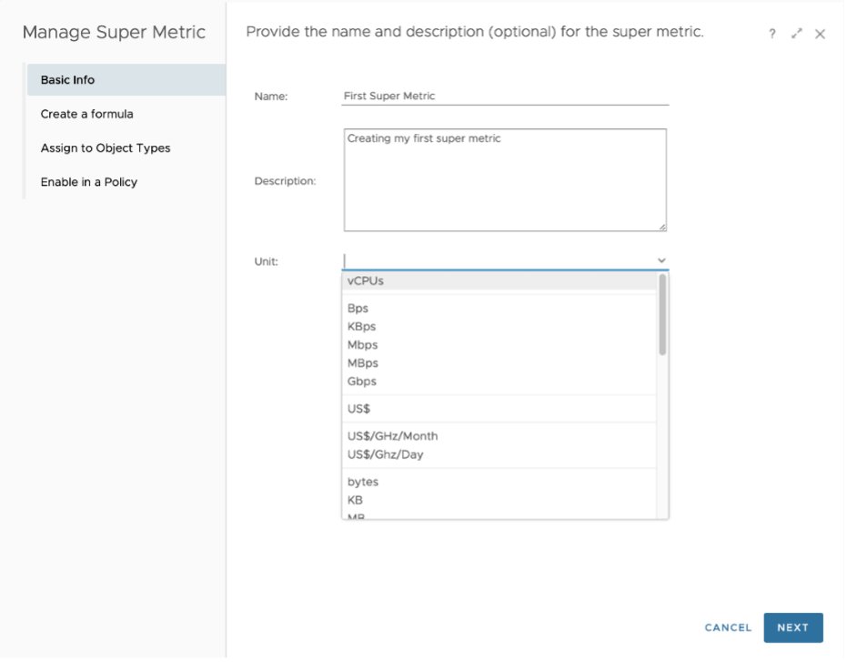
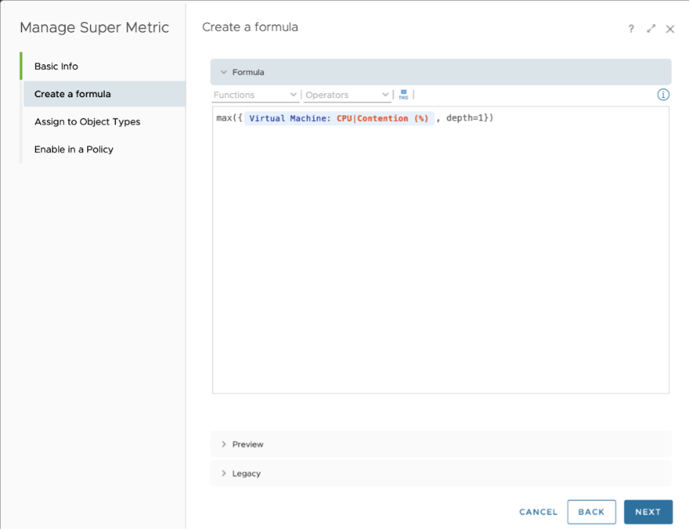
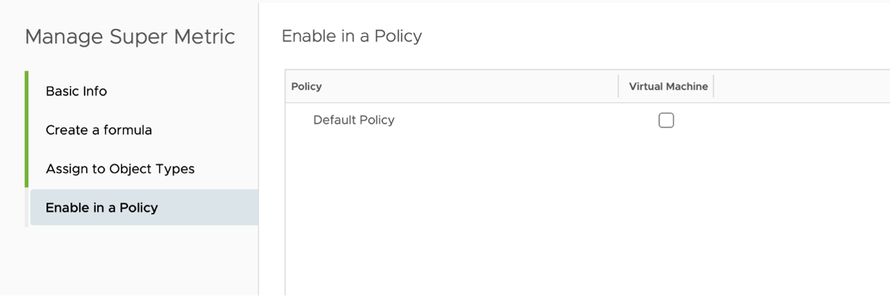

## Step 1

From the main menu, click Administration and in the left pane click Configuration -> Super Metrics.

Click on "Add" to start Super Metrics creation wizard.

## Step 2

Start with a meaningful name for the super metric and description.

You may also assign a unit from the available drop-down list, if required. (available only from version 8.1)

## Step 3

Start with Selecting "Functions" from the drop-down options available, followed by "Object Type" or "Object" ( typing in the name brings up suggestive text which can be selected) and followed by Metric or Property to use ( typing in the key words of required metric or property brings up suggestive text which can be selected). Further, you may add any operators as required in the super metrics workspace.

"CTRL + Space" keyboard shortcut will activate search for key words while typing in the super metrics workspace.

By default, any expression ends with depth=1, which means that the metric is assigned to an object that is one level above the referred object in the relationship chain. If you would need to assign super metric to higher levels, accordingly, the depth level needs to be increased. For example, if you are creating a super metric to find maximum value of CPU Usage on all VMs in the vSphere World, the super metric which is created based on VM metric with "max" function will need to be applied on vSphere World object and with Depth=5 in the expression. The depth can also be negative, this happens when you need to aggregate the parents of a child object. For example, when aggregating all the VMs in a datastore, the metric expression ends with depth=-1, because VM is a parent object of datastore.

Other options available in the page are:

-   Preview: Shows the values of a super metric against any object without needing to save and apply.

-   Legacy: This mode switches to the template to create a super metric formula without the suggestive text as it used to be in version 7.0 or older.

## Step 4

Add the object(s) to which the super metric needs to be applied.

## Step 5 

The last step of creating super metric is to apply to relevant policy or policies.

Once the super metric is enabled, it will take one or two collection cycles ( 5-10 minutes) to start seeing the super metric for the object. For the assigned object, you will see all the super metrics applied under All Metrics \> Super Metric.

An example is shown below:

