### vRealize Operations

Log Insight sports out of the box dashboards that visualizes security-related activities in your vRealize Operation. It also has a dashboard to help you watch and troubleshoot upgrade.

#### Authentication Analysis

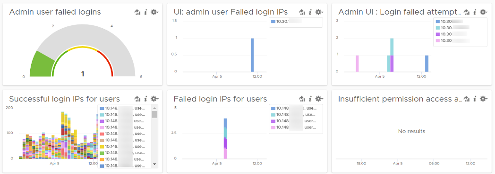

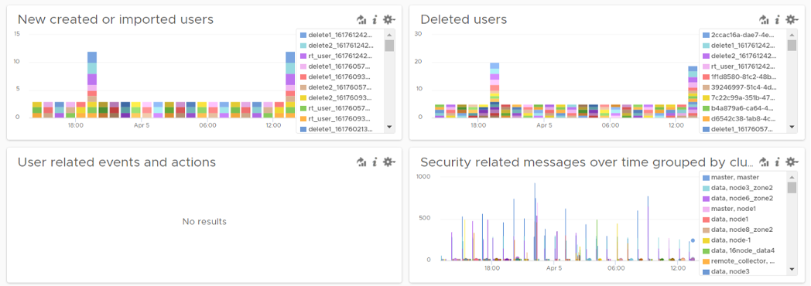

Let’s go through some of its contents in-depth.

There are two privileged login ID that customers have access that audit requires compliance reporting: root and admin. Other privileged account such as MaintenanceAdmin is not accessible. How many times do admin ID login with the wrong passwords in a specific period? The following chart counts each time a login failure happens.


The count is possible because Log Insights create a field out of the log entries. The field is named `vmw_vr_ops_admin_attempt` and that’s what plotted over time. I’m showing two examples of actual log entries, with value added context by Log Insight.


The log entries themselves are in turn filtered using the following query. Log Insight has awareness of vRealize Operations via the variable `vmw_vr_ops_appname`.

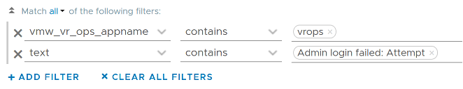

vRealize Operations has 2 UI that are accessed via separate URLs. The Admin UI is for platform administration such as upgrading vRealize Operations, so it’s important to track login activities. How many failed login attempts made in the Admin UI is also provided out of the box.

We’ve covered admin. How about root? As this is a Linux account as opposed to vRealize Opertions account, check the Linux content pack. The concept is the same.

What IP address do they login from? This helps you trace the location of the user who used the account. The following chart shows 6 different users and when they log in. We can drill down to any of them to see the exact time and the IP address used.


Alternatively, you can present in table format to show the IP address information. If you want the time stamp, use the **Field Table** feature.

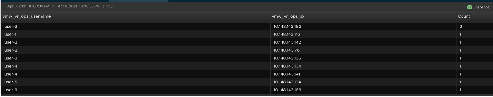

Users addition, especially unexpected ones, can be a cause of security concern. Audit team may ask for the lists of users added in certain period. Users deletion is typically not an audit concern, but could be useful in troubleshooting. You can figure who deleted the user account and when.

The widgets in the third row of the dashboard covers users creation, import and deletion. By now you can guess that we can plot this event over time too. The following shows the list of user accounts that got deleted and when. I cut the fullname as that’s part of actual product validation.

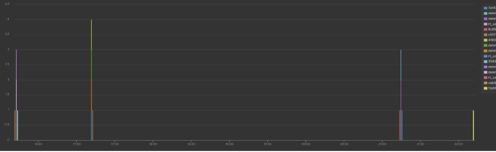

The query that produces the above chart is the following. To some extend, it’s actually human-readable!

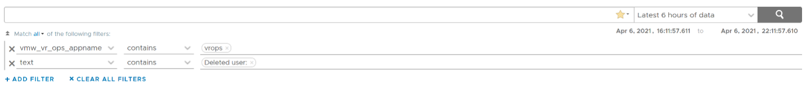

Insufficient permission access logs events where users tried performing activities that they do not have sufficient privilege. The following shows some example where users were denied access.

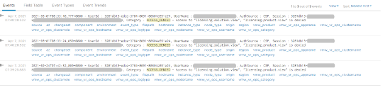

If user has the access, you will see something like this

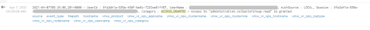

The widget “Security related message” is my personal favourite, as it demonstrate the adhoc troubleshooting ability of Log Insight. The following shows the many security related messages. They are grouped by the vRealize Operations nodes, so you can exclude certain types or zoom into a particular type.

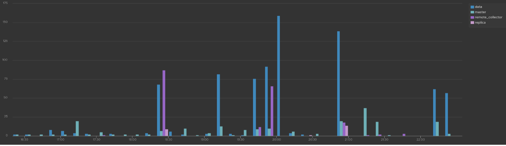

How was the above achieved? The following shows the actual query. Log Insight automatically group log entries of similar type and give them a unique event_type. This means you can filter out the types that are not relevant, like what I have done below.

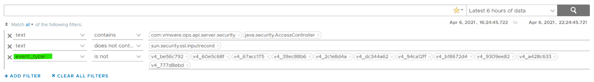

## Activity Audit


Use this dashboard to select a user and audit that user’s actions. The type of actions you can audit are

-   Dashboards, Views and Reports. This covers creation, update, deletion, import, schedule (report) and generate (report).

-   Alerts. This covers alert definition, symptom definition, notification rules and recommendation.

-   Environment. This covers Application, Custom Data Center and Custom Group activities

-   Inventory. This covers resource creation, resource deletion, resource changes, collection start, collection stop, maintenance mode start, maintenance mode end.

-   Configuration. This covers changes in global setting, cost settings, credential, collector groups, etc.

The widgets are separated as in the menu of vRealize Operations Manager UI, so you can easily to orientate.

Let’s go through some of its contents in-depth.

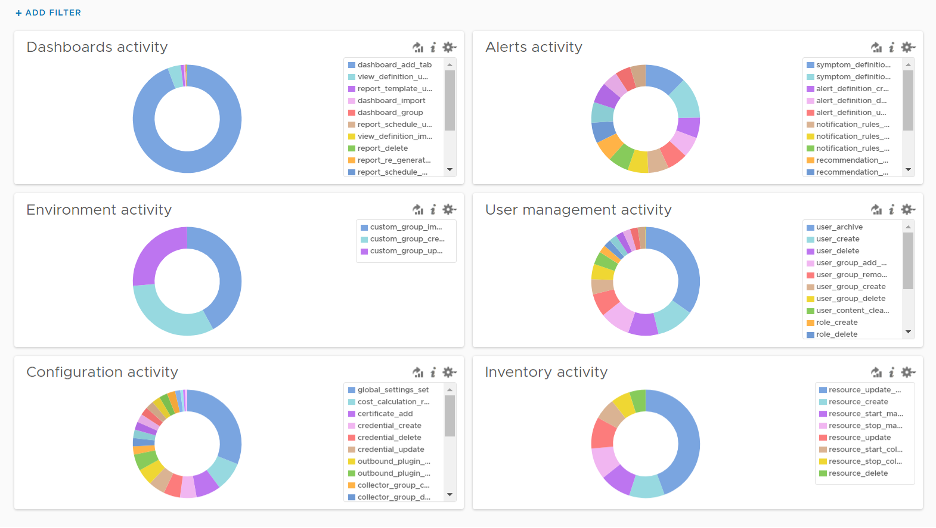

The query that produces the above chart is the following. I’ve excluded “dashboard_add_tab” from the category as it dominates the chart.


Let’s drill down into a specific task. Let’s say we have some views deleted and we need to know who deleted them and when. For that, we select the view_definition_delete and add it. Log Insight will automatically add the field name and operator. No need to manually type!


Since we’re down into a single activity, we can now plot the chart over time, grouped by the user. We can see here that the user is the system account **maintenanceadmin**.

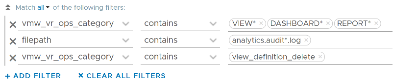

Let’s take another example from the dashboard. This time we will take user management, where you can track things like user deletion, role creation, user password change and many others. The following shows some of those activities.

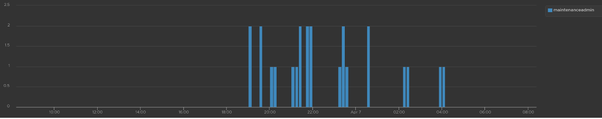

I’ve filtered out **user_archive** event as its value dominates the chart. As mentioned earlier, no need to manually type. Simply click on one of the log entries, choose a filter from the pop-up menu and that’s it!


As usual, you can have a table of who did what when.

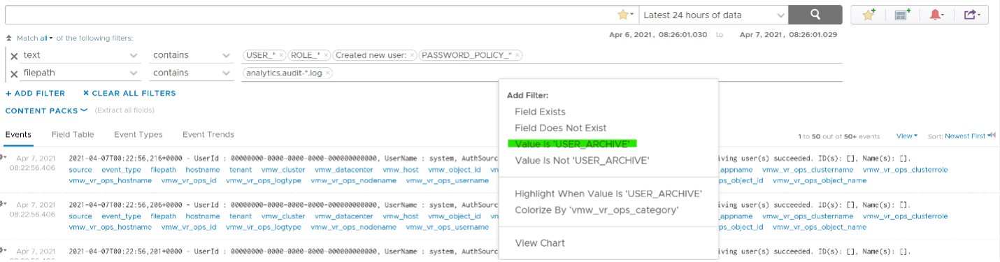

Let’s take one last example. I will take the configuration activity as it shows a range of interesting events. As usual, I started with a bar chart as it lets me see the activity name. We can see that changes in global settings dominate the result.


We already know how to filter it, so I’ll show you another way. Go to the Event Types. You’ll see the log entries grouped by type of events. To filter out, simply click on the **X** icon.

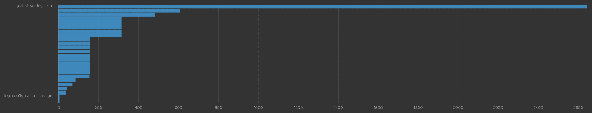

Once filtered out, the following is what I get. Let us know if there are events that you need to be logged that’s not trapped.


The query to get the above is complex


```text
.*POLICY.*|super_metric_.*|disk_rebalance|collector_group.*|global_settings_set|GLOBAL_SETTINGS_OVERRIDE|dynamic_threshold_.*|license.*|DESCRIBE|CREDENTIAL_.*|CERTIFICATE_.*|MAINTENANCE_SCHEDULE_.*|WLP_.*|SCHEDULE_.*|RIGHTSIZING_.*|RECLAIM.*|OUTBOUND_.*|LOG_CONFIGURATION_.*|COST_.*|REFLIB_UPDATE
```

## Delete Activity Audit


Let’s dive into “Deletion activity per resource” widget by opening it in **Interactive Analytics** page. You get the same information shown on the widget, but this time you can adjust it. I’ve made each time block to be 10 minute instead of 1 hour so I can see the changes better.


Note that not all activities show the actual resource name being added/modified/deleted. In the following screenshot, I’ve highlighted in green where the affected resource name being shown, and in orange where it is not captured.

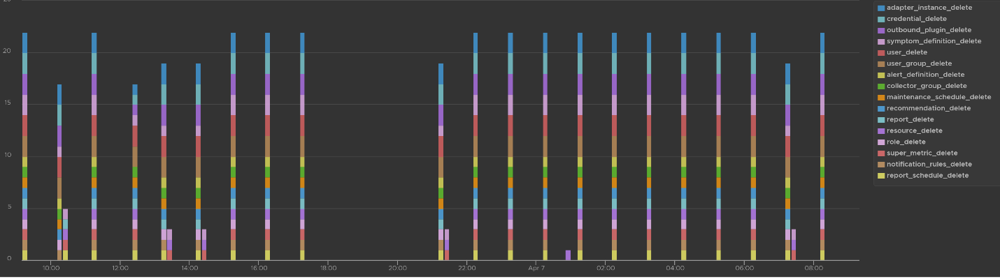

All the columns above are Log Insight field, a type of variable. Each extracted field has its own rules for extraction. Log Insight scans events and extracts fields whenever predefined patterns get matched. Let’s take vmw_vr_ops_username as an example, and shows its extraction formula.

| 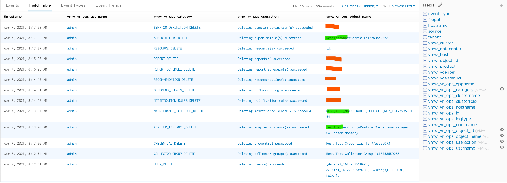 |  |
|-----------------------|-----------------------|

All the VMware extracted fields are prefixed with **vmw_** followed by the product name.

We’re now ready to evaluate the filters used in the preceding chart. It requires three filters working together, meaning they all must be true. It’s an AND operator, not an OR operator.

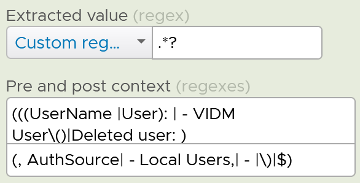

The first filter uses **vmw_vr_ops_category** field to filter out the events which were generated as a result to some kind of deletion.

The second filter uses **filepath** filter, a special system wide filter, to track the name and the path of the file from where events are collected. In vRealize Operations, all audit related events are collected from **analytics.audit** log files.

The last filter uses **vmw_vr_ops_username** field to exclude logs generated by service and system users. We have to exclude automation admin, maintenance admin, migration admin and system as they are not accessible by users.

## Upgrade Troubleshooting

You can monitor the above stages as they progress via Log Insight. Yup, pretty much like watching a live streaming, as the logs are streamed into the Log Insight dashboard. The dashboard sports 9 widgets arranged in 4 rows.


The “**Upgrade Range**” widget shows when the upgrade started and when it completed. It covers the time range of the upgrade process. If the process was successful, you’ll see two columns, one marking the start and one marking the end, as shown in the following.

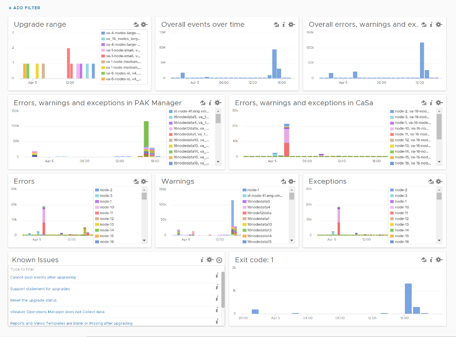

This widget is actually capable of monitoring multiple upgrades running in parallel. You can filter to only show the environment or nodes you are going to monitor by specifying their values in the fields **vmw_vr_ops_clustername**, **vmw_vr_ops_hostname**, and **vmw_vr_ops_nodename**.

The actual query to produce the chart is this.

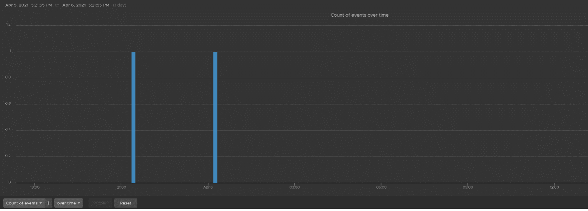

When you see “uploaded into reserved” that means the upgrade process has started. When you see “Completed operation CLEANUP for pakID” that means the upgrade process for that node has been completed successfully. The following shows examples of actual messages you should expect to see.

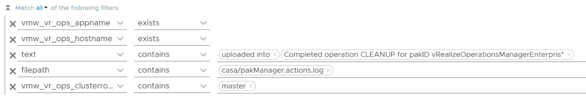

The “Overall events over time” widget is showing the proportion of all logs generated during the upgrade.

The “Overall errors, warnings and exceptions” widget is showing the proportion of all logs with errors, warnings and exceptions generated during the upgrade.

The second row of the dashboard shows 2 widgets. They cover the main two services responsible for upgrade: PAK Manager and CaSa. The widget monitoring errors, warnings and exceptions generated from that services.

The query is as the following:

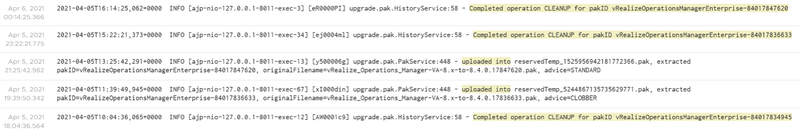

The third row of the dashboard covers errors, warning and exceptions separately. Ensure that the spikes here are not unusual high.

An example of the errors during the upgrade:

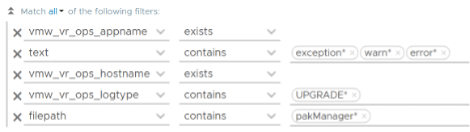

Some examples of warnings during the upgrade:

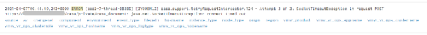

An example of the exceptions:


Note that the errors, warnings and exceptions may be not critical in this case and upgrade process may not be affected.

The last row contains the list of queries which are based on known Knowledge Base articles. Use it to check if a particular KB article is relevant in your environment. The last widget covers all log entries with **exit code: 1**. This is typically the reason for the failure of the upgrade process.

## Collection Troubleshooting

vRealize Operations collect data every 5 minutes by default. For metric, it will store the value. For property, it will only store if there is a change. That means for metric, you should see a consistent collection every 5 minutes, something like this.

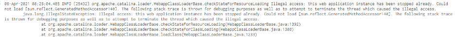

If you see missing dots, that means there is no metric stored. That could be because there is no metric to begin with (e.g. the VM is powered off) or there is a collection failure.

If you suspect a problem in collection, dive in “VMware - vROps 6.7+” content pack and go to the “Cluster - Collector Overview” dashboard. Check under “Collector Service shutdown events by Node, Role” widget and “Collector Service error events by node, role” widget and see if there are error messages.