Log Insight provides the ability to slice and dice vCenter events, tasks and alarms. This can be handy in audit investigation.

## vCenter Events Analysis

To see all the vCenter events, all we need is to select a built-in variable called VC Event Type. A log entry that has this field exist will appear.

From the following chart, we can see there are steady stream of events every 10 minutes. You can change the data granularity.

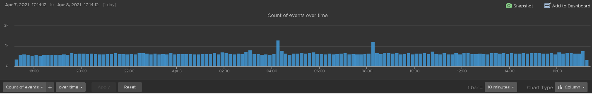

We can see actual event names by changing into a table. We can sort it to show the top events if required.

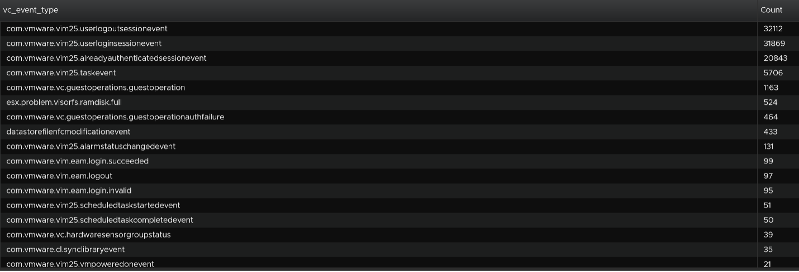

We are interested in events impacting our consumer (VMs), so let's filter it out. The filter is `vim25.vm*` as that is what vCenter shows in its log as we can see from the above table. I did not know that vCenter uses `vim25.vm`, but looking at the table above I could make an educated guess.

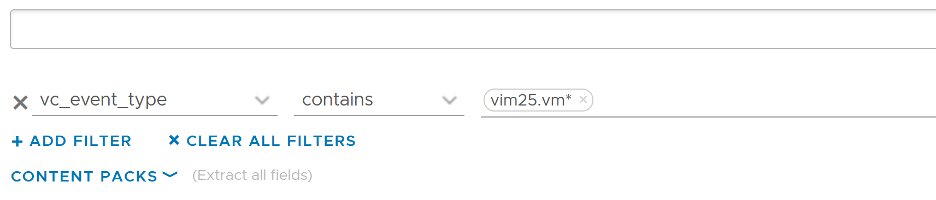

Once the above filter is set, I rerun the search and get all events impacting VM.

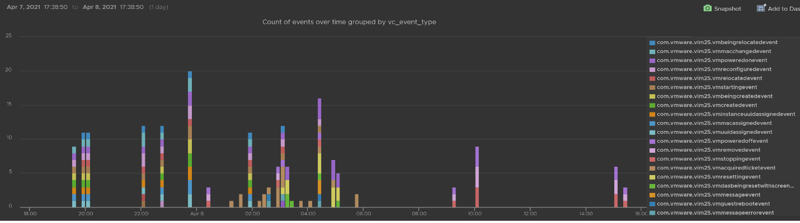

Let's zoom into one of the events. Let's say we're interested in VM configuration event and want to know what exactly was changed. So let's zoom into that event and group it by the user who changed it. We get the following chart, showing the user in the legend.

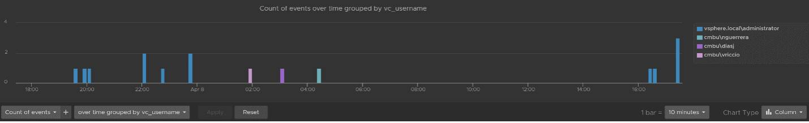

You can group the data by VM name to see which VM were changed when. I've cropped the VM name in the legend.

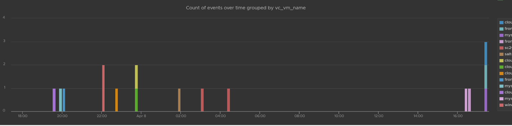

You can see the result in tabular format. You have the VM name, user name and additional context such as the parent ESXi host at the time of the change.

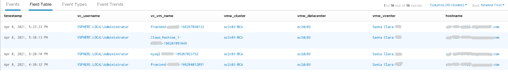

Last but not least, you can see the actual change, as higlighted in green.

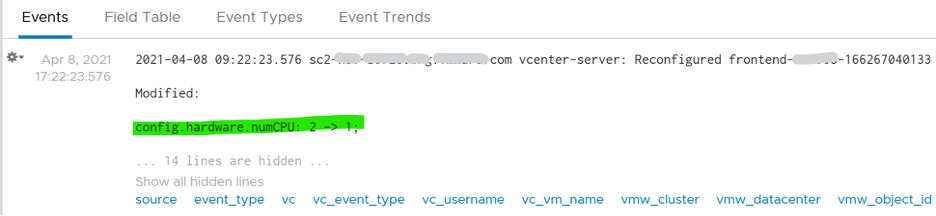

## vCenter Tasks Analysis

To see all the vCenter Tasks, all we need is to select a built-in variable called VC Task Type. A log entry that has this field exist will appear.

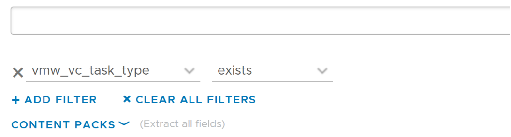

We can see that there is a regular stream of events throughout the day. The pattern looks normal.

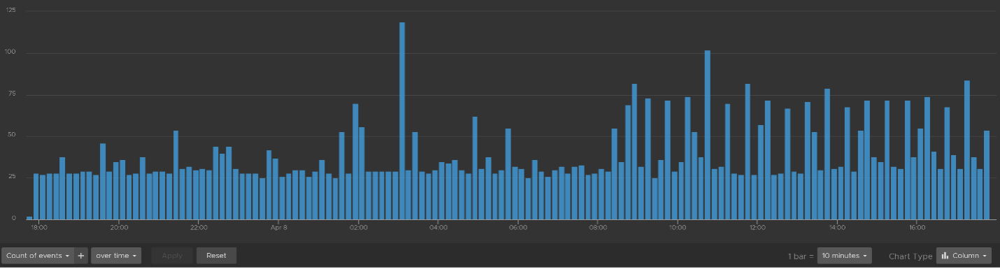

Let's show the top tasks by showing the result in table format.

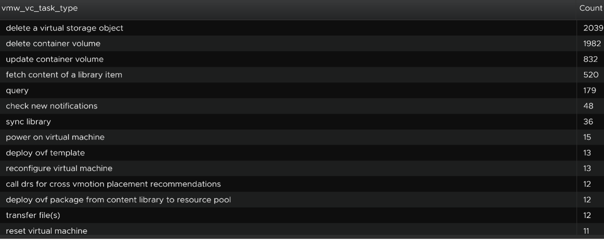

To zoom into any of the tasks, we specify the task name. I only specify one below, but it can take multiple.

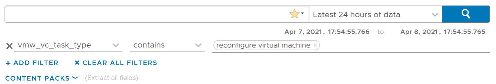

Using the above, and limiting the result to a narrower time window, we can zoom into the nearest minute.

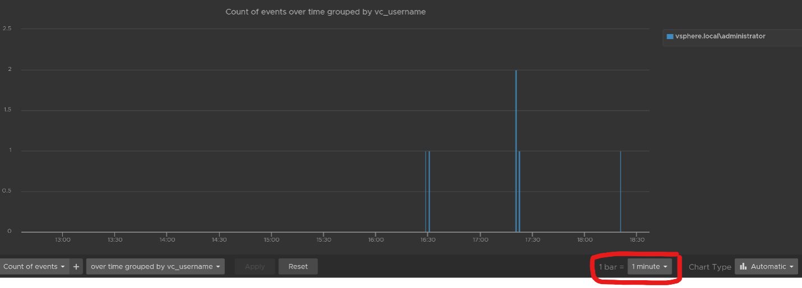

## Snapshot Analysis

You can visually see all the snapshot operations with a single filter `vmw_esxi_snapshot_operation`. Just use the **exist** operator.

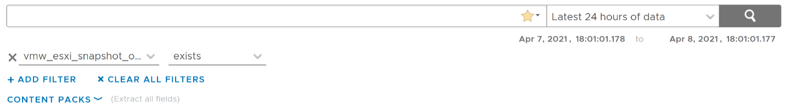

Group the data by the operations and you will get something like this. I can see there are 3 snapshots created but only two were removed. So one of the VM still has a snapshot.

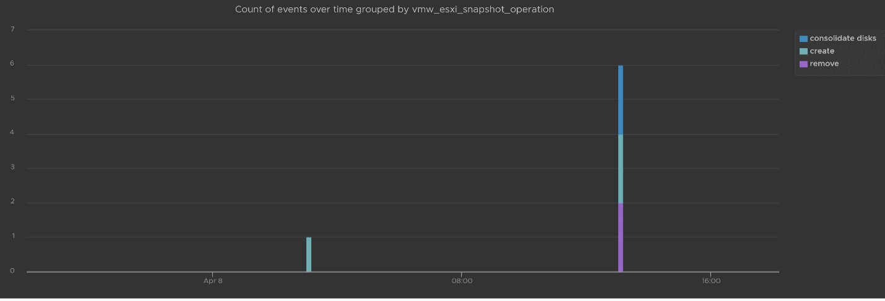

The above shows the time too. In production, you should not take snapshot during busy hours, especially on mission critical VM. So if you run the query in the last 1 week, you should expect no data during the busy hours, and all the daily back up should appear within the backup window.

You can see the details such as the VM name and other context, so see which VM did not have its snapshot removed.

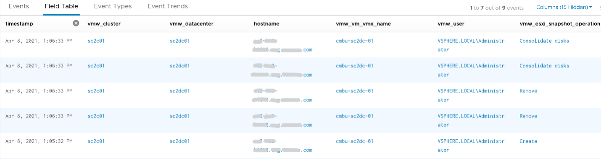

You can check the snapshot name (partially masked out in grey) and whether the snapshot include memory.

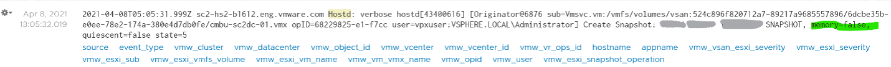

## Template Analysis

How do you prove to auditor that your templates have not been modified by unauthorised person. If a template has been modified, you want to know who did it.

The good thing is there are only a few things you can change to a template. You can rename the template, change the permission, and convert it into a VM. All other changes require the template to be converted into a VM first. That means we can focus on this conversion.

The vCenter logs the entry as "mark virtual machine as template" when you convert a VM into a template. When it is converted back to, it writes "mark as virtual machine". So it's a matter of tracking these 2 entries.

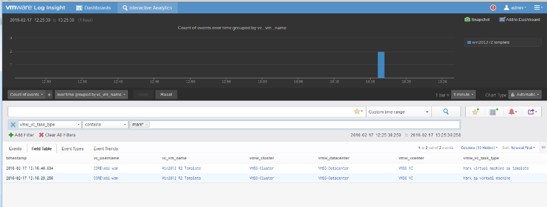

## vSphere Health

In general, you know that you did a good job with your vSphere IaaS as the VM owners are happy with the performance of their VMs. The business is powered by the VMware infrastructure that you design and operate. However, there is a chance that the vSphere logs bear evidence of hidden issues which are not visible from the UI.

As VMware professionals, we know vSphere well and probably have years of experience working with vSphere. We can architect, design, implement, upgrade, and troubleshoot it.

The same thing cannot be said about the logs. Generally speaking, deep knowledge of vSphere logs belongs to [VMware GSS](https://www.vmware.com/support/services/compare) engineers, as they read logs on a daily basis, and perform all kinds of troubleshooting activities. That knowledge has been transitioned to Log Insight release after release in the form of a vSphere content pack.

One common question I get from customers is how to prove that there are not hidden warning lurking around in the log files. As you know, vSphere produces a lot of logs.

Your first stop should be the General Problems dashboard in Log Insight. This dashboard checks the health of your vSphere using 8 queries. You expect a flying color, meaning it should be blank like this. That means vSphere has not logged any issues.

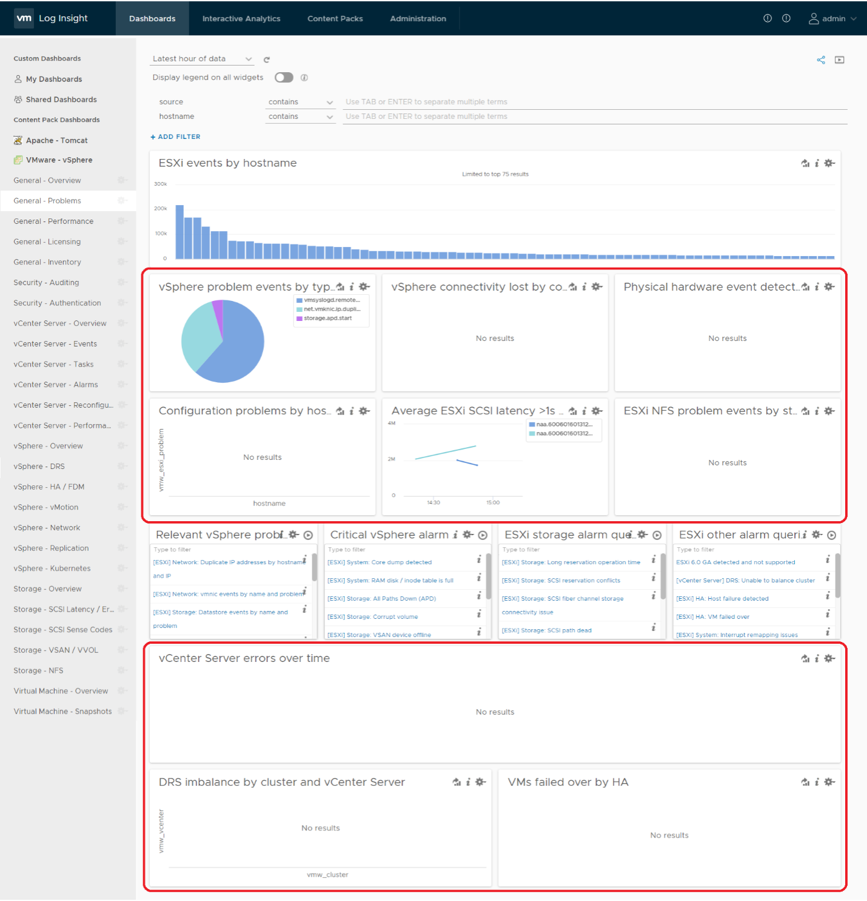

Let's look at some of the queries that Log Insight runs. The SCSI latency is based on 1 second, which is 1,000,000 microseconds. Here is what the query looks like:

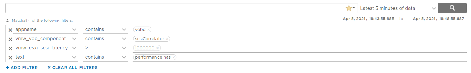

1 second is on the high side; you can change it to a lower number. Do note that this is from VMkernel viewpoint and it's taking 1 SCSI operation (1 read or 1 write), so the number will be much higher than vCenter average. I've seen 12 ms value in vCenter (from the real time chart, so it is a 20 second average) became 600 ms. For details, see [this](http://virtual-red-dot.info/vsphere-storage-latency-view-from-the-vmkernel/).

The above query is pretty simple, as it's looking for a specific item. Here is a much broader health check.

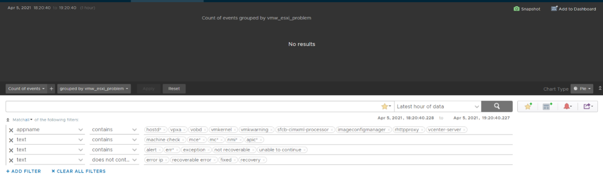

The example below checks for any errors in the vCenter which have not yet been reported as an alarm.

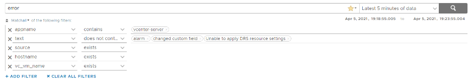

This query below checks for cluster imbalance.

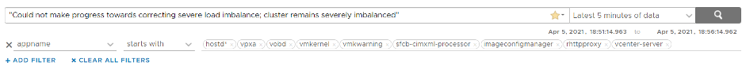

And this query tracks for VM which were rebooted due to HA.

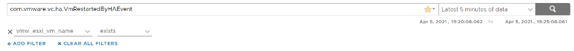

All the above widgets are what you would check out first. You might also want to ensure that there are no errors across major vSphere components.

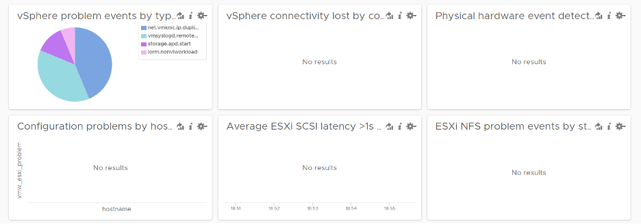

## VM Log File

The file **vmware.log** contains detailed VM activity messages including reconfiguration events, vmotions, VMware tools messages, memory state, power on/off events, features enabled, API requests, etc. It can be used to troubleshoot events leading up to core dumps or kernel panics.

For more information, read [this blog](https://blogs.vmware.com/management/2020/10/configure-a-vms-vmware-log-file-to-send-messages-to-vrealize-log-insight.html) by [Julie Roman](https://blogs.vmware.com/management/author/julie_roman).