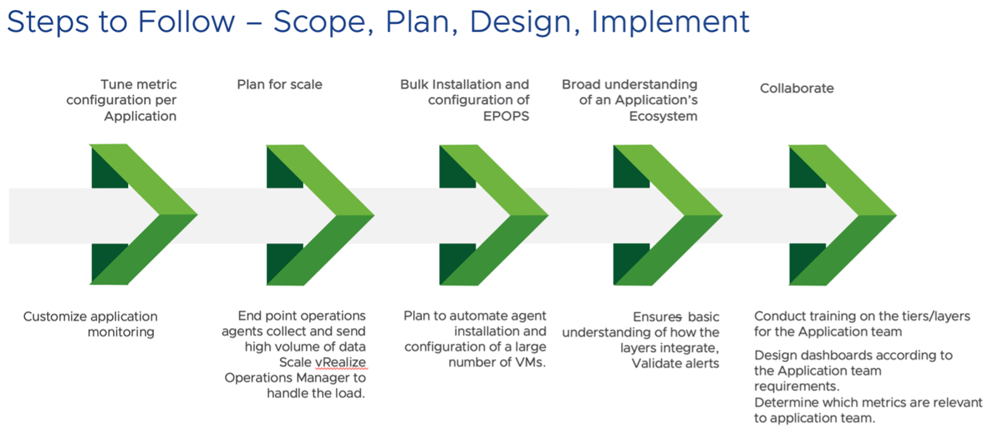
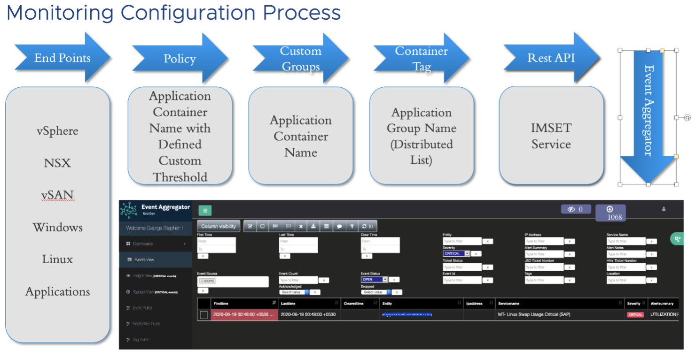

As VMware continued to make acquisitions and drive organic growth, the infrastructure monitoring landscape expanded to include thousands of objects, significantly increasing Objects licensing costs.

Simultaneously, challenges with configuration and tool management started to build up. The increased complexity of our infrastructure landscape and growing demand for modern, proactive features such as dashboards, reports, rich historical data, and real-time monitoring made it clear that the existing tooling was no longer adequate.

## Challenges 

VMware IT Tools Team, are responsible for Availability, Performance and Automate the monitoring to cover IT Infrastructure monitoring space. We were running various tools for silo and legacy monitoring since we don’t have a tool to cover proactive and End-to-End monitoring. Its lead into operation over-ahead and more Opex cost.

As a consumer, it's difficult to see their owned device monitoring courage, historical data, dashboards and reports. They need to analysis various tools matrix to troubleshoot their problem. Need more time to isolate the issue on multi support group organisation.

## Defining Solution Requirements

Before we got to work migrating to new infrastructure monitoring solutions, we needed to formulate a solid definition of success – what were we trying to achieve and how would we know when we got there. To get started, VMware IT prepared a case study focused on the current data collection methodology, frequency, metrics, and how the existing tool issued alerts and notifications. It included the service owner requirements according to application type for new custom groups, dashboards, views, and scheduled reports. We collected all the custom monitoring requirements and created user stories to support the service owner’s requests.

VMware IT recognized the need to move from traditional monitoring to a more modern approach. Shifting from reactive monitoring to a proactive, modern stance would help us identify new issues and root causes more quickly. The advanced reporting capabilities in modern monitoring solutions provide the flexibility to customize performance metrics based on service owner requirements.

VMware IT use vRealize Operations Manager for our infrastructure monitoring to gain application-to-storage visibility across physical, virtual, and cloud infrastructures. We can now investigate and solve complex technical issues faster because of the more precise analytics provided by vRealize Operations. Once the vCenters are identified and plugged in, all components under the purview of each vCenter get automatically monitored during the lifecycle of the component.

## Migration Preparation

Ensuring continuous monitoring with no impact to service owners with a seamless migration was a critical objective that drove the team’s preparations. The first step was to set up the vRealize Operations node and location-based collectors behind the load balancer, to meet network latency and high availability standards.

Customization was a key area of focus. We ensured that the correct ownership was assigned to each application and tagged accordingly to configure alert notifications based on the application owner’s specifications and policies.

In vRealize Operations we used the “delay” feature to set alert timeframes according to the requirements of service owners. This helped us to ensure that all the alerts received by service owners are actionable. We also created container tags to distinguish our inventory as production, non-production and maintenance which helps our team provide efficient operational support.

We wrote several scripts based on the vRealize Operations API to automate steps to configure the monitoring tool.

-   Simplified the migration of 4,000 plus devices

-   Separate devices by operating system (OS)

-   Group and map them according to specific policies

-   Attach objects and devices to service owners

-   Create remote checks for critical items mapped to container tags

Once we completed writing these scripts, it was time to launch the migration of devices from the current tool to vRealize Operations.

We have many objects being monitored and it’s challenging to know who is responsible to remediate/action upon the alerts. To simplify this, we have introduced [IMSET](https://flings.vmware.com/vrealize-operations-rest-notifications-helper), an external service to accomplish these requirements.

We tagged objects based on support groups and enabled this tagged information in IMSET payload to reflect the tag name in alert content. This helps Operations teams to easily identify the Application/Service Owner and thus reduce the overall time taken to remediate the issue.

## Implementation Approach

To launch this phase, we completed several steps and collaborated closely with service owners to ensure their acceptance of the vRealize Operations alerts.

The first step was to extract the master object inventory list from the existing tool. Next, the VMware IT infrastructure team installed agents on servers and confirmed the object availability from vRealize Operations. Finally, we initiated the prepared scripts to create the objects and then mapped to the groups and policies from the existing tool object inventory list.

The plan was to run parallel monitoring between the current tool and vRealize Operations for three months. We created a separate channel in the Network Operations Centers (NOC) dashboard to receive all vRealize Operations alerts and run a comparison between the existing tool and vRealize Operations alerts against the objects.

During the parallel monitoring stage, VMware IT exported the data from NOC dashboard, then worked together with the service owners to compare and fine-tune the alerts. Once the service owners accepted the alerts issued from vRealize Operations, we discontinued parallel monitoring and began utilizing vRealize Operations as the primary monitoring tool for VMware IT infrastructure.