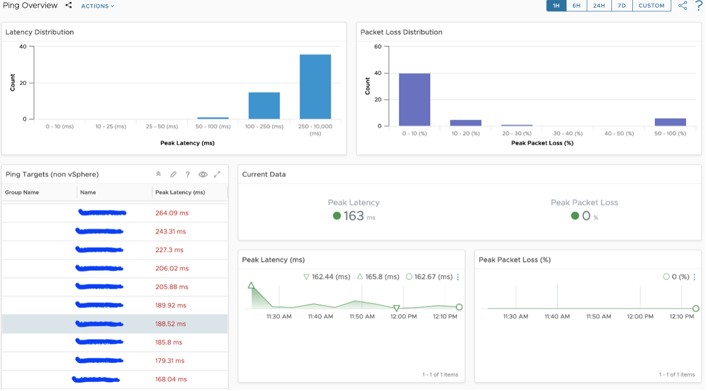
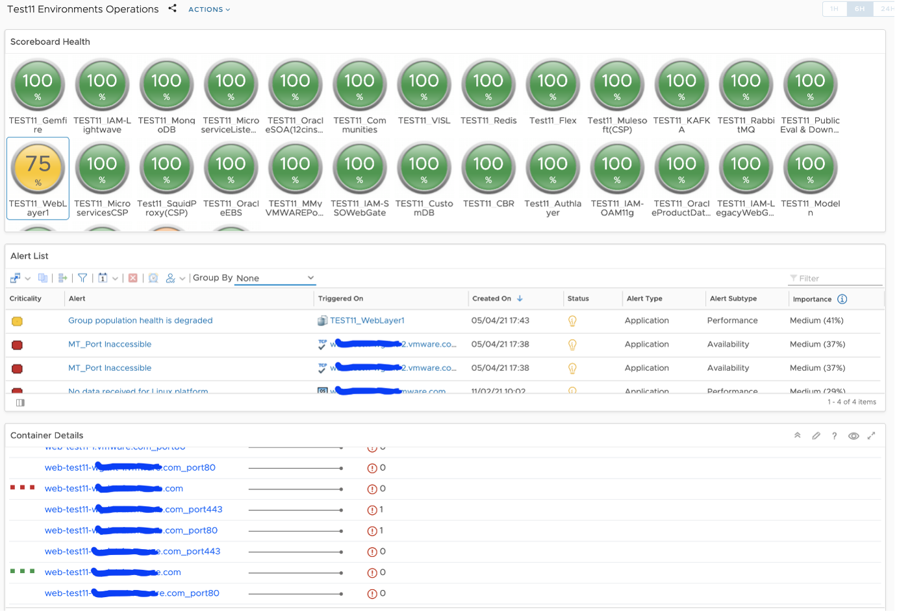
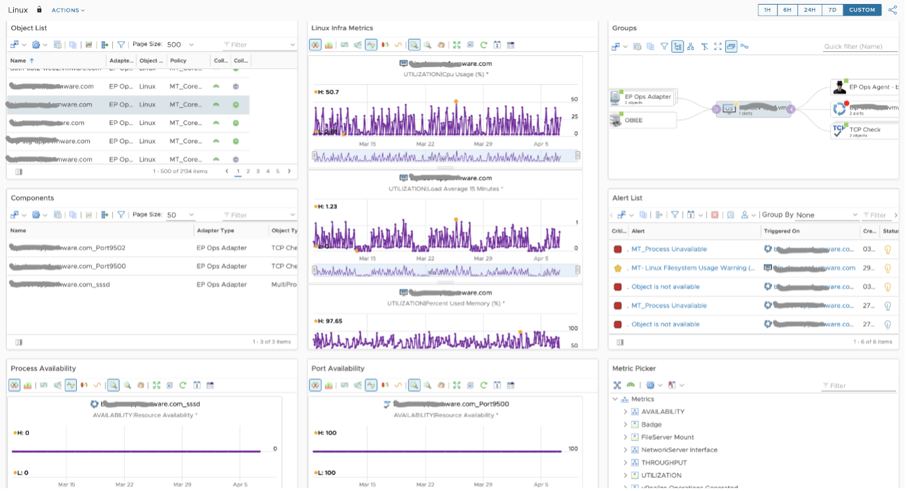
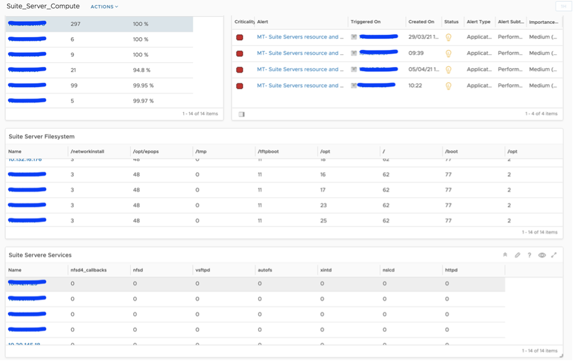

We prepared the number of use-cases, while defining the solution to achieve the service owners monitoring requirements. As a customer one program we worked with product team to achieve the monitoring requirements and raised the user stories to develop the solution to remove monitoring gap. We are sharing some of the key use-cases here.

## Availability Monitoring

To address challenges in monitoring availability of both virtual and physical components, we had to resort to numerous workarounds, which eventually became evident that the existing solution would not scale beyond a certain finite point.

To eliminate this operational overhead, the team introduced additional functionality in the form a Ping Adaptor. The ping functionality can now be easily configured at the adapter instance for IP addresses, group of IP addresses, and FQDN.

## Daily Operational Dashboard

With over 250+ applications and services, and 4000+ components, it is indeed challenging for the Operations teams to have a 'birds-eye' view of the health of all applications/services. vRealize Operations made it seamless with the logical grouping functionality.

We grouped devices based on service and application component with the help of applications owners. We used these groups to custom health and operations dashboard. This will help to know the health and deeper data analysis to troubleshoot the issue. If this dashboard was not made available, the Operations teams would have to view multiple dashboards in order to ascertain the overall health of the Applications/Services.

## Object Inventory Dashboard

We have configured multiple object types per object and it's very difficult to know what was configured and what is the data value for relational objects. Also this page will help to compare the multiple objects type value during single object troubleshooting. If this dashboard is not available, one would have to click through different sections to know the child and parent objects data values.

## Appliances Monitoring

Some Applications run as appliances (vApp) to ensure better security and Application integrity. This, however, poses a challenge from a monitoring standpoint- agents or other internal probes are not allowed to be installed. As a feature request, we worked with vRealize Operations product team to develop a new SNMP Adapter. This new adapter filled the gap of monitoring remote components/vApps.

## Custom Monitoring

Our main goal was to provide an end-to-end monitoring solution to service owners. With the help of super metrics and custom scripts, we covered the adhoc monitoring gaps. For example, we had a requirement to keep NTP sync value between clients and master server to a minimum. We developed a script and executed the same from client servers to obtain the NTP metrics.

## Service Monitoring

We have some application using shared services and database instances. We used corresponding service management packs to auto-discover all KPI's and segregate KPI's based on Applications. For instance, RabbitMQ management pack was leveraged to discover all virtual host and queues. We grouped the queues based on applications to support overall health and operational dashboards.