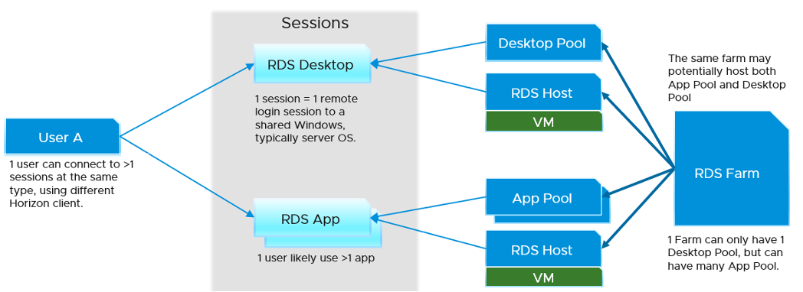

At the end of the day, users just wants to access their desktops (e.g. to organise their files) and use their applications (e.g. browser, spreadsheet). There are 2 competing architecture to deliver the above (desktop and application):

- Shared Windows. This is typically Windows Server.
- Dedicated Windows. This is always Windows 10

The shared architecture is called RDS and the dedicated architecture is called VDI. As you can guess, the shared is cheaper as it has less overhead, but harder to troubleshoot. Shared technology also carries higher availability risk. When the application or Windows crash, more than 1 user are affected. Windows 2019 also does not have concept of shares, limit and reservation. All the sessions compete freely for its resources.

[Hilko Lantiga](https://www.linkedin.com/in/hilkolantinga/) shares another limitation of RDS is the load balancer does not balance based on actual load. It's simply distributing the session based on initial placement. The initial placement can consider any metrics, but there is no "session vMotion" subsequently within the RDS Farm. If you are unlucky all the heavy users could end up on the same RDS session host. That's why vRealize Operations introduces the Usage Disparity metrics.

VDI can be used to deliver application session. It's not common as the overhead is the same with giving entire desktop. The primary use case is usability. If you're delivering Windows applications to Mac users, showing them a Windows desktop will be more confusing than simply showing them the individual applications. Showing the individual application will make them feel like an Apple Mac application.

RDS presents another challenge as it introduces Farm and Host concept. A farm can have many hosts and many pools, and pool has M:N relationship to host. A session connects to a pool, and runs on the host. So a session has 2 parents: pool and host. To keep it simpler operationally, limit to 1 pool per RDS farm. But this results in smaller farms and more farms.

In terms of monitoring and troubleshooting, VDI provides more metrics, as it's just a VM. RDSH provides limited metrics, as they are just a collection of processes. For example, process level contention (be it CPU, memory, disk and network) are not exposed.

The following diagram shows the possible permutation that you can give to a user. Let's start with RDS first.

For VDI, this is what the connection looks like. The pool cannot be both desktop pool and application pool.

I did not draw the permutation where a user accesses all 4 types of sessions. You can certainly have it. When you design, think of complexity in operations. Flexibility can reduce cost but often comes at the price of complexity. A few human errors in a year can negate the benefit of cost savings, or reduce customer satisfaction.